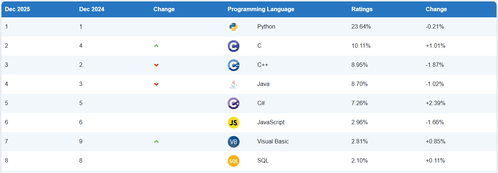
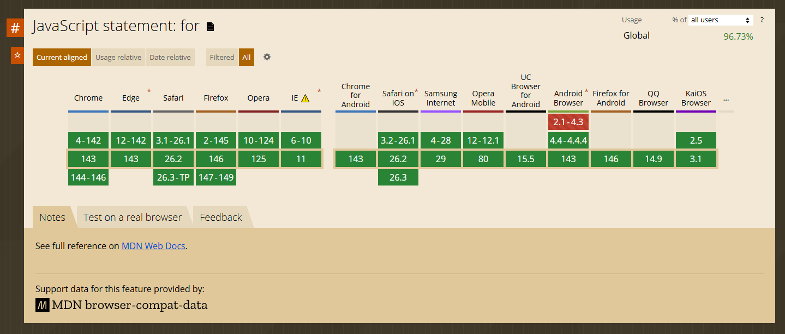
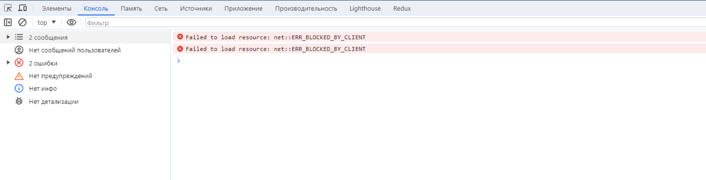

# Введение в JavaScript

## Содержание

- [Введение в JavaScript](#введение-в-javascript)
  - [Содержание](#содержание)
  - [Немного о курсе и "Зачем мне изучать JavaScript?"](#немного-о-курсе-и-зачем-мне-изучать-javascript)
    - [Что представляет из себя этот курс?](#что-представляет-из-себя-этот-курс)
    - [Где и зачем мне может пригодиться JavaScript?](#где-и-зачем-мне-может-пригодиться-javascript)
    - [Как лучше изучать материал, чтобы он действительно остался в голове?](#как-лучше-изучать-материал-чтобы-он-действительно-остался-в-голове)
    - [И, наконец, зачем вообще тратить время на изучение JavaScript?](#и-наконец-зачем-вообще-тратить-время-на-изучение-javascript)
    - [Подытожим](#подытожим)
  - [О JavaScript](#о-javascript)
    - [Что такое JavaScript?](#что-такое-javascript)
    - [JavaScript: История, ECMAScript и JavaScript движки](#javascript-история-ecmascript-и-javascript-движки)
    - [О безопасности языка "JavaScript"](#о-безопасности-языка-javascript)
  - [Инструменты разработчика](#инструменты-разработчика)
  - [Выполнение JavaScript-кода](#выполнение-javascript-кода)
    - [Выполнение JavaScript в браузере](#выполнение-javascript-в-браузере)
    - [Выполнение JavaScript локально](#выполнение-javascript-локально)
  - ["Привет, мир" на JavaScript или "Как заставить браузер говорить?"](#привет-мир-на-javascript-или-как-заставить-браузер-говорить)
    - [Подключение JavaScript к HTML-файлу](#подключение-javascript-к-html-файлу)
    - [Внешние JavaScript скрипты](#внешние-javascript-скрипты)
  - [Написание JavaScript кода](#написание-javascript-кода)
    - [Выражения, инструкции и выражения-инструкции](#выражения-инструкции-и-выражения-инструкции)
    - [Точка с запятой `;`](#точка-с-запятой-)
  - [Теперь вы знаете ...](#теперь-вы-знаете-)

## Немного о курсе и "Зачем мне изучать JavaScript?"

Здравствуй, дорогой читатель! Этот курс - вводное путешествие в язык программирования JavaScript. Да, подобных курсов сегодня действительно тысячи: какие-то глубже, какие-то поверхностнее, какие-то написаны сухо, а какие-то, наоборот, излишне разговорно. Наш курс не претендует на уникальность формы, но стремится быть честным по содержанию.

Он рассчитан прежде всего на студентов, которые только начинают знакомство с JavaScript и, во многом, с программированием в целом. Мы будем двигаться постепенно, иногда даже медленно - осознанно. Некоторые примеры покажутся тебе слишком простыми, местами банальными, а иногда и откровенно наивными. Это нормально. Более того, это сделано специально. Простые примеры работают как учебные костыли: сначала они поддерживают, а потом становятся ненужными.

Перед тем как перейти к первой теме, имеет смысл остановиться и ответить на несколько вопросов, которые почти неизбежно возникают у любого начинающего:

- Что из себя представляет этот курс?
- Где и зачем мне может пригодиться JavaScript?
- Как лучше изучать материал, чтобы он действительно остался в голове?
- И, наконец, зачем вообще тратить время на изучение JavaScript?

На эти вопросы я, как автор курса, постараюсь дать понятные и честные ответы. Иногда я буду отходить от основной линии повествования - делиться наблюдениями, типичными ошибками студентов или небольшими профессиональными ремарками. Считай это разговором между преподавателем и внимательным студентом после пары.

Если ты готов не просто "прочитать", а попытаться понять - можешь смело двигаться дальше.

### Что представляет из себя этот курс?

Курс «JavaScript» рассчитан на студентов 1-го года обучения и знакомит их с основами одноимённого языка программирования - _JavaScript_. Материал курса выстроен последовательно и разделён на три основных раздела:

- _Основы синтаксиса JavaScript_. Несмотря на то, что базовый синтаксис многих языков программирования во многом схож, JavaScript имеет свои "подводные камни", которые на первый взгляд могут показаться сложными и даже нелогичными.
- _Продвинутые модули JavaScript_. В этом разделе рассматриваются более сложные и важные части языка, без понимания которых невозможно уверенно писать код и двигаться дальше.
- _Прикладное программирование JavaScript_. Взаимодействие с HTML. После изучения синтаксиса и ключевых возможностей языка студенты смогут применять JavaScript для разработки одностраничных веб-страниц, связывая HTML, CSS и JavaScript в единое целое.

Курс включает 15 теоретических тем и 5 лабораторных работ, направленных на закрепление полученных знаний и формирование практических навыков.

Важно отметить, что в теоретическом материале ответы не всегда будут даны сразу. Иногда вам, как читателю, придётся остановиться, подумать или запустить код самостоятельно, чтобы разобраться и понять, почему программа ведёт себя именно так. Это сделано намеренно.

### Где и зачем мне может пригодиться JavaScript?

JavaScript - один из самых популярных языков программирования. По данным рейтинга TIOBE[^1], на декабрь 2025 года он занимает 6-е место по популярности, уступая Python, C, C++, C# и Java.



_Рисунок 1.1. Топ языков программирования по версии TIOBE_

Основная причина такой популярности проста: без JavaScript сегодня не обходится почти ни одно фронтенд-приложение. Фактически весь современный фронтенд построен на JS. Какую бы IT-сферу вы ни выбрали, вы почти наверняка встретите разработчика, который пишет на JavaScript. Разве что искусственный интеллект? Но нет - и там JavaScript тоже [встречается](https://dev.to/chetandevx/how-javascript-is-used-in-ai-1h3m).

Поэтому, изучая JavaScript и развиваясь в этом направлении, вы существенно расширяете свои возможности и почти наверняка сможете найти для себя место в мире программирования - комфортное и востребованное.

### Как лучше изучать материал, чтобы он действительно остался в голове?

В целом, это довольно философский вопрос. У каждого свой ритм, свои привычки и способы обучения. Я могу лишь дать несколько практических советов, которые хорошо сработали у меня.

1. _Изучайте не более одной темы в день_. Не стоит пытаться охватить всё сразу, даже если кажется, что "всё влезет". Информация, усвоенная медленно, почти всегда оказывается полезнее.
2. _Не просто читайте, а запускайте код_. Держите рядом редактор кода и выполняйте каждый пример, который встречаете. Меняйте значения, ломайте код, смотрите, что произойдёт. Пытайтесь понять, почему результат именно такой. В этом месте листок и ручка всё ещё отлично работают.
3. _Одна только практика без цели тоже не работает_. Обязательно выполняйте все лабораторные работы, которые есть в курсе, стараясь делать это без использования ИИ. Как получится. Уже после этого можно проверить себя с помощью ИИ и сравнить подходы.
4. _Используйте ИИ как тренажёр, а не как костыль_. Попросите ИИ задавать вам задачи по текущей теме и решайте их самостоятельно. Это хороший способ проверить, действительно ли вы поняли материал.
5. Дополняйте обучение сторонними материалами. Смотреть видео и проходить дополнительные курсы - нормально и полезно. Лично я рекомендую:
   - [JavaScript - Полный Курс JavaScript Для Начинающих [11 ЧАСОВ]](https://www.youtube.com/watch?v=CxgOKJh4zWE). Не пытайтесь посмотреть всё за один день.
   - Курсы на платформе [freeCodeCamp](https://www.freecodecamp.org/learn/javascript-v9/).
   - [Современный учебник JavaScript](https://learn.javascript.ru/). Настоятельно рекомендую.

Отдельно дам ещё один совет, который лично мне очень помог. После прохождения темы попробуйте объяснить её своему «коллеге по цеху», просто другу или партнеруы. А ещё лучше - человеку с другого факультета, который в IT ничего не понимает. _Это удивительно эффективная практика_. В такие моменты вы быстро понимаете, где сами «плаваете», а где действительно разобрались. Вы начинаете не просто запоминать, а понимать материал. Для этого вполне можно использовать презентации и схемы из данного курса.

### И, наконец, зачем вообще тратить время на изучение JavaScript?

Отвечу просто. Вы же хотите стать миллионером, не так ли? А вот долларовым или леевым - это уже зависит от вас.

### Подытожим

Цель данного курса - изучить инструмент, язык программирования JavaScript. Далее, в течение последующих лет обучения, вы будете «прикладывать» его уже в конкретных IT-направлениях, где вас научат делать это правильно. Сейчас же задача проще и важнее одновременно: спокойно и последовательно освоить сам язык.

Вперед? Вперед!

## О JavaScript

### Что такое JavaScript?

_JavaScript (JS, ЖС)_ - высокоуровневый, интерпретируемый язык программирования, широко используемый для создания динамических веб-страниц. Он обеспечивает взаимодействие пользователя с веб-страницей, обеспечивая динамические изменения содержимого и обработку событий.

> [!TIP]
> Напомним, что означает термин «интерпретируемый язык». Когда вы изучали C или C++, после написания программы вы компилировали её в машинный код, чтобы компьютер мог её выполнить. Такие языки называются _компилируемыми_.
>
> В случае с интерпретируемыми языками процесс другой. Код не компилируется заранее целиком, а выполняется построчно. Если программа состоит из пяти строк, то сначала выполнится первая строка, затем вторая, третья и так далее. Если ошибка возникает, например, на четвёртой строке, то первые три строки успеют выполниться и даже могут что-то вывести в консоль. На четвёртой строке выполнение программы завершится с ошибкой.
>
> В компилируемых языках ситуация иная. Если в коде есть ошибка, программа не будет выполнена вовсе: компилятор остановит процесс и укажет на проблему ещё до запуска программы.
>
> Такое различие важно понимать с самого начала - оно объясняет, почему в JavaScript вы часто видите результат работы программы даже при наличии ошибок дальше по коду.

JavaScript изначально создавался для того, чтобы сделать веб-страницы "живыми" [^2]. Долгое время веб-сайты были полностью статическими и состояли только из HTML и CSS. Пользователь мог зайти на сайт, прочитать информацию - и на этом всё. О каком-либо взаимодействии речи не шло. Появление JavaScript изменило эту модель.

Веб-страницы стали динамическими: они получили возможность реагировать на действия пользователя, изменять содержимое страницы без перезагрузки, обновлять данные динамически. Например, при нажатии на кнопку можно изменить цвет элемента или обновить значение счётчика. Как вы думаете, можно ли было бы без JavaScript реализовать на веб-странице секундомер или счётчик?

Небольшие программы на данном языке программирования называются _скриптами_.

> [!TIP]
>
> _Скрипт (или сценарий)_ - это небольшая программа, которая выполняется последовательно и решает одну конкретную задачу. Как правило, у скриптов нет собственного визуального интерфейса. Скрипт запускается по определённой команде, выполняет набор действий и затем завершает работу.
>
> _Скриптовый язык_ - это язык программирования, специально созданный и оптимизированный для написания таких программ. Подобные языки обычно обладают простым и понятным синтаксисом, что делает их удобными для быстрой разработки, экспериментов и отладки.

JavaScript является примером скриптового языка, который часто используется в браузерах для создания динамических и интерактивных веб-страниц.

### JavaScript: История, ECMAScript и JavaScript движки

Компания _Netscape_ хотела сделать веб "живым" - таким, чтобы страницы могли реагировать на действия пользователя прямо в браузере, без постоянной перезагрузки и без сложных серверных решений.

В 1995 году программист _Брендан Айк_, работавший в Netscape, всего за несколько дней создал первый прототип языка, который сначала назывался "Mocha", затем "LiveScript", а затем из-за популярности "Java", был переименован в "JavaScript". Язык сразу был внедрен в браузер Netscape Navigator и начал использоватся для простых сценариев.

Почти сразу началась конкуренция. Компания Microsoft, увидев успех JavaScript, добавила свой вариант языка - JScript - в браузер Internet Explorer 3. Формально это был "почти JavaScript", но с отличиями. В результате один и тот же код мог нормально работать в браузере Netscape и ломаться в Internet Explorer.

Очевидно, что такой разброд нужно было решать. Здесь важно перейти к понятию _стандартизации_ и к организации _Ecma International_, которая занимается разработкой и поддержкой международных стандартов в области информационных технологий.

> [!TIP]
>
> Напомним, что такое _стандарт_. Это описание того, как должна выглядеть и вести себя та или иная система. Например, клавиатура QWERTY: дизайн самой клавиатуры может быть любым, но раскладка клавиш должна соответствовать установленному стандарту.

Чтобы решить описанную выше проблему и добиться того, чтобы код работал одинаково во всех браузерах, компания Netscape в 1996 году передала JavaScript на стандартизацию в Ecma International. В результате в 1997 году был опубликован первый стандарт [_ECMA-262_](https://tc39.es/ecma262/), также известный как _ECMAScript_ - стандарт скриптового языка общего назначения.

С этого момента язык стал описываться формальным документом - спецификацией. Браузеры получили возможность создавать собственные реализации JavaScript, опираясь на единый стандарт. Эта спецификация определяет, какие возможности должен поддерживать язык и как именно они должны работать, обеспечивая единообразие выполнения кода на разных платформах и в разных браузерах. Например, если в спецификации указано, что функция может принимать неограниченное количество аргументов, то все браузеры, которые хотят поддерживать JavaScript, обязаны реализовать эту возможность в своих движках.

> [!NOTE]
>
> _ECMAScript_ - это стандарт, то есть описание, как язык "должен выглядить" и какие функции поддерживать.
> _JavaScript_ - это непосредственно реализация стандарта.

Но сам по себе стандарт ничего не исполняет. Он лишь описывает, как язык должен работать. За реальное выполнение JavaScript-кода внутри браузера отвечает JavaScript _движок_. Именно движок читает код, анализирует его, и выполняет шаг за шагом (он выполняет и другие функции, о которых мы погорим позже).

В последствии у каждого браузера появился свой движок, чтобы запускать javascript в браузере. В Netscape (а позже в Firefox) это был _SpiderMonkey_, в Google Chrome, Opera, Edge - _V8_, в Safari - _JavaScriptCore_, в Internet Explorer - _Chakra_.

> [!IMPORTANT]
>
> Важно понимать, что движок - это не язык, JavaScript остаётся одним и тем же, а движки - это разные реализации одного стандарта.

То есть схема в целом выглядит следующим образом:

- _В стандарте ECMA-262 появляется новая функциональность_. Например, условно описывается функция `isOdd()`, предназначенная для проверки числа на нечётность. На этом этапе это не код, а лишь формальное описание того, что должно существовать и как оно должно себя вести.
- _Разработчики JavaScript-движков читают спецификацию_. Команды, которые разрабатывают движки (V8, SpiderMonkey, JavaScriptCore и другие), изучают новый стандарт и решают, как именно реализовать описанную функциональность внутри своего движка.
- _Каждый движок реализует эту функциональность у себя_. Реализация может отличаться внутренне (алгоритмы, оптимизации, производительность), но внешнее поведение должно строго соответствовать спецификации.
- _Браузеры обновляются и получают новую возможность_. После того как движок поддержал новую функциональность, браузер, в котором он используется, также начинает её поддерживать. Именно поэтому новые возможности JavaScript появляются в браузерах постепенно.

Именно поэтому иногда возникает ситуация, когда новая функциональность уже работает в Chrome, но при этом ещё не поддерживается в Firefox. Причины, как правило, вполне прозаичные: разные команды, разные приоритеты, разная скорость внедрения. Хотя, кто знает, возможно разработчики Firefox просто ещё не отошли от новогодних праздников?

Чтобы понимать, какая функциональность JavaScript и в каких браузерах поддерживается, разработчики используют специальные таблицы совместимости. Самый популярный ресурс для этого - сайт caniuse.com. На нём можно найти практически любую возможность JavaScript, HTML или CSS и увидеть, в каких браузерах и с каких версий она работает.

Рассмотрим, к примеру, инструкцию for. Очевидно, что это базовая конструкция языка, и она поддерживается во всех браузерах без исключений.



_Рисунок 1.2. Поддержка инструкции for в разных браузерах_

Этот пример хорошо показывает, что фундаментальные элементы языка, появившиеся давно и закреплённые стандартом, одинаково работают во всех современных браузерах.

> [!TIP]
>
> Если вы используете новую или малоизвестную функциональность - проверьте её поддержку в браузерах. Это сэкономит вам время, нервы и пару загадочных багов, которые «_почему-то работают у меня, но не работают у других_».

### О безопасности языка "JavaScript"

_JavaScript - «безопасный» язык_, он не предоставляет низкоуровневый доступ к памяти или процессору (т.е. программистам не нужно беспокоиться о таких проблемах, как утечки памяти или несанкционированный доступ, что способствует созданию более надежного и безопасного кода).

Кроме того, в браузере некоторые функциональности JavaScript подвергаются ограничениям. Например,

- JavaScript на веб-страницах ограничен в своих возможностях для обеспечения безопасности пользователей. Например, он не может произвольно читать или записывать файлы на жестком диске, запускать программы или иметь прямой доступ к системным функциям операционной системы.
- Современные браузеры предоставляют JavaScript ограниченный доступ к файлам только после определенных действий пользователя, таких как "перетаскивание" файла в окно браузера или выбор файла через тег `<input>`. Взаимодействие с камерой, микрофоном и другими устройствами также требует явного разрешения пользователя.
- Каждая веб-страница с поддержкой JavaScript работает в изолированном окружении, и скрипты на одной странице не могут несанкционированно взаимодействовать с другими страницами, особенно если они принадлежат к разным сайтам.

Эти ограничения призваны защитить пользователя, предотвращая несанкционированный доступ и сохраняя конфиденциальность данных при работе с различными веб-ресурсами.

> [!NOTE]
> Описанные выше ограничения не действуют, если JS запускается на стороне сервера.

## Инструменты разработчика

Одним из важнейших инструментов при разработке на JavaScript являются инструменты разработчика. Представьте, что вы написали скрипт JavaScript и запустили её в браузере. Как вы думаете, есть ли гарантия, что в коде нет ошибок? Если скрипт состоит из одной строки с выводом Hello, World, вероятность ошибки минимальна. Но как только программа становится чуть сложнее, ошибки появляются почти неизбежно. А иногда вам просто нужно посмотреть, что именно выводит код.

Для этого во всех браузерах есть инструмент под названием "_инструменты разработчика_", в котором есть вкладка с _консолью_. Это как обычная консоль, типо в Visual Studio, только в браузере.

Рассмотрим пример открытия консоли в браузере Google Chrome. Открываем вашу HTML страницу и нажимаем клавишу `F12` (если используете Mac `Ctrl+Opt+J`). Переходим во вкладку Консоль (Console), там будут показаны все ошибки и другие сообщения.



_Рисунок 1.3. Консоль для отладки_

Кроме того, вы можете писать код прямо в этой консоли. Откройте консоль, введите выражение `2 + 3` и нажмите `Enter` - в ответ браузер сразу выведет результат вычисления.

## Выполнение JavaScript-кода

JavaScript-код можно выполнять как в браузере, так и локально на компьютере.

### Выполнение JavaScript в браузере

Для выполнения кода в браузере вы можете создать отдельный JS-файл и подключить его к HTML-странице - об этом подробно пойдёт речь в следующей главе. Либо, как уже обсуждалось ранее, вы можете выполнять код напрямую в консоли разработчика.

Зайдите в консоль разработчика и введите следующий код:

```js
console.log('Hello, World!');
```

После нажатия Enter сообщение сразу появится в консоли браузера.

### Выполнение JavaScript локально

JavaScript-код можно выполнять и локально на компьютере, но здесь есть нюанс: сам по себе компьютер JavaScript «не понимает». Для этого используется специальная среда выполнения - [Node.js](https://nodejs.org/en/download), основанная на JavaScript-движке V8. Установив Node.js, вы фактически научите свой компьютер исполнять JavaScript-код.

После установки создайте файл `index.js` и добавьте в него следующий код:

```js
console.log('Hello, World!');
```

Затем откройте папку с этим файлом в терминале и выполните команду `node index.js`. В обычной консоли появится сообщение `Hello, World!`.

> [!TIP]
> Кстати, вы только что написали свой первый Hello World на JavaScript. Поздравляю!

## "Привет, мир" на JavaScript или "Как заставить браузер говорить?"

### Подключение JavaScript к HTML-файлу

Теперь, когда мы разобрались, как выполнять JavaScript-код, можно пойти дальше и попробовать запускать более крупные скрипты, не вводя их каждый раз в консоль разработчика.

Чтобы выполнить JavaScript-скрипт, его необходимо подключить к HTML-странице. Когда браузер "увидит" этот скрипт, он выполнит его построчно в процессе загрузки страницы.

Создадим простую HTML-страницу:

```html
<!DOCTYPE html>
<html lang="en">
  <head>
    <title>Hello, world!</title>
  </head>
  <body>
    <div>Эй, а ты точно знаешь JS?</div>
  </body>
</html>
```

На данный момент на странице нет JavaScript-кода - это обычный статический HTML. Теперь попробуем добавить JS. Для этого используется тег `<script>`.

```html
<!DOCTYPE html>
<html lang="en">
  <head>
    <title>Hello, world!</title>
  </head>
  <body>
    <div>Эй, а ты точно знаешь JS?</div>

    <!-- Место, где мы будем писать наш скрипт -->
    <script>
      alert('Hello, World!');
    </script>
  </body>
</html>
```

Теперь, если открыть эту HTML-страницу в браузере, скрипт, находящийся внутри тега `<script>`, выполнится, и вы увидите всплывающее окно с надписью _Hello, World!_.

> [!NOTE]
> Тег `<script>` - это HTML-элемент, предназначенный для встраивания или подключения JavaScript-кода на страницу. Код внутри него выполняется автоматически в момент, когда браузер обрабатывает этот тег.

Вместо `alert('Hello, World!')` попробуйте добавить следующий код:

```html
<script>
  console.log('Hello, world');
  console.log(2 + 3);
</script>
```

После открытия HTML-страницы результат выполнения появится во вкладке Console в инструментах разработчика браузера.

> [!NOTE]
> Тег `<script>` можно размещать в HTML-разделах `<head>` и `<body>`. Код, внутри этого тега, будет выполняться в момент обработки браузером соответствующей части HTML-документа. Обычно скрипты, относящиеся к настройкам и загрузке страницы, помещают в раздел `<head>`, а скрипты, влияющие на визуальное отображение или взаимодействие с пользователем, размещают в разделе `<body>`.

### Внешние JavaScript скрипты

Когда JavaScript-код начинает разрастаться, добавлять его напрямую в HTML-файл становится не самым удачным решением - разметка перегружается и теряет читаемость. В таких случаях рекомендуется выносить код в отдельный JS-файл и подключать его к HTML-странице.

Оставим тот же HTML-файл и создадим рядом с ним JavaScript-файл `index.js` со следующим содержимым:

```js
console.log('Hello, world');
console.log(2 + 3);
```

Оставим тот же HTML-файл и создадим рядом с ним JavaScript-файл `index.js` со следующим содержимым:

```html
<!DOCTYPE html>
<html lang="en">
  <head>
    <title>Hello, world!</title>
  </head>
  <body>
    <div>Эй, а ты точно знаешь JS?</div>

    <!-- Подключение внешнего JS-файла -->
    <script src="index.js"></script>
  </body>
</html>
```

При открытии страницы JavaScript-код из файла `index.js` будет выполнен точно так же, как если бы он находился внутри HTML.

Теперь можно написать чуть более интересный пример и добавить взаимодействие с пользователем. Измените содержимое файла `index.js` следующим образом:

```js
// Используем функцию prompt для запроса данных у пользователя
// и сохраняем введённый текст в переменной text
const text = prompt('Впиши сюда, что хочешь!');
// Выводим введённый текст в консоль разработчика
console.log(text);
```

> [!IMPORTANT]
>
> Если у тега `<script>` используется атрибут `src`, то любой код, написанный между открывающим и закрывающим тегами, будет проигнорирован:
>
> ```html
> <script src="index.js">
>   console.log("Hello, world!"); // игнорируется
> </script>
> ```

Теперь вы знаете три основных способа выполнения JavaScript-кода:

- С использованием консоли разработчика.
- Путём подключения JavaScript к HTML-странице.
- Локально на компьютере с помощью Node.js.

## Написание JavaScript кода

После того как вы научились выполнять JavaScript-код, самое время разобраться в некоторых важных аспектах самого языка. Именно здесь начинается знакомство с тем, как писать код, а не просто запускать его.

### Выражения, инструкции и выражения-инструкции

В JavaScript выделяют три основные синтаксические сущности, которые важно понимать с самого начала. В дальнейшем, при изучении синтаксиса языка, вы будете встречать их постоянно.

_Выражение_ - это фрагмент JavaScript-кода, который возвращает значение. Проще говоря, выражение - это то, что можно _вычислить_.

К выражениям относятся:

- Арифметические операции (`2 + 3`, `10 * 5`).
- Литералы (`5`, `"Hello"`, `true`).
- Вызовы функций.
- Переменные (`x`, если в ней хранится значение).

Примеры выражений:

```js
10; // результат выражения будет равен числу 10
20 + 30; // Результат выражения будет равен числу 50.
'Hello' + 'World'; // Результат выражения будет строкой 'Hello World'.
x = 3; // Результат выражения - значение, которое вы присваиваете переменной, то есть число 3.
func(a); //  // Результат выражения зависит от возвращаемого значения функции func с аргументом a.
v >= a; // Результат выражения будет логическим значением (true или false)
```

_Инструкции_ представляют собой синтаксические конструкции и команды, которые выполняют определенные действия, но сами по себе ничего не возвращают.

К инструкциям относятся:

- Объявление переменных (`let x = 10;`).
- Условные конструкции (`if`, `else`).
- Циклы (`for`, `while`).
- Инструкция `return`.

Примеры инструкций:

```js
alert('Hello'); // вызов функции `alert` для отображения сообщения
let a; // создание переменной
let b = 3; // создание константы b и присвоение ей значения 3
if (3 > 2) {
  // условная конструкция if для проверки условия
  console.log('Hello, world');
}
```

_Выражение-инструкция_ - это выражение, использованное как самостоятельная инструкция. Проще говоря, это выражение, которое, помимо вычисления, выполняет дополнительное действие.

Чаще всего такими выражениями являются те, которые вызывают побочный эффект: вывод информации, изменение состояния программы или взаимодействие с внешней средой.

Примеры выражений-инструкций:

```js
b = 1; // выполняет действие присваивания и изменяет состояние программы
console.log('Hello'); // выполняет вывод информации в консоль
```

Оба примера являются выражениями, но используются как самостоятельные инструкции, так как их основной смысл - не получение значения, а выполнение действия.

В принципе, нет ничего сложного, главное - найти ту тонкую грань между этими понятиями.

### Точка с запятой `;`

Один из самых частых споров на просторах интернета - ставить ли точку с запятой в конце строки в JavaScript.

Формально _в JavaScript точка с запятой не является обязательной_. Дело в том, что парсер JavaScript использует механизм _Automatic Semicolon Insertion (ASI)_ [^3], который автоматически вставляет точки с запятой там, где это необходимо для корректного выполнения кода. Проще говоря, если вы не поставили точку с запятой, движок в большинстве случаев сделает это за вас.

Однако существуют ситуации, когда парсер может пропустить точку с запятой там, где её ожидание может привести к ошибкам в интерпретации кода, таких примеров не много, но такое случается. Пока не будем вдаваться в эти тонкости, чтобы не усложнять понимание. Просто доверьтесь.

На основе сказанного можно выделить плюсы и минусы использования точки с запятой в JavaScript.

| Плюсы использования точек с запятой в JavaScript                                                                                            | Минусы применения точек с запятой в JavaScript                                                                                            |
| ------------------------------------------------------------------------------------------------------------------------------------------- | ----------------------------------------------------------------------------------------------------------------------------------------- |
| Предсказуемость кода: Явное указание на конец инструкции делает код более предсказуемым и уменьшает вероятность ошибок.                     | Избыточность: В некоторых случаях точки с запятой могут показаться избыточными, особенно когда автоматическая вставка работает корректно. |
| Совместимость: Некоторые инструменты и среды разработки могут лучше взаимодействовать с кодом, в котором точки с запятой использованы явно. | Эстетика: Для некоторых разработчиков отсутствие явных точек с запятой делает код более читаемым и эстетичным.                            |
| Читаемость (дела вкуса)                                                                                                                     | Лишний символ: экономия времени и места                                                                                                   |
| Дело привычки: Ты привык пользоваться точкой с запятой.                                                                                     | Автоматическая вставка: точка запятой и так вставляется автоматически                                                                     |

Как можно заметить, однозначного "правильного" ответа здесь нет - это во многом вопрос стиля и договорённостей внутри команды. Лично я рекомендую использовать точку с запятой, особенно на начальном этапе изучения JavaScript: так код становится более предсказуемым и понятным.

## Теперь вы знаете ...

1. Что такое JavaScript и зачем он нужен - как язык делает веб-страницы динамическими и где он применяется.
2. Как появился JavaScript - от идеи Брендана Айка до стандарта ECMAScript и браузерных движков.
3. Как выполняется JavaScript-код - в браузере, через HTML, в консоли разработчика и локально с помощью Node.js.
4. Базовые основы синтаксиса - что такое выражения, инструкции, выражения-инструкции и зачем вообще нужны точки с запятой.

[^1]: _TIOBE Index for December 2025_. tiobe.com [online]. Available at: https://www.tiobe.com/tiobe-index/
[^2]: "Netscape Communications Corp.", Browser enhancements. Encyclopedia Britannica 2006 Ultimate Reference Suite DVD
[^3]: _Automatic Semicolon Insertion_. 262.ecma-international.org [online]. Available at: https://262.ecma-international.org/13.0/#sec-automatic-semicolon-insertion

