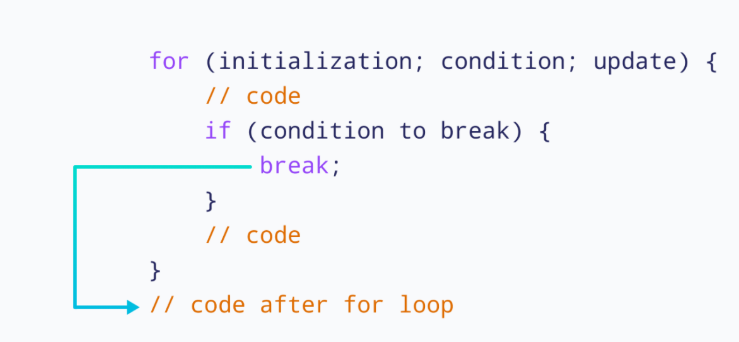
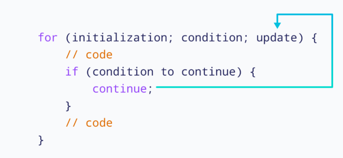

# Основы синтаксиса JavaScript  

После того как вы научились запускать JavaScript-код, необходимо затронуть одну из основных тем - синтаксис JavaScript. JavaScript является C-подобным языком, поэтому многие его конструкции покажутся знакомыми.

Тем не менее, у JavaScript есть немало особенностей и отличий, о которых важно знать с самого начала.

## Сожержание

- [Основы синтаксиса JavaScript](#основы-синтаксиса-javascript)
  - [Сожержание](#сожержание)
  - [Переменные](#переменные)
    - [Определение переменной](#определение-переменной)
    - [Объявление переменной](#объявление-переменной)
    - [Отличия `var` и `let`](#отличия-var-и-let)
      - [Область видимости](#область-видимости)
      - [Поднятие переменных (Hoisting)](#поднятие-переменных-hoisting)
      - [Многократное объявление переменной](#многократное-объявление-переменной)
      - [Влияние области видимости на повторное объявление](#влияние-области-видимости-на-повторное-объявление)
    - [Глобальные переменные](#глобальные-переменные)
  - [Константы](#константы)
  - [Наименование идентификаторов в JavaScript](#наименование-идентификаторов-в-javascript)
    - [Правила наименования идентификаторов](#правила-наименования-идентификаторов)
    - [Нотации при наименовании переменных и функций](#нотации-при-наименовании-переменных-и-функций)
  - [Типы данных](#типы-данных)
    - [JavaScript - динамически типизированный язык](#javascript---динамически-типизированный-язык)
    - [Немного про типы данных](#немного-про-типы-данных)
    - [Тип данных `number`: Числовой тип данных](#тип-данных-number-числовой-тип-данных)
      - [Литералы](#литералы)
      - [Операции](#операции)
      - [Специальные числовые значения](#специальные-числовые-значения)
    - [Тип данных `string`](#тип-данных-string)
      - [Литералы](#литералы-1)
      - [Операции](#операции-1)
    - [Тип данных `boolean`](#тип-данных-boolean)
      - [Литералы](#литералы-2)
    - [Тип данных `undefined`](#тип-данных-undefined)
      - [Литералы](#литералы-3)
    - [Тип данных `Symbol`](#тип-данных-symbol)
    - [Тип данных BigInt](#тип-данных-bigint)
      - [Литералы](#литералы-4)
      - [Операторы](#операторы)
    - [Оператор typeof](#оператор-typeof)
  - [Преобразования типов данных](#преобразования-типов-данных)
    - [Явное преобразование](#явное-преобразование)
      - [Явное преобразование к типу `string`](#явное-преобразование-к-типу-string)
      - [Явное преобразование к типу `number`](#явное-преобразование-к-типу-number)
      - [Явное преобразование к типу `boolean`](#явное-преобразование-к-типу-boolean)
    - [Неявное преобразование](#неявное-преобразование)
      - [Неявное преобразование к `string`](#неявное-преобразование-к-string)
      - [Неявное преобразование к `number`](#неявное-преобразование-к-number)
      - [Неявное преобразование к `boolean`](#неявное-преобразование-к-boolean)
    - [Преобразование логических операндов с использованием `&&` и `||`](#преобразование-логических-операндов-с-использованием--и-)
      - [Оператор \&\& (логическое И)](#оператор--логическое-и)
      - [Оператор || (логическое ИЛИ)](#оператор--логическое-или)
      - [Почему возвращается операнд, а не `true` или `false`](#почему-возвращается-операнд-а-не-true-или-false)
      - [Ленивые вычисления](#ленивые-вычисления)
  - [Операторы](#операторы-1)
    - [Математические операторы](#математические-операторы)
      - [Возведение в степень](#возведение-в-степень)
      - [Оператор взятия остатка от деления](#оператор-взятия-остатка-от-деления)
      - [Унарный плюс](#унарный-плюс)
    - [Операторы сравнения](#операторы-сравнения)
    - [Оператор присваивания](#оператор-присваивания)
    - [Инкремент и Декремент](#инкремент-и-декремент)
    - [Строгое и нестрогое сравнение](#строгое-и-нестрогое-сравнение)
    - [Тернарный оператор](#тернарный-оператор)
    - [Логические операторы и оператор нулевого слияния](#логические-операторы-и-оператор-нулевого-слияния)
  - [Управление потоком выполнения](#управление-потоком-выполнения)
    - [Условные конструкции](#условные-конструкции)
      - [`if`](#if)
      - [`switch`](#switch)
    - [Циклы](#циклы)
      - [`for`](#for)
      - [`while` и `do-while`](#while-и-do-while)
  - [Теперь вы знаете ...](#теперь-вы-знаете-)


## Переменные

### Определение переменной

_Переменные_ - это символические имена, используемые для хранения данных в программировании. Проще говоря, это именованные области памяти компьютера. Например, если в памяти хранится число 6, то для обращения к нему используется имя - переменная.

Переменные можно представить как коробки, в которых хранятся числа, строки или другие значения, чтобы компьютер мог с ними работать: в любой момент получить значение, изменить его и «положить обратно».

<center>


_Рисунок 2.1. Переменная как контейнер данных_

</center>

### Объявление переменной

В JavaScript существует два способа объявления переменной и один способ объявления константы.

Для объявления переменных используются ключевые слова:

- `var`
- `let`

Синтаксис объявления переменной:

```js
// Объявление с помощью var
var x1;
x1 = 3;

// Объявление с помощью let
let x2;
x2 = 3;
```

В обоих случаях сначала создаётся переменная, а затем ей присваивается значение.

При использовании ключевых слов `var` и `let` переменную можно сразу инициализировать - то есть объявить и присвоить значение в одной строке:

```js
var x1 = 3;
let x2 = 4;
```

В JavaScript можно объявлять несколько переменных в одной строке, однако на практике такой подход часто ухудшает читаемость кода.

```js
let user = 'John', age = 22, message = 'Hello';

// Гораздо более читаемым и предпочтительным считается следующий вариант:
let user = 'John';
let age = 22;
let message = 'Hello';
```

> [!NOTE]
>
> Читаемость кода почти всегда важнее его краткости, особенно в учебных и командных проектах.

Хотя способов объявления переменных два, на практике рекомендуется использовать `let`, так как `var` считается устаревшим подходом. Тем не менее `var` по-прежнему используется во многих существующих проектах (legacy-коде).

Далее рассмотрим основные отличия и проблемы, связанные с использованием ключевого слова `var`.

### Отличия `var` и `let`

#### Область видимости

> [!TIP]
>
> _Область видимости_ - это то, где в программе доступна переменная.
>
> Проще говоря, область видимости определяет, в каких местах кода вы можете использовать переменную, а где - уже нет. Если переменная объявлена внутри какого-то блока, функции или конструкции, то за её пределами она может быть недоступна.
>
> Можно представить это как комнату: пока вы находитесь внутри - переменная "видна", вышли за дверь - переменная исчезла.

| var                                                                                                                                          | let                                                                                                                                        |
| -------------------------------------------------------------------------------------------------------------------------------------------- | ------------------------------------------------------------------------------------------------------------------------------------------ |
| Переменные, объявленные с помощью `var`, имеют функциональную область видимости. Они видны во всей функции, даже если объявлены внутри блока | Переменные, объявленные с помощью `let`, имеют блочную область видимости. Они доступны только внутри блока `{}`, в котором были объявлены. |

Пример:

```js
// var
if (true) {
  var a = 1;
}
console.log(a); // a = 1

// let
if (true) {
  let b = 1;
}
console.log(b); // b is not defined
```

#### Поднятие переменных (Hoisting)

> [!TIP]
>
> _Поднятие переменных (Hoisting)_ - это поведение JavaScript, при котором объявления переменных как бы «поднимаются» в начало области видимости ещё до выполнения кода.
>
> Проще говоря, JavaScript сначала просматривает код и запоминает объявления переменных, а уже потом начинает выполнять строки по порядку.

| var                                                               | let                                                                    |
| ----------------------------------------------------------------- | ---------------------------------------------------------------------- |
| Объявление поднимается, переменная доступна до строки объявления. | Объявление поднимается, но переменная недоступна до строки объявления. |
| При обращении до объявления значение равно `undefined`.           | При обращении до объявления возникает `ReferenceError`.                |
| Может приводить к неочевидному поведению.                         | Поведение более строгое и предсказуемое.                               |

Пример:

```js
// var
console.log(a); // a = undefined
var a = 3;
console.log(a); // a = 3

// let
console.log(b); // ReferenceError: Cannot access 'b' before initialization (нельзя использовать b до инициализации)
let b = 3;
console.log(b); // b = 3
```

#### Многократное объявление переменной

| var                                                                                                                                                                                                                 | let                                                                                                                                    |
| ------------------------------------------------------------------------------------------------------------------------------------------------------------------------------------------------------------------- | -------------------------------------------------------------------------------------------------------------------------------------- |
| Ключевое слово `var` позволяет неоднократно объявлять одну и ту же переменную в пределах одного контекста выполнения. Повторное объявление не приводит к ошибке и может незаметно перезаписать значение переменной. | Ключевое слово `let` позволяет объявить переменную только один раз в рамках одного блока кода. Повторное объявление приводит к ошибке. |

```js
// var
var a = 3; // a = 3
var a = 4; // a = 4

// let
let b = 3; // a = 3
let b = 4; // SyntaxError (Переменная b уже была объявлена)
```

#### Влияние области видимости на повторное объявление

Из-за различий в области видимости могут возникать непредвиденные ситуации, особенно при использовании `var`:

```js
// var
var a = 4;

if (true) {
  var a = 3; // перезаписывает переменную `a`
  // `var` не имеет блочной области видимости,
  // поэтому изменение внутри блока влияет на значение за его пределами
}

console.log(a); // 3
```

В этом примере переменная `a`, объявленная внутри блока `if`, перезаписывает значение переменной `a`, объявленной выше. Такое поведение часто приводит к трудноуловимым ошибкам и побочным эффектам.

Для сравнения рассмотрим тот же пример с `let`:

```js
// let
let b = 4;

if (true) {
  let b = 3;
  // Внутри блока `if` b = 3
}

console.log(b); // 4
```

Здесь переменная `b`, объявленная внутри блока, не влияет на значение переменной `b` снаружи, так как `let` ограничен областью блока.

### Глобальные переменные

В JavaScript существует понятие _глобальной переменной_ - это переменная с глобальной областью видимости, то есть доступная из любой части программы.

_Использование глобальных переменных не рекомендуется_, так как они усложняют понимание кода, могут приводить к конфликтам имён и к трудноотлавливаемым ошибкам, особенно в больших и долгоживущих проектах.

Пример:

```js
function func() {
  z = 15;
}

func();
console.log(z); // 15
```

## Константы

Начиная со стандарта ES6, в JavaScript появились константы.

_Константы_ - это именованные значения, которые остаются постоянными в течение выполнения программы. Они объявляются с использованием ключевого слова `const`.

Объявление константы:

```js
const a = 1;

a = 2; // Ошибка: нельзя изменить значение константы
```

По своим свойствам константы во многом похожи на переменные, объявленные с помощью `let`: они имеют блочную область видимости и не поддерживают повторное объявление. Главное отличие заключается в том, что значение константы нельзя переназначить.

> [!TIP]
>
> По своим свойствам константы во многом похожи на переменные, объявленные с помощью `let`: они имеют блочную область видимости и не поддерживают повторное объявление. Главное отличие заключается в том, что значение константы нельзя переназначить.

## Наименование идентификаторов в JavaScript

### Правила наименования идентификаторов

_Идентификатор_ - это имя, которое используется для обозначения переменных, констант, функций и других сущностей в JavaScript.

Идентификаторы в JavaScript могут состоять из:

- Букв (`a–z`, `A–Z`),
- Цифр (`0-9`),
- Символов `_`, `$`.

При этом существуют важные ограничения:

- Идентификатор не может начинаться с цифры.
- Идентификатор не должен совпадать с зарезервированным словом языка, например `for`, `if`, `while`.

> [!NOTE]
>
> В идентификаторах допускается использование Unicode-символов в виде шестнадцатеричных кодов: `\uXXXX` или `\u{n}`. На практике это не используется и не рекомендуется, так как ухудшает читаемость кода.

Примеры допустимых идентификаторов:

```js
const $my_var = 2;
let OK4;
function myFunction() {}
const O\u004B4 = 5; // эквивалентно имени OK4, так как Unicode-код символа \u004B,  соответствует букве K.
```

Примеры недопустимых идентификаторов:

```js
let 1abs; // нельзя, так как идентификатор начинается с цифры
const I*ab; // нельзя, так как содержит недопустимый символ '*'
let for; // нельзя, так как for - зарезервированное слово
```

### Нотации при наименовании переменных и функций

Несмотря на то что переменные можно называть разными способами, существуют рекомендации по их наименованию, которые делают код более читаемым и единообразным.

_Нотация в программировании_ - это набор правил и соглашений, используемых для формирования имён переменных, функций и других сущностей в коде. Например, Camel Case (`myVariable`) и Snake Case (`my_variable`) - распространённые нотации, помогающие поддерживать читаемость и единый стиль кода.

На практике многое зависит от проекта и команды. Однако важно придерживаться одного правила: _если вы начали использовать определённую нотацию - используйте её последовательно во всём коде_.

В JavaScript чаще всего для переменных и функций применяется нотация `camelCase`.

Для констант обычно придерживаются следующих правил:

- Если значение константы известно заранее и не меняется, используется нотация `UPPER_SNAKE_CASE`, например:
  ```js
  const PI = 3.14;
  ```
- Если значение вычисляется во время выполнения программы (например, результат функции), используется нотация `camelCase`, несмотря на то что это константа:
  ```js
  const result = max(1, 4, 5, -5);
  ```

## Типы данных

> [!NOTE]
>
> В этой главе мы кратко рассмотрим основные типы данных в JavaScript, но не будем углубляться в детали, которые на первых порах не так важны и почти не встречаются при написании кода. На начальном этапе вашего пути в JavaScript, не нужно перегружать себя сложными фактами, о которых мы еще успеем поговорить. Давайте сконцентрируемся на том, что встречается чаще всего.

### JavaScript - динамически типизированный язык

JavaScript - _динамически типизированный_ язык программирования.

_Динамическая типизация_ означает, что тип данных переменной определяется автоматически на основе её значения. Переменная может хранить значения разных типов в разное время выполнения программы.

```js
let x = 5; // Переменная x изначально содержит число
x = 'Hello'; // Теперь переменная x содержит строку
x = true; // Теперь переменная x содержит логическое значение
```

В этом примере переменная `x` изменяет свой тип данных в процессе выполнения программы: сначала это число, затем строка и, наконец, логическое значение.

Обратите внимание, что при объявлении переменной тип данных явно не указывается - JavaScript определяет его автоматически, исходя из значения, которое ей присваивается. Этот подход делает язык гибким и удобным, но требует аккуратности, так как тип значения может измениться незаметно для разработчика.

### Немного про типы данных

Типы данных в JavaScript делятся на _примитивные_ и _ссылочные_ (объектные).

Всего стандарт ECMA определяет _8 типов данных_:

- `number` - числовой тип данных (целые и дробные числа).
- `string` - строки, последовательности символов.
- `boolean` - логический тип (`true` или `false`).
- `undefined` - значение переменной, которой ещё не присвоено значение.
- `Symbol` - уникальный и неизменяемый идентификатор.
- `BigInt` - тип для работы с очень большими целыми числами.
- `null` - специальное значение, обозначающее "пусто" или "ничего".
- `object` - сложный тип данных для хранения коллекций значений и более сложных структур.

В данной главе мы рассмотрим только примитивные типы данных и их литералы (6 типов данных). Об объектных типах мы поговорим в отдельной теме, чтобы более детально разобраться в их устройстве и освоить их применение.

> [!TIP]
>
> Вспомним, что такое литерал.
> _Литерал_ - это последовательность символов в исходном коде, которая представляет фиксированное значение определённого типа данных. Например, для типа Number литералом может быть число 5.

### Тип данных `number`: Числовой тип данных

_Числовой тип данных (number)_ - это тип данных, представляющий числовые значения, в формате 64-битного числа двойной точности с плавающей запятой. Данный тип данных определяет еще несколько специальных чисел: бесконечность (`Infinity`) и "не число" (`NaN`), которое мы рассмотрим позже. Этот тип данных также включает несколько специальных значений: `Infinity` - бесконечность, `NaN` (Not a Number) - значение "не число", о котором мы подробнее поговорим позже.

Максимальное целое число, которое может быть точно представлено типом number, равно `2^53 - 1`.

#### Литералы

_Целочисленные литералы_ - это числовые значения, записанные без дробной части. Число может быть представлено в разных системах счисления:

- _Десятичной_ - без префикса,
- _Шестнадцатеричной_ - с префиксом `0x` или `0X`,
- _Восьмеричной_ - с префиксом `0o` или `0O`,
- _Двоичной_ - с префиксом `0b` или `0B`.

Примеры:

```js
let dec = 42; // Десятичное число
let hex = 0x7b; // Шестнадцатеричное число
let oct = 0o173; // Восьмеричное число
let bin = 0b01111011; // Двоичное число
let negative = -55; // Отрицательное число
```

_Литералы вещественных чисел_ используются для представления чисел с дробной частью. В JavaScript такие числа также относятся к типу `number`.

Вещественные числа можно записывать несколькими способами:

- С использованием десятичной точки,
- В научной (экспоненциальной) нотации.

Примеры:

```js
let float1 = 3.14; // Вещественное число
let float2 = 0.5; // Число меньше единицы
let float3 = 0.25; // Допустимая форма записи (0.25)
let float4 = 10; // Допустимая форма записи (10.0)
let scientific = 1.2e3; // Научная запись (1.2 × 10³)
let scientificNeg = 5e-4; // Научная запись (5 × 10⁻⁴)
```

> [!NOTE]
>
> Важно помнить, что из-за особенностей представления чисел с плавающей точкой некоторые арифметические операции могут давать неожиданные результаты - к этому мы ещё вернёмся в дальнейшем.

#### Операции

Как и в большинстве языков программирования, числовой тип данных в JavaScript поддерживает стандартные арифметические операции.

| Операция             | Символ |
| -------------------- | ------ | 
| Сложение             | `+`    |
| Вычитание            | `-`    |
| Умножение            | `*`    |
| Деление              | `/`    |
| Остаток от деления   | `%`    |
| Возведение в степень | `**`   |
| Логические И         | `&&`   |
| Логическое ИЛИ       | `||`   |
| Логическое НЕ        | `!`    |

```js
let a = 3;
let b = 5;

// сложение
a + b;

// вычитание
a - b;

// умножение
a * b;

// деление
a / b;

// возведение в степерь (с ES6)
a ** b; // `a` в степени `b`

// логические операторы
a > b;
a < b;
a === b;
```

> [!NOTE]
>
> Важно отметить один интересный момент: в JavaScript возведение в степень `0` всегда возвращает `1`, независимо от того, что стоит слева - число, строка или другое значение.

#### Специальные числовые значения

Одной из особенностей типа `number` в JavaScript являются так называемые специальные числовые значения:

1. `Infinity` и `-Infinity` - математическая бесконечность. Числовые значения, которые больше (или меньше) любого конечного числа.
2. `NaN` (*N*ot *a* *N*umber - «не число») - появляется в результате операций, которые невозможно корректно выполнить или которые не имеют числового смысла.

```js
console.log(1 / 0);        // Infinity
console.log("a" / 2);     // NaN - деление строки на число невозможно
console.log(Math.sqrt(-1)); // NaN - квадратный корень из отрицательного числа
console.log(0 / 0);       // NaN
console.log(NaN + 2);     // NaN
```

Любая арифметическая операция с `NaN` в результате снова даёт `NaN`. Исключением является возведение в степень `0`: `NaN ** 0 = 1`.

### Тип данных `string`

Тип данных *string* (строки) представляет собой последовательность символов, заключённую в кавычки (одинарные или двойные). Строка может состоять из нуля или более Unicode-символов.

#### Литералы

*Строковый литерал* - это последовательсоть Unicode-символов в парных или одинарных ковычках.

```js
let str1 = "I am string";
let str2 = 'I am also string!';
let char = "a";    // Даже один символ - это строка
let empty = "";    // Пустая строка
```

В стандарте ES6 появились  *шаблонные литералы*. Они записываются с использованием обратных кавычек (`).

```js
let str = `template string`;
```

Одним из главных преимуществ шаблонных литералов является возможность встраивать произвольные выражения с помощью конструкции `${...}`. Выражение внутри фигурных скобок вычисляется в момент создания строки и автоматически преобразуется в строку.

```js
let a = 3;
let b = 5;
const name = "John";

const str = `${a} + ${b} = ${a + b}`;
console.log(str);
console.log(`His name is ${name}`);
```

Шаблонные литералы делают работу со строками более удобной и читаемой, особенно при формировании сложных строк и сообщений.

#### Операции

В JavaScript строки поддерживают несколько основных операций. На начальном этапе нас в первую очередь интересуют *конкатенация* и *сравнение строк*.

*Конкатенация* - это операция объединения строк. В JavaScript для этого используется оператор `+`.

```js
let firstName = "John";
let lastName = "Doe";

let fullName = firstName + " " + lastName;
console.log(fullName); // John Doe
```

Строки в JavaScript можно сравнивать с помощью операторов сравнения: `==`, `===`, `!=`, `!==`, `<`, `>`. При сравнении строк JavaScript сравнивает их лексикографически - по порядку Unicode-кодов символов.

```js
console.log("a" === "a"); // true
console.log("a" === "b"); // false
console.log("5" == 5);    // true (приведение типов)
console.log("5" === 5);   // false (строгое сравнение)
```

> [!TIP]
>
> Про различие операций `===` и `==` будет рассказано в следующих разделах.

### Тип данных `boolean`

Тип данных *boolean* (Булев, Логический тип данных) - это примитивный тип данных в JavaScript, который может принимать только два значения: `true` (истина) или `false` (ложь). Этот тип данных часто используется для условных операций и логических выражений.

#### Литералы

Тип boolean имеет всего два литерала: `true` и `false`.

```js
let flag = false; // false
let result = 8 > 2; // true
```

### Тип данных `undefined`

`undefined` - это примитивный тип данных, который автоматически присваивается переменной в момент её объявления, если ей не было задано значение.

#### Литералы

Тип undefined имеет единственный литерал - значение `undefined`.

```js
let value = undefined;
```

Чаще всего undefined служит сигналом: *значение отсутствует*, но переменная или параметр при этом определены.

### Тип данных `Symbol`

Тип данных `Symbol` в JavaScript представляет собой уникальное и неизменяемые строки, которое используется для создания уникальных идентификаторов.

В основном тип `Symbol` нужен чтобы избежать конфликта имен. 

Пример:

```js
const id = Symbol();

// При необходимости символу можно передать описание - строку, которая используется исключительно для удобства отладки и не влияет на уникальность значения
const userId = Symbol("userId");

// Важно понимать, что описание - это не значение символа, а всего лишь вспомогательная информация. 
// Даже если два символа имеют одинаковое описание, они всё равно остаются разными:
const a = Symbol("test");
const b = Symbol("test");

console.log(a === b); // false
```

### Тип данных BigInt

В JavaScript тип `number`, не может безопасно работать с целыми числами, больше, чем $2^{51} - 1$ ($9007199254740991$) или меньше, чем $-2^{51} - 1$. Для этого рекомендуется использовать тип `BigInt`.

*BigInt* - это числовой тип данных, предназначенный для работы с числами произвольной длины (так называемая '[длинной арифметики](https://en.wikipedia.org/wiki/Arbitrary-precision_arithmetic)'). Проще говоря, `BigInt` позволяет обрабатывать очень большие целые числа, как положительные, так и отрицательные, которые не помещаются в тип `number`.

#### Литералы

Для создания значений типа `BigInt` используются числовые литералы с суффиксом `n`. Этот суффикс указывает JavaScript, что перед ним не обычное число (`number`), а значение типа `BigInt`.

```js
const big1 = 123n;
const big2 = 9007199254740993n; // больше максимального безопасного number
const big3 = -42n;
```

Также значение `BigInt` можно создать с помощью функции `BigInt()`:

```js
const big = BigInt("123456789012345678901234567890");
```

> [!NOTE]
>
> Функция `BigInt()` преобразует числа в тип `BigInt`. Если число большое, то необходимо добавлять суффикс '`n`'.
> 
> Например, для `BigInt(42)` добавлять суффикс не требуется, так как само число 42 не является большим. Однако, для `BigInt( 9978894837590438540990n)` нужно использовать суффикс '`n`', так как само число `9978894837590438540990` превышает максимально безопасное целое значение для типа `number`.

#### Операторы

Для `BigInt` используются те же операторы, что и для типа `number` (`+`, `-`, `*`, `**`, ...), но оба операнда должны быть типа `BigInt`.

```js
let a = BigInt(89584985498589994989909090905498594854);
console.log(a + 8); // Ошибка, потому что JavaScript не может выполнить операцию сложения между значением типа bigint и числом типа number.
```

### Оператор typeof

Для определения типа данных значения в JavaScript используется оператор `typeof`.

Пример:

```js
let x1 = 3;
let x2 = 78798789n;
let x3 = "hello, world";

// Узнаём тип данных переменных
console.log(typeof x1); // "number"
console.log(typeof x2); // "bigint"
console.log(typeof x3); // "string"
```

Оператор `typeof` возвращает тип значения в виде строки. Это удобный способ проверить, с каким типом данных вы работаете в данный момент.

Также существует альтернативный синтаксис оператора `typeof`, напоминающий вызов функции. Он полностью эквивалентен обычному виду, но используется значительно реже:

```js
let x1 = 'hello';
let x2 = 5;
console.log(typeof(x1 + x2)) // "string"
```

## Преобразования типов данных

JavaScript является динамически типизированным языком программирования, поэтому в нём очень легко происходит преобразование типов данных. С одной стороны, это делает язык гибким и удобным, а с другой - создаёт опасную и "скользкую" почву, так как неявные преобразования могут приводить к трудноуловимым ошибкам.

В JavaScript существует всего три базовых вида преобразования типов данных:

- В тип `string`
- В тип `number`
- В тип `boolean` (`true` / `false`)

Типы данных в JavaScript можно преобразовывать *явно*, указывая, к какому типу должно быть приведено значение. Например, строку "2" можно явно преобразовать в число 2. Однако во многих случаях JavaScript выполняет *неявное преобразование типов* автоматически, без явного указания со стороны разработчика. Именно такие неявные преобразования чаще всего становятся источником ошибок и неожиданного поведения программы.

### Явное преобразование

Для явного преобразования одного типа к другому используются функции: `Number(...)`, `String(...)`, `Boolean(...)`.


#### Явное преобразование к типу `string`

Одно из самых простых и предсказуемых преобразований типов - преобразование в тип `string`. Любое значение, приведённое к типу `string`, в результате становится строковым представлением этого значения.

```js
// Приведение `number` к `string`
String(23);      // "23"
String(-25.5);   // "-25.5"
String(NaN);     // "NaN"

// Приведение `undefined` к `string`
String(undefined); // "undefined"
`
// Приведение `boolean` к `string`
String(true);   // "true"
String(false);  // "false"
```

Как думаете, что будет если преобразовать `Infinity` в тип `string`?

#### Явное преобразование к типу `number`

К типу `number` можно преобразовать `string`, если она содержит корректное числовое значение. Также допускается преобразование логического типа `boolean`, где `true` преобразуется в `1`, а false - в `0`.

Во всех остальных случаях результатом преобразования будет значение `NaN`.

```js
// Преобразование строк
Number("42");      // 42
Number("3.14");    // 3.14
Number("hello");   // NaN
Number("-2,5");    // NaN (В JS десятичный разделитель должен быть точкой, а не запятой)

// Преобразование boolean
Number(true);      // 1
Number(false);     // 0

// Другие значения
Number(undefined); // NaN
Number(NaN);       // NaN
```

#### Явное преобразование к типу `boolean`

При приведении значения к типу `boolean` в JavaScript действует простое правило: существует небольшой набор значений, которые преобразуются в `false`. Все остальные значения будут преобразованы в `true`.

Значения, которые дают false:

- `0`
- `NaN`
- `undefined`
- `""` (пустая строка)
- `null`

Все остальные значения при приведении к `boolean` дают `true`.

```js
Boolean(0);        // false
Boolean("");       // false
Boolean(undefined); // false
Boolean(null);     // false
Boolean(NaN);     // false

Boolean(1);        // true
Boolean("hello");  // true
Boolean(100);      // true
Boolean(Infinity); // true
```

### Неявное преобразование

Выше был рассмотрен подход, при котором типы данных преобразуются явно. Этот способ считается наиболее рекомендуемым, так как позволяет избежать множества ошибок. Особенно важно явно приводить типы тогда, когда данные приходят из неизвестного источника.

Однако на практике JavaScript очень часто выполняет неявное преобразование типов самостоятельно. Это означает, что во время выполнения программы значения могут автоматически приводиться к другим типам без явного указания со стороны разработчика. Такое поведение нередко приводит к неожиданным и даже странным результатам, способным сбить с толку даже опытного программиста.

Один из простых примеров:

```js
1 - "2"; // -1
```

В этом случае строка `"2"` неявно преобразуется в число, и операция вычитания выполняется корректно с точки зрения интерпретатора.


#### Неявное преобразование к `string`

Интерпретатор JavaScript приводит значение к типу `string`, если в выражении используется оператор `+` и хотя бы один из операндов является строкой.

Проще говоря, если в выражении есть строка и оператор `+`, второй операнд автоматически будет преобразован в строку.

```js
"2" + 3; // Результат: "23" (3 будет преобразована в строку)
true + ", false" // Результат: true, false (true будет преобразован в строку)
NaN + "3" // Результат: NaN3 (NaN будет преобразован в строку)
```

#### Неявное преобразование к `number`

Интерпретатор JavaScript неявно приводит значения к типу number в следующих случаях:

1. Используются операторы сравнения `>`, `<`, `<=`, `>=`. Перед сравнением значения приводятся к числу (если это возможно).
2. Используются арифметические операции: `-`, `*`, `/`, а также `+`, если ни один из операндов не является строкой.
3. Используется унарный плюс `+`, например `+'2'`, который явно заставляет интерпретатор преобразовать значение в число.
4. Используется оператор нестрогого сравнения `==`, при котором JavaScript пытается привести значения к одному типу перед сравнением.

```js
"8" - 6; // Результат: 2
2 - "3"; // Результат: -1
6 - "-6"; // Результат: 12
2 + true; // true преобразовано в 1, результат: 3
+ "2"; // Результат: 2
"2" >= 2; // "2" будет преобразовано в число -> true
9 == "9"; // "9" будет преобразовано в число -> true

// если один из операндов оператора сложения является строкой, то другой операнд преобразуется в строку, как было рассмотрено ранее.
2 + "3"; // Результат: 23
```

Если преобразование в численный тип невозможно, то результатом будет NaN:

```js
undefined + 2; // Результат: NaN, так как преобразование невозможно
"adf" - 3; // Результат: NaN, так как "adf" невозможно преобразовать в число
```

#### Неявное преобразование к `boolean`

Неявное преобразование к типу boolean происходит в тех местах, где JavaScript ожидает логическое значение. Чаще всего это связано с проверкой условий.

Такое преобразование выполняется, когда:

- Значение используется в условиях (`if`, `else if`).
- Значение используется в циклах (`while`, `for`).
- Значение применяется в логических операциях (`&&`, `||`, `!`).

```js
if (1) {
  // выполнится, так как 1 → true
}

if (0) {
  // не выполнится, так как 0 → false
}

if ("hello") {
  // выполнится, непустая строка → true
}

if ("") {
  // не выполнится, пустая строка → false
}
```

### Преобразование логических операндов с использованием `&&` и `||`

В JavaScript логические операторы `&&` (И) и `||` (ИЛИ) работают не совсем так, как ожидают новички.

Они не обязаны возвращать `true` или `false`. Вместо этого они возвращают одно из значений операндов, которое в последствии будет преобразовано в `boolean` при необходимости.

#### Оператор && (логическое И)

Оператор `&&` возвращает первый ложный (falsy) операнд, а если все операнды истинные - последний операнд.

Проще говоря:

- Если слева `false` → возвращается он.
- Если слева `true` → проверяется следующий.

Примеры: 

```js
true && "hello";   // "hello"
false && "hello";  // false
0 && 5;            // 0
1 && 2 && 3;       // 3
```

Это поведение довольно логично. JavaScript анализирует выражение слева направо. Как известно, при использовании оператора `&&`, если хотя бы один операнд оказывается `false`, всё выражение в целом тоже будет `false`. Поэтому интерпретатор прекращает дальнейшие проверки.

Например, в выражении:

```js
7 && 5 && "" && 3
```

JavaScript сначала проверит `7` - это true, затем `5` - тоже `true`. После этого он дойдёт до пустой строки `""`, которая является `false`. На этом этапе становится понятно, что дальнейшая проверка не имеет смысла, и интерпретатор возвращает значение `""`, не анализируя оставшиеся операнды.

#### Оператор || (логическое ИЛИ)

Оператор `||` возвращает первый истинный (truthy) операнд, а если все операнды ложные - последний операнд.

Проще говоря:

- Если слева `true` → возвращается он.
- Если слева `false` → проверяется следующий.

Примеры: 

```js
false || "hello";   // "hello"
true || "world";    // true
0 || 5;             // 5
null || undefined || "default"; // "default"
```

#### Почему возвращается операнд, а не `true` или `false`

Такое поведение возникает потому, что операторы `&&` и `||` возвращают результат последней выполненной проверки, а не логическое значение `true` или `false`. Это сделано намеренно и активно используется в реальном JavaScript-коде.

Рассмотрим практический пример. Представьте ситуацию: пользователь вводит никнейм в поле `<input />`, и нам нужно проверить, ввёл ли он имя. Если нет - подставить значение по умолчанию.

Классический вариант с использованием `if` может выглядеть так:

```js
// userInput - значение, введённое пользователем

let username;

if (userInput) {
  username = userInput;
} else {
  username = "Гость";
}
```

Этот код работает корректно, но его можно упростить, используя оператор `||`:

```js
const username = userInput || "Гость";
```

В данном примере:

1. Если `userInput` - непустая строка (то есть `true` в логическом контексте), она и будет присвоена переменной username. 
2. Если же `userInput` пустая строка, `null` или `undefined`, оператор `||` вернёт значение `"Гость"`.

Другие примеры будут показаны по ходу изучения материала. Это действительно удобная и часто используемая особенность JavaScript.

*Попробуйте сами определить, какой будет результат у следующих выражений*:

```js
"Hello" && "World";
NaN || undefined;
undefined || NaN;
undefined || (1 && "Hello") && true || (NaN && 0)
```

#### Ленивые вычисления

Поскольку JavaScript проверяет логические выражения постепенно, слева направо, это в некотором смысле оптимизирует выполнение кода: интерпретатор не всегда вычисляет выражение целиком.  

*Ленивые вычисления (lazy evaluation)* - это техника, при которой вычисление выражения прекращается, как только дальнейшая проверка становится бессмысленной.

Например, в выражении:

```js
A || B
```

если значение `A` приводится к `true`, JavaScript не будет вычислять `B`, так как результат всего выражения уже определён - `true`.

Аналогично, в выражении:

```js
A && B
```

если `A` приводится к `false`, проверка `B` также не выполняется.

## Операторы

Большинство операторов вам уже знакомы из курса по основам программирования, поэтому в данной главе мы не будем подробно останавливаться на базовых операторах. Вместо этого рассмотрим некоторые менее очевидные и нестандартные операторы JavaScript.

> [!TIP]
>
> Вспомним два основополагающих термина.
>
> *Оператор* в программировании - это символ или ключевое слово, которое выполняет операцию над одним или несколькими операндами и возвращает результат.
>
> *Операнды* - это значения или выражения, над которыми выполняется операция.
>
> Например, в выражении `5 + 3` оператор `+` выполняет операцию сложения над операндами `5` и `3`.

### Математические операторы

В настоящее время стандартом определены следующие математиеческие операторы:

- Сложение `+`
- Вычитание `-`
- Умножение `*`
- Деление `/`
- Возведение в степень `**`
- Взятие остатка от деления `%`

Операторы сложения, вычитания, умножения и деления являются базовыми и очень распространёнными, их работу мы не будем подробно рассматривать.

#### Возведение в степень

Одним из нестандартных операторов является оператор возведения в степень. Оператор был добавлен в стандарте EcmaScript 2016 (ES7).

Пример:

`2 ** 3` => $2^3$

`3 ** 4` => $3^4$

`9 ** (1/2)` => $9^{1/2}$ (или $\sqrt{9}$)

#### Оператор взятия остатка от деления

*Оператор взятия остатка от деления*, также присутствующий в C и C++, представляет собой математическую операцию, которая возвращает остаток от деления одного числа на другое.

```js
5 % 2; // Результат: 1
6 % 8; // Результат: 6
```

#### Унарный плюс

Один из менее очевидных операторов в JavaScript - унарный плюс. Если применить его к числу, он ничего не изменяет:

```js
+5; // Результат: 5
```

Однако на практике унарный плюс чаще всего используется для преобразования значения в число. В этом смысле он является краткой альтернативой функции `Number()`.

Пример:

```js
let age = "22";
console.log(+age); // 22
```

Здесь строка `"22"` неявно преобразуется в числовое значение `22`.

### Операторы сравнения

Операторы сравнения используются для сравнения двух значений и возвращают логическое значение `true` или `false` в зависимости от результата сравнения.

- `>` (больше)
- `<` (меньше)
- `>=` (больше или равно)
- `<=` (меньше или равно)
  
> [!NOTE]
> 
> Операторы равенства будут рассмотрены отдельно ниже, так как в JavaScript они имеют ряд важных особенностей.

### Оператор присваивания

Оператор присваивания (`=`) используется для присваивания значения переменной. Например, в выражении `x = 5;` оператор `=` присваивает переменной `x` значение `5`.

Важно помнить, что оператор присваивания возвращает присвоенное значение. Благодаря этому он может участвовать в более сложных выражениях.

```js
let x = 10;
let y = (x = 5); // переменной x присваивается 5,
                 // результат операции (5) возвращается и присваивается y

console.log(y); // 5
console.log(x); // 5
```

Из-за того, что оператор присваивания возвращает значение, возможны *цепочки присваиваний*:

```js
let x, y, z, w;
x = y = z = w = 2 + 2;

// x = 4, y = 4, z = 4, w = 4
// присваивание выполняется справа налево
```

### Инкремент и Декремент 

*Инкремент и декремент* - это унарные операторы, используемые для увеличения или уменьшения значения переменной на `1`.

- *Инкремент* (`++`) увеличивает значение переменной на `1`.
- *Декремент* (`--`) уменьшает значение переменной на `1`.

Примеры:

```js
let x = 5;
x++; // x становится равным 6 (инкремент)
console.log(x); // 6

let y = 10;
y--; // y становится равным 9 (декремент)
console.log(y); // 9
```

Инкремент и декремент могут использоваться в *префиксной* и *постфиксной* формах.


*Префиксная форма* - сначала изменяет значение, затем возвращает его:

```js
let a = 5;
let b = ++a; // сначала увеличиваем a на 1, затем присваиваем b

// a = 6
// b = 6
```

*Постфиксная форма* - сначала возвращает текущее значение, затем изменяет его:

```js
let c = 5;
let d = c++; // сначала присваиваем d значение c, затем увеличиваем c на 1

// c = 6
// d = 5
```

### Строгое и нестрогое сравнение

В JavaScript важную роль играют операторы строгого (`===`, `!==`) и нестрогого (`==`, `!=`) сравнения. Они часто встречаются в языках с динамической типизацией, где существует необходимость явно контролировать, сравниваются ли только значения или значения вместе с их типами данных.

*Строгое сравнение* (`===` и `!==`) *сравнивает и значение, и тип данных операндов*. Это означает, что два значения считаются равными только в том случае, если они:

- имеют одинаковый тип данных;
- имеют одинаковое значение.

*Нестрогое сравнение* (`==` и `!=`) *сравнивает только значения, игнорируя тип данных*. Перед сравнением JavaScript пытается привести операнды к одному типу, что может приводить к неожиданным результатам.

```js
console.log(5 === 5); // true (строгое сравнение чисел)
console.log(5 === "5"); // false (строгое сравнение числа и строки)
console.log(5 == "5"); // true (нестрогое сравнение числа и строки, значения могут быть приведены к одному типу)
console.log(5 !== "5"); // true (строгое сравнение числа и строки)
console.log(5 != "5"); // false (нестрогое сравнение числа и строки, значения могут быть приведены к одному типу)
```

Из-за неявного преобразования типов операторы нестрогого сравнения могут вести себя непредсказуемо. Поэтому *на практике рекомендуется использовать строгое сравнение* (`===`), а нестрогое применять только в тех случаях, когда вы чётко понимаете, что именно происходит.

### Тернарный оператор

*Тернарный оператор (? :)* - это компактная форма условного выражения `if ... else`, которая позволяет выбрать одно из двух значений в зависимости от условия. Данный оператор является единственным оператором в JavaScript, который содержит три операнда.

Общий синтаксис:

```js
условие ? значение_если_истина : значение_если_ложь;
```

Если условие истинно, возвращается первое значение, иначе - второе.

Пример:

```js
const age = 18;
const message = age >= 18 ? "Совершеннолетний" : "Несовершеннолетний";

console.log(message);
```

> [!NOTE]
>
> Тернарный оператор часто используется для коротких и простых условий. Однако не рекомендуется применять его для сложной логики или вкладывать несколько тернарных операторов друг в друга, так как это ухудшает читаемость кода.

### Логические операторы и оператор нулевого слияния

Основные логические операторы, такие как:

- `&&` (И),
- `||` (ИЛИ),
- `!` (НЕ),

вам уже знакомы.

Однако в JavaScript существует ещё один менее очевидный оператор - оператор нулевого слияния `??`.

Оператор `??` возвращает правый операнд, если левый операнд равен `null` или `undefined`. Во всех остальных случаях он возвращает левый операнд.


```js
// Пример №1
const defaultColor = "blue";
const userPreferredColor = undefined;

// Если пользователь не выбрал цвет (undefined),
// используется значение по умолчанию
const color = userPreferredColor ?? defaultColor;

console.log(color); // "blue"

// Пример №2
const age = 18;

age ?? console.log("Ваш возраст не указан!");
// Так как age не равен null или undefined,
// правая часть выражения не выполняется
```

> [!TIP]
> Оператор `??` часто используется для задания значений по умолчанию и выгодно отличается от `||`, так как не считает значения `0`, `false` или пустую строку ошибочными

## Управление потоком выполнения

*Управление потоком выполнения* - это концепция, позволяющая программно контролировать порядок выполнения инструкций в программе. Проще говоря, речь идёт об условных конструкциях и циклах.

Эти понятия вам уже знакомы из курса по основам программирования, поэтому в данном главе мы быстро их вспомним и систематизируем, прежде чем двигаться дальше.

### Условные конструкции

#### `if`

Инструкция `if` используется для выполнения определённого блока кода, если указанное условие истинно.

Общий синтаксис:

```js
if (условие) {
  // Блок кода, который будет выполнен, если условие истинно
}
```

Пример:

```js
const age = 18;

if (age >= 18) {
  alert("Поздравляю, вам есть 18 лет!");
}
```

Как уже упоминалось ранее, условие в инструкции `if` неявно приводится к типу boolean. Поэтому допускается использование значений, которые в логическом контексте интерпретируются как `true` или `false`.

```js
let userAge = undefined; // Предположим, что прользователь не ввел свой возраст

// В данном случае не обязательно писать userAge !== undefined
if (!userAge) {
  // ...
}
```

В этом примере условие сработает, если `userAge` имеет значение `undefined`, `null`, пустую строку или другое falsy-значение.

Как и в других языках программирования, в JavaScript присутствуют конструкции `else` и `else if`. Блок `else` в инструкции `if` позволяет выполнить определённый участок кода в том случае, если условие в `if` оценивается как ложное.

```js
const age = 18;
if (age < 18) {
    alert("Вы несовершеннолетний");
} else if (age >= 18 && age < 21) {
    alert("Вы совершеннолетний, но еще не достигли совершеннолетия по закону.");
} else {
    alert("Вы точно совершеннолетний.");
}
```

#### `switch`

Оператор `switch` в JavaScript используется для выбора одного из нескольких вариантов выполнения кода в зависимости от значения выражения. Он часто применяется как более наглядная альтернатива длинной цепочке `if ... else if ... else`.

Общий синтаксис:

```js
switch (выражение) {
  case значение1:
    // Код, выполняемый при совпадении с значение1
    break;
  case значение2:
    // Код, выполняемый при совпадении с значение2
    break;
  // ...
  default:
    // Код, выполняемый, если ни одно значение не совпало
}
```

JavaScript сравнивает значение выражения с каждым case строгим сравнением (`===`). Как только найдено совпадение, выполняется соответствующий блок кода.

Пример:

```js
let age = 18;
switch (age) {
    case 1:
        alert("Вам всего годик!");
        break;
    case 10: 
        alert("Вам уже 10! Юбилей!");
        break;
    default:
        alert("Вы нам не подходите, вам не годик и не 10 лет!");
}
// будет выведено: Вы нам не подходите, вам не годик и не 10 лет!
```

Ключевое слово `break` используется для выхода из конструкции `switch`. Если его опустить, выполнение продолжится дальше - к следующему `case`. Такое поведение называется проваливанием (*fall-through*) и иногда используется намеренно, но чаще всего приводит к ошибкам, если о нём забыть.

```js
let fruit = "apple";
let message = "";

switch (fruit) {
  case "banana":
    message += "It's a banana";
  case "apple":
    message += "It's an apple"; // При совпадении с "apple" выполнится этот код...
  case "orange":
    message += "It's an orange"; // ...и этот код...
  default:
    message += "Unknown fruit"; // ...и этот код тоже
}

console.log(message); // Результат: "It's an appleIt's an orangeUnknown fruit"
```

### Циклы

#### `for`

Один из самых распространённых циклов в программировании - `for`. Существует даже теория, что при желании можно программировать, используя только его. Более того, в языке Go действительно присутствует только один цикл - `for`.

*Цикл `for`* позволяет выполнять один и тот же блок кода заданное (N-ое) количество раз.

Общий синтаксис:

```js
for (инициализация; условие; шаг) {
  // Тело цикла
}
```

Где:

- *инициализация* - выполняется один раз перед началом цикла;
- *условие* - проверяется перед каждой итерацией; если оно ложно, цикл завершается;
- *шаг* - выполняется после каждой итерации цикла.

Пример:

```js
// Вывод на экран значений от 0 до 10

const MAX_VALUE = 10;

for (let i = 0; i <= MAX_VALUE; i++) {
    console.log(i);
}
```

Вместе с циклом `for` часто используются ключевые слова `break` и `continue`.

- `break` используется для немедленного завершения цикла и перехода к инструкции, следующей после цикла.
  
  

  _Рисунок 2.2. Использование клювевого слова break_

- `continue` используется для пропуска текущей итерации цикла и перехода к следующей итерации.

  

  _Рисунок 2.3. Использование клювевого слова continue_

Пример использования ключевого слова `break`:

```js
// Задача: найти первый нечетный элемент массива
const arr = [4, 4, 8, 9, 3];
let firstOdd;

// Вариант без использования break.
let flag = true; //  Переменная-флаг, чтобы найти только первый нечетный элемент
for (let i = 0; i < 5; i++) {
    if (arr[i] % 2 !== 0) {
        if (flag) { // Если первый нечетный элемент еще не найден
            firstOdd = arr[i]; // Присвоить первый нечетный элемент переменной firstOdd
            flag = false; // Пометить, что первый нечетный элемент найден
        }
    }
}

// Вариант с использованием break.
for (let i = 0; i < 5; i++) {
    if (arr[i] % 2 !== 0) {
        firstOdd = arr[i]; // Присвоить первый нечетный элемент переменной firstOdd
        break; // Прервать выполнение цикла, так как первый нечетный элемент уже найден
    }
}
```

Использование break делает код проще, короче и понятнее, так как цикл сразу завершается, когда цель достигнута.

Пример использования ключевого слова `continue`:

```js
// Задача: вывести в консоль только чётные числа из массива.

const numbers = [1, 2, 3, 4, 5, 6];

for (let i = 0; i < numbers.length; i++) {
  if (numbers[i] % 2 !== 0) {
    continue; // Пропускаем нечётные числа
  }

  console.log(numbers[i]); // Выводятся только чётные
}
```

В этом примере при встрече нечётного числа выполнение текущей итерации прекращается, и цикл сразу переходит к следующей.

Также в цикле `for` можно пропускать отдельные части конструкции. Все три части (инициализация, условие, шаг) являются необязательными.

```js
// Пропуск части 'инициализация'
let i = 0;
for (; i < 5; i++) {
  console.log(i);
}

// Пропуск части "шаг"
let j = 0;
for (; j < 5;) {
  console.log(j);
  j++;
}

// Пропуск части "условие"
// Условие проверяется внутри тела цикла
for (let k = 0; ; k++) {
  if (k >= 5) {
    break;
  }
  console.log(k);
}

// Пропуск всех частей
for (;;) {
  // Бесконечный цикл
  // Все части цикла опущены, поэтому условие считается всегда истинным
  // Такой подход используется, например, для:
  // - ожидания пользовательского ввода
  // - работы серверов
  // - бесконечных игровых циклов
}
```

#### `while` и `do-while`

В JavaScript существуют ещё два цикла - `while` и `do...while`. Они используются реже, чем `for`, но в некоторых ситуациях оказываются более удобными.

Цикл `while` выполняет блок кода до тех пор, пока указанное условие остаётся истинным. Условие проверяется перед каждой итерацией.

Общий синтаксис:

```js
while (condition) {
  // Тело цикла
}
```

Пример:

```js
let i = 0;

while (i <= 5) {
  console.log(i);
  i++;
}
```

Если условие сразу ложно, тело цикла не выполнится ни разу.

Цикл `do...while` похож на `while`, но с одним важным отличием: *условие проверяется после выполнения тела цикла*. Это гарантирует, что тело цикла выполнится как минимум один раз.

Общий синтаксис:

```js
do {
  // Тело цикла
} while (condition);
```

```js
let count = 0;

// Даже если условие изначально ложно, код внутри do всё равно выполнится один раз.
do {
  console.log("Count is: " + count);
  count++;
} while (count < 5);
```

## Теперь вы знаете ...

1. Как объявлять переменные и константы в JavaScript, в чём разница между `var`, `let` и `const`, и почему на практике рекомендуется использовать `let` и `const`.
2. Что такое область видимости и поднятие переменных (hoisting), какие проблемы может вызывать var, и почему блочная область видимости делает код более предсказуемым.
3. Какие типы данных существуют в JavaScript, чем примитивные типы отличаются от объектных, и как работают `number`, `string`, `boolean`, `undefined`, `Symbol` и `BigInt`
4. Как работают литералы, включая числовые, строковые, шаблонные и BigInt-литералы, и зачем они нужны в реальном коде.
5. Как определять и преобразовывать типы данных, в чём разница между явным и неявным преобразованием, и почему неявные преобразования считаются опасными.
6. Как работают логические операторы `&&`, `||` и `??`, почему они возвращают операнды, а не `true` или `false`, и что такое ленивые вычисления.
7. Какие операторы существуют в JavaScript, включая арифметические, логические, операторы сравнения, присваивания, инкремента, декремента и тернарный оператор.
8. Как управлять потоком выполнения программы, используя условные конструкции (`if`, `else`, `switch`) и циклы (`for`, `while`, `do...while`), а также ключевые слова break и continue.