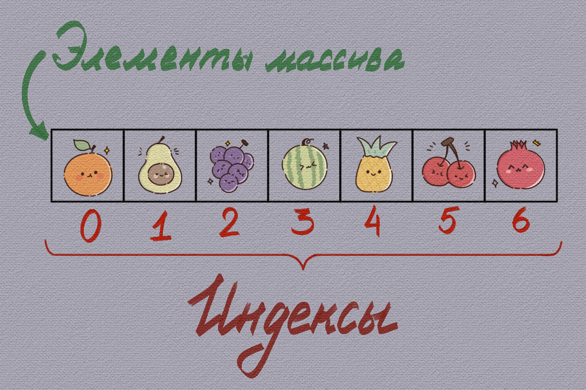

# Массивы в JavaScript

## Содержание

- [Массивы в JavaScript](#массивы-в-javascript)
  - [Содержание](#содержание)
  - [Что такое массив?](#что-такое-массив)
  - [Массивы в JavaScript](#массивы-в-javascript-1)
    - [Определение массива](#определение-массива)
    - [Объявление массива](#объявление-массива)
    - [Динамическая «природа» массива](#динамическая-природа-массива)
    - [Доступ к элементам массива](#доступ-к-элементам-массива)
    - [Добавление элементов в массив](#добавление-элементов-в-массив)
      - [Добавление элементов с помощью индекса](#добавление-элементов-с-помощью-индекса)
      - [Добавление элементов с помощью специальных методов](#добавление-элементов-с-помощью-специальных-методов)
      - [Длина массива](#длина-массива)
  - [Деструктуризация массивов и оператор расширения](#деструктуризация-массивов-и-оператор-расширения)
    - [Что такое деструктуризация?](#что-такое-деструктуризация)
    - [Деструктуризация в JavaScript](#деструктуризация-в-javascript)
      - [Использование деструктуризации](#использование-деструктуризации)
      - [Пропуск элементов при деструктуризации](#пропуск-элементов-при-деструктуризации)
      - [Остаточные параметры](#остаточные-параметры)
    - [Значения по умолчанию](#значения-по-умолчанию)
    - [Примеры использования деструктуризации массивов](#примеры-использования-деструктуризации-массивов)
      - [Пример 1. Генерация массива случайных чисел заданной длины](#пример-1-генерация-массива-случайных-чисел-заданной-длины)
      - [Пример 2. Вычисление суммы и среднего арифметического чисел](#пример-2-вычисление-суммы-и-среднего-арифметического-чисел)
      - [Пример 3. Реализация стэка с помощью массива](#пример-3-реализация-стэка-с-помощью-массива)
  - [Rest и Spread оператор (`...`)](#rest-и-spread-оператор-)
    - [Rest оператор](#rest-оператор)
    - [Оператор расширения](#оператор-расширения)
      - [При вызове функции](#при-вызове-функции)
      - [Создание массива с помощью литерала](#создание-массива-с-помощью-литерала)
  - [Устройство массива в JavaScript](#устройство-массива-в-javascript)
    - [Хранение в памяти](#хранение-в-памяти)
    - [Свойство length](#свойство-length)
    - [Массив как ссылочный тип данных](#массив-как-ссылочный-тип-данных)
    - [Объявления массива с помощью const](#объявления-массива-с-помощью-const)
  - [Теперь вы знаете ...](#теперь-вы-знаете-)

## Что такое массив?

Перед тем как приступить к изучению массивов в JavaScript, имеет смысл напомнить, что такое массив в целом и зачем он используется в программировании.

_Массив_ - это структура данных, представляющая собой упорядоченный набор элементов, к каждому из которых можно обратиться по числовому *индексу*. Индексация, как правило, _начинается с нуля_. Элементами массива могут быть значения любого типа данных: числа, строки, логические значения, объекты и даже другие массивы.



_Рисунок 5.1. Массив как упорядоченный набор элементов_

Если попытаться провести аналогию с реальным миром, массив можно представить как контейнер, ящик или полку с пронумерованными ячейками. В каждой ячейке лежит некоторое значение, и по номеру ячейки мы всегда можем быстро получить доступ к нужному элементу.

В программировании массивы решают сразу несколько важных задач:

- _Группировка данных_. Вместо множества отдельных переменных используется одна структура. Например, вместо переменных `let car1 = 'Toyota'; let car2 = 'Honda'; let car3 = 'Ford';` можно создать массив `let cars = ['Toyota', 'Honda', 'Ford'];`.
- _Упорядоченное хранение_. Элементы массива располагаются в строго определённой последовательности.
- _Удобный доступ_. К любому элементу можно обратиться по его индексу.
- _Работа с наборами данных_. Массивы позволяют выполнять операции сразу над несколькими значениями, например перебирать их, фильтровать или изменять.

Без массивов невозможно представить работу с коллекциями данных: списками пользователей, набором чисел, результатами запросов или элементами интерфейса.

## Массивы в JavaScript

### Определение массива

_Массивы в JS_ - это специальные объекты, которые представляют собой упорядоченные списки элементов, индексированные числовыми значениями (о том, что такое объекты, мы поговорим немного позже).

### Объявление массива

В JavaScript существует _два основных способа объявить массив_: с помощью литерала массива `[]` и с помощью конструктора `Array`.

```js
// Объявление с помощью литерала массива
let arr = [];

// Объявление с помощью конструктора
let arr = new Array();
```

> [!NOTE]
>
> Оба варианта корректны, однако на практике почти всегда для объявления массивов используется литерал `[]`. Этот способ считается стандартом и рекомендуется к применению в большинстве случаев.

Инициализация массива значениями может выглядит следующим образом:

```js
// Инициализация  с помощью литерала массива
let arr = [1, 2, 3, 4];

// Инициализация  с помощью конструктора
let arr = new Array(1, 2, 3, 4);
```

Когда элементы массива имеют большую длину (например, строки), принято записывать каждый элемент с новой строки. Это повышает читаемость кода и упрощает его сопровождение:

```js
const users = [
  "Gilbert",
  "Marry",
  "Daniela",
  "Mark?", // Запятая после последнего элемента упрощает добавление и удаление элементов
];
```

### Динамическая «природа» массива

Важно отметить, что поскольку JavaScript является динамически типизированным языком программирования, массивы в нём могут содержать элементы разных типов данных одновременно.

```js
let arr = [1, "string", undefined, function (a, b) { return a + b; }];
```

В этом массиве хранятся: число, строка, значение `undefined`, функция. При этом функция - это такое же значение, как и остальные элементы массива, поэтому её можно вызвать по индексу: `arr[3](1, 2);`

Однако, несмотря на такую гибкость языка, _подобное использование массивов крайне не рекомендуется_. Массивы, содержащие элементы разных типов, плохо читаются, сложнее обрабатываются и чаще приводят к ошибкам.

### Доступ к элементам массива

Для доступа к элементам массива используются квадратные скобки `[]`. Этот механизм универсален и работает одинаково во всех основных языках программирования, включая JavaScript.

```js
let users = ["John", "Peter", "Kate", "Mary"];

console.log(users[0]); // John
console.log(users[3]); // Mary
```

> [!TIP]
>
> Важно помнить, что нумерация элементов массива начинается с нуля. Первый элемент всегда имеет индекс `0`, второй - `1` и так далее.

Элементы массива можно не только читать, но и изменять, обращаясь к ним по индексу:

```js
let users = ["John", "Peter", "Kate", "Mary"];

users[1] = "Mark?";

console.log(users[1]); // "Mark?"
```

Доступ к элементам массива считается безопасной операцией. Если попытаться обратиться к элементу, которого не существует, JavaScript не выбросит ошибку, а вернёт значение `undefined`. Это поведение удобно, но требует внимательности: отсутствие ошибки не означает, что значение корректно. При работе с массивами важно осознанно проверять существование элементов, особенно в более сложных сценариях.

```js
let users = ["John", "Kate"];

console.log(users[3]); // undefined
console.log(users[123]); // undefined
```

### Добавление элементов в массив

Существует два основных способа добавить элементы в массив:

1. через явное указание индекса,
2. с помощью специальных методов массива.

#### Добавление элементов с помощью индекса

Первый способ заключается в прямом обращении к ячейке массива по индексу и присваивании ей значения.

```js
let arr = [1, 2, 3]; // Массив из трёх элементов: 1, 2, 3

arr[3] = 4;
console.log(arr); // [1, 2, 3, 4]

arr[4] = 6;
console.log(arr); // [1, 2, 3, 4, 6]
```

Технически такой способ работает, но он считается неудачным с точки зрения практики. Основная проблема заключается в том, что легко ошибиться с индексом и: добавить элемент не туда, куда ожидалось, создать "дыры" (пустые элементы) внутри массива.

Пример:

```js
let arr = [1, 2, 3];
arr[4] = 4;

console.log(arr); // [1, 2, 3, <1 empty item>, 4]
```

#### Добавление элементов с помощью специальных методов

Гораздо более надёжный и распространённый способ - использование встроенных методов массива.

Для добавления элементов в конец массива применяется метод `push()`:

```js
let arr = [1, 2, 3];

arr.push(8, 7); // добавляет элементы 8 и 7 в конец массива
console.log(arr); // [1, 2, 3, 8, 7]
```

Для добавления элементов в начало массива используется метод `unshift()`.

```js
let arr = [1, 2, 3];
arr.unshift(8, 7); // добавить в начало массива элементы 8, 7
console.log(arr); // [8, 7, 1, 2, 3]
```

Использование методов `push()` и `unshift()` предпочтительнее, так как они: не требуют ручного управления индексами, не создают пустых элементов, делают код более очевидным.

#### Длина массива

Для получения количества элементов в массиве используется свойство `length`. Это значение автоматически обновляется при добавлении или удалении элементов.

```js
let arr = [22, 38, 18, 223];
console.log(arr.length); // 4
```

Одно из самых распространённых применений `length` - перебор массива с помощью цикла `for`:

```js
const arr = [1, 2, 3, 4];

for (let i = 0; i < arr.length; i++) {
  console.log(arr[i]);
}
```

## Деструктуризация массивов и оператор расширения

### Что такое деструктуризация?

Перед тем как понять, что такое деструктуризация массивов, важно разобраться с самой природой слова "_деструктуризация_". Понимание этого концепта поможет вам легче усвоить, что именно происходит при деструктуризации в JavaScript.

Слово "деструктуризация" происходит от латинского корня "_de-_", который означает "_разъединение_" или "_разрушение_". Иначе говоря, Другими словами, это процесс разъединения или разрушения какой-либо структуры.

Например, вы купили красивый букет цветов, а затем достаёте из него отдельные цветы, чтобы использовать их дальше - для нового, более креативного букета или для украшения дома. В этом случае вы, по сути, _деструктуризируете букет_: была структура - букет, теперь эта структура разбита на отдельные части.


_Рисунок 5.2. Деструктуризация букета цветов_

Если вспомнить химию, ситуация похожая. Сложное соединение можно разложить на более простые элементы или компоненты, каждый из которых затем используется отдельно.

### Деструктуризация в JavaScript

_Деструктуризация_ (или _деструктурирующее присваивание_) - это процесс извлечения данных из структуры (массива, объекта или другого составного типа данных) и присваивания их отдельным переменным. Проще говоря, у нас есть структура - массив, и мы "достаём" его элементы в отдельные переменные.

#### Использование деструктуризации

Синтаксически деструктуризация массива выполняется с помощью: квадратных скобок `[]` в _левой части присваивания_, где перечисляются переменные, в которые будут помещены значения элементов массива, а _в правой части указывается массив_ (или выражение, возвращающее массив), из которого извлекаются значения.

Рассмотрим массив `["Hello", "World"]`. Допустим, мы хотим его деструктуризировать, то есть поместить элементы массива в отдельные переменные: строку `"Hello"` -> в переменную `hello`, а строку `"World"` -> в переменную `world`.

```js
const arr = ["Hello", "World"];

// Деструктуризация массива:
// значение "Hello" присваивается переменной hello,
// а значение "World" - переменной world
const [hello, world] = arr;

console.log(hello); // Hello
console.log(world); // World
```

После этого мы можем использовать переменные `hello` и `world` в коде так же, как любые другие значения.

> [!NOTE]
>
> Важно понимать, что деструктуризация не изменяет и не удаляет массив. После этой операции массив `arr` остаётся доступным и может использоваться дальше без каких-либо ограничений.

Деструктуризацию можно применять не только при объявлении переменных, но и в любом другом месте программы, где допускается операция присваивания.

```js
let a, b;
let arr = [1, 2, 3];
[a, b] = arr;
console.log(a, b); // 1 2
```

Кстати, с помощью деструктуризации существует удобный "лайфхак", позволяющий быстро поменять значения переменных местами, без использования временной переменной.

```js
let a = 3;
let b = 4;

// Меняем значения переменных местами с помощью деструктуризации.
// В этой строке создаётся новый массив из двух элементов:
// - первый элемент - значение переменной b
// - второй элемент - значение переменной a
// В результате переменная a получает значение b,
// а переменная b - значение a.
[a, b] = [b, a];

console.log(a, b); // 4 3
```

Этот приём часто используется на практике, так как он лаконичен, нагляден и избавляет от необходимости объявлять дополнительную временную переменную

#### Пропуск элементов при деструктуризации

Если вам требуется извлечь только первые `N` элементов массива, при деструктуризации достаточно указать соответствующее количество переменных. _Все остальные элементы массива при этом будут проигнорированы_.

```js
const arr = [1, 2, 3, 4, 5];
const [a, b, c] = arr;
console.log(a, b, c); // 1 2 3
```

Если нужно пропустить конкретные элементы при деструктуризации, это можно сделать с помощью дополнительных запятых, не указывая переменные для ненужных значений.

```js
const arr = ["Andrei", "Ivanov", 23];

// Пропускаем второй элемент массива
const [name, , age] = arr;

console.log(name); // Andrei
console.log(age); // 23
```

Такой подход позволяет извлекать только те элементы массива, которые действительно нужны, не создавая лишних переменных и не изменяя сам массив.

#### Остаточные параметры

При изучении функций мы уже рассматривали суть остаточных параметров, здесь используется тот же самый принцип.

Если нам нужно получить первые `N` элементов массива, а все остальные собрать в отдельный массив, можно воспользоваться оператором `...` (spread-оператором) при деструктуризации.

```js
const arr = [1, 2, 3, 4, 5, 6, 7];

let [a, b, ...other] = arr;

console.log(a, b); // 1 2
console.log(other); // [3, 4, 5, 6, 7]
```

В этом примере переменные `a` и `b` получают первые элементы массива, а переменная `other` содержит массив из всех оставшихся значений, сохраняя их исходный порядок.

### Значения по умолчанию

Если при деструктуризации массива мы пытаемся извлечь элемент, которого не существует, в соответствующую переменную будет записано значение `undefined`.

```js
const user = ["Alexey"];

const [name, surname] = user; // значения по умолчанию не заданы

console.log(name); // Alexey
console.log(surname); // undefined
```

Чтобы избежать появления `undefined`, можно указать _значения по умолчанию_ прямо в синтаксисе деструктуризации.

```js
const user = ["Alexey"];

// Деструктуризация массива user:
// - первый элемент присваивается переменной name
// - второй элемент - переменной surname
// Если элемент отсутствует, используется значение по умолчанию
const [name = "Guest", surname = "Unknown"] = user;

console.log(name); // Alexey
console.log(surname); // Unknown
```

Такой подход особенно полезен, когда структура массива заранее неизвестна или может быть неполной, и вы хотите обеспечить корректные значения переменных в любом случае.

### Примеры использования деструктуризации массивов

#### Пример 1. Генерация массива случайных чисел заданной длины

```js
/**
 * Генерирует массив случайных чисел заданной длины.
 * @param {number} length - Длина массива случайных чисел.
 * @returns {number[]} - Массив случайных чисел.
 */
function getRandomNumbers(length) {
    const numbers = [];
    for (let i = 0; i < length; i++) {
        numbers.push(Math.random());
    }
    return numbers;
}

const [firstNumber, secondNumber, thirdNumber] = getRandomNumbers(3);
console.log(firstNumber, secondNumber, thirdNumber); // выводит три случайных числа
```

#### Пример 2. Вычисление суммы и среднего арифметического чисел

```js
/**
 * Вычисляет общую и среднюю суммы переданных числовых аргументов.
 * @param {...number} nums - Числовые аргументы.
 * @returns {number[]} - Массив, содержащий общую и среднюю суммы.
 */
function calculateSumAndAverage(...nums) {
    // Вычисление суммы
    const totalSum = nums.reduce((acc, curr) => acc + curr, 0);

    // Вычисление среднего арифметического
    const average = totalSum / nums.length;

    return [totalSum, average];
}

const [total, avg] = calculateSumAndAverage(10, 20, 30, 40, 50);
// Вывод: Total sum: 150, Average: 30
console.log(`Total sum: ${total}, Average: ${avg}`);
```

#### Пример 3. Реализация стэка с помощью массива

Данный пример является более сложным и демонстрирует использование деструктуризации в контексте реализации структуры данных - стэка. Приложение [04.sample01](../_samples/04_arrays/sample01.js).

## Rest и Spread оператор (`...`)

В главах выше мы уже сталкивались с оператором `...,` который часто называют _оператором расширения_. На самом деле он используется не только с массивами, но и с другими структурами данных. Мы будем возвращаться к нему постепенно, в разных темах, чтобы его было проще освоить.

Оператор `...` называется _rest_ или _spread оператором_. Возникает логичный вопрос: как один и тот же оператор может называться по-разному? Всё зависит от контекста использования.

### Rest оператор

В предыдущей главе мы рассматривали функции и остаточные параметры. В этом случае оператор `...` называется `rest` - он собирает несколько значений в одну структуру (массив).

```js
function max(...values) {
  let maxValue = values[0];

  for (let i = 1; i < values.length; i++) {
    if (values[i] > maxValue) {
      maxValue = values[i];
    }
  }

  return maxValue;
}
```

Также оператор `...` используется при деструктуризации массивов. В этом контексте он работает как _rest-оператор_, собирая оставшиеся элементы в новый массив.

```js
const arr = [1, 2, 3, 4];

const [firstElement, ...other] = arr;

console.log(other); // [2, 3, 4]
```

В данном примере первый элемент массива сохраняется в переменную `firstElement`, а все остальные элементы объединяются в массив `other`. Исходный массив при этом не изменяется.

### Оператор расширения

В свою очередь, оператор `...` называется _spread_, когда он используется для _массивов_ и _объектов_.

Оператор расширения позволяет _развернуть итерируемую структуру_. В данном контексте "развернуть" означает взять каждый элемент массива и использовать его как отдельное значение, а не как часть массива.

```js
const arr = [1, 2, 3];

console.log(arr); // [1, 2, 3] - выведен как массив
console.log(...arr); // 1 2 3 - выведен как отдельные элементы
```

В теме с массивами есть несколько ситуаций, где оператор расширения применяется особенно часто.

#### При вызове функции

Часто возникает ситуация, когда мы хотим использовать элементы массива в качестве аргументов функции. Если функция не принимает массив напрямую, элементы пришлось бы передавать вручную.

```js
function sum(a, b) {
  return a + b;
}

const elements = [1, 2];

// Можно передать вручную
console.log(sum(elements[0], elements[1]));

// Либо использовать spread-оператор
// В данном случае из массива elements появляются два независимых элемента,
// то есть вызов будет эквивалентен sum(1, 2)
console.log(sum(...elements));
```

В этом случае массив `elements` разворачивается в отдельные аргументы функции: `[1, 2] -> 1, 2`.

#### Создание массива с помощью литерала

Spread-синтаксис удобно использовать _при создании новых массивов на основе уже существующих_. Без него такие операции либо выглядят неочевидно, либо приводят к вложенным массивам вместо ожидаемого результата.

- Расширение массива

  ```js
  const arr1 = [1, 2, 3];
  const arr2 = [4, 5, 6];

  // Без использования оператора ...
  const arrayWithoutOperator = [arr1, arr2];
  // Получается массив в массиве
  // [[1, 2, 3], [4, 5, 6]]
  console.log(arrayWithoutOperator);

  // С использованием оператора ...
  const arrayWithOperator = [...arr1, ...arr2];
  // [1, 2, 3, 4, 5, 6]
  console.log(arrayWithOperator);
  ```

- Создание копии массива

  ```js
  const arr = [1, 2, 3];

  // Без использования оператора ...
  const arrayWithoutOperator = [arr];
  // [[1, 2, 3]] - массив внутри массива
  console.log(arrayWithoutOperator);

  // С использованием оператора ...
  const arrayWithOperator = [...arr];
  // [1, 2, 3]
  console.log(arrayWithOperator);
  ```

- Создание нового массива с добавлением элемента

  ```js
  const arr = [1, 2, 3];

  // Без использования оператора ...
  const arrayWithoutOperator = [arr, 4];
  // [[1, 2, 3], 4]
  console.log(arrayWithoutOperator);

  // С использованием оператора ...
  const arrayWithOperator = [...arr, 4];
  // [1, 2, 3, 4]
  console.log(arrayWithOperator);
  ```

Во всех примерах оператор `...` разворачивает элементы массива и позволяет работать с ними как с отдельными значениями, а не как с одной вложенной структурой.

В заключение можно сказать, что оператор _rest_ является противоположностью оператора _spread_. _rest_ собирает несколько значений в один массив, а _spread_ - наоборот, разворачивает массив на отдельные элементы.


## Устройство массива в JavaScript

Массивы в JavaScript устроены не совсем так, как в большинстве классических языков программирования. Более подробно внутреннее устройство массивов мы разберём позже, когда дойдём до объектов. Сейчас важно зафиксировать лишь несколько ключевых моментов.

### Хранение в памяти

JavaScript-движки _стараются хранить элементы массива в непрерывной области памяти_, один за другим, как это обычно изображают в учебниках и на схемах. Такой способ хранения позволяет быстро получать доступ к элементам по индексу. Но… это лишь идеальный сценарий. На практике всё зависит от того, как именно используется массив и элементы могут храниться не в одной области памяти.

### Свойство length

Свойство `length` массива в JavaScript не просто отражает количество элементов, а фактически _обновляется самим движком_ при добавлении или удалении значений.

На самом деле `length` - это не просто счётчик, а _индекс элемента, следующего за последним_. Иными словами, это `максимальный числовой индекс массива + 1`. Например, если в массиве последний элемент имеет индекс `4`, то `length` будет равен `5`.

```js
let arr = [1, 2, 3];
arr[50] = 1;
console.log(arr.length); // 51
```

Свойство `length` можно изменять вручную, что приводит либо к обрезке массива, либо к добавлению пустых элементов в конец.

```js
let arr = [1, 2, 3, 4, 5];

arr.length = 3; // обрезаем массив до первых трёх элементов
console.log(arr); // [1, 2, 3]

arr.length = 5; // увеличиваем длину массива
console.log(arr); // [1, 2, 3, <2 empty items>]
```

Использовать свойство `length` для ручного управления массивом не рекомендуется, так как это может привести к неожиданным результатам и трудноуловимым ошибкам.

Исключение всё же есть. Если требуется быстро очистить массив, можно установить `length` в `0` - это простой и эффективный способ удалить все элементы.

```js
let arr = [1, 2, 3, 4, 5];

arr.length = 0; // очищаем массив

console.log(arr); // []
```

### Массив как ссылочный тип данных

Как и во многих других языках программирования, _массив в JavaScript является ссылочным типом данных_. Это означает, что если две переменные ссылаются на один и тот же массив, то изменения, сделанные через одну переменную, будут видны и через другую.

```js
const arr = [1, 2, 3];
const oneMoreArr = arr; // обе переменные ссылаются на один и тот же массив

oneMoreArr.push(4); // изменение массива через одну переменную

console.log(oneMoreArr); // [1, 2, 3, 4]
console.log(arr); // [1, 2, 3, 4]
```

Это поведение важно учитывать при работе с массивами, особенно когда они передаются между функциями или используются в нескольких частях программы.

### Объявления массива с помощью const

Может показаться, что если массив объявлен с помощью `const`, то его элементы нельзя изменять. На самом деле массив остаётся _изменяемым_ (мутабельным), несмотря на использование `const`: вы по-прежнему можете менять его содержимое - добавлять, удалять и изменять элементы.

Неизменяемой остаётся только _ссылка_ на сам массив.

```js
const arr = [1, 2, 3];

arr[0] = 10; // изменение элемента массива
arr.push(4); // добавление элемента

console.log(arr); // [10, 2, 3, 4]

// А вот попытка переназначить ссылку на массив приведёт к ошибке
// arr = [5, 6, 7]; // Ошибка: нельзя переназначить ссылку
```

## Теперь вы знаете ...

1. Что такое массив в JavaScript, чем он является с точки зрения языка и почему массивы - одна из ключевых структур данных при работе с наборами значений.
2. Как объявлять и инициализировать массивы с помощью литерала `[]` и почему этот способ считается предпочтительным на практике.
3. В чём заключается *динамическая природа массивов* в JavaScript и почему, несмотря на возможность хранить разные типы данных, так делать не рекомендуется.
4. Как осуществляется *доступ к элементам массива по индексу*, почему индексация начинается с нуля и что происходит при обращении к несуществующему элементу.
5. Какими способами можно добавлять элементы в массив, почему явное управление индексами опасно и когда стоит использовать методы `push()` и `unshift()`.
6. Что на самом деле означает свойство `length`, почему это не просто счётчик элементов и к каким последствиям может привести его ручное изменение.
7. Что такое деструктуризация массивов, каков её синтаксис и как с её помощью извлекать элементы массива в отдельные переменные.
8. Как пропускать элементы при деструктуризации, использовать значения по умолчанию и собирать оставшиеся элементы с помощью *rest-оператора*.
9. В чём разница между `rest` и `spread` оператором, почему это один и тот же синтаксис `...` и как его роль определяется контекстом использования.
10. Как применять *spread-оператор при вызове функций*, создании новых массивов, копировании и объединении массивов.
11. Почему массивы в JavaScript являются ссылочным типом данных и как это влияет на поведение кода при присваивании и передаче массивов.
12. Почему объявление массива с помощью `const` не делает его неизменяемым, и что именно в этом случае остаётся константным - ссылка, а не содержимое массива.