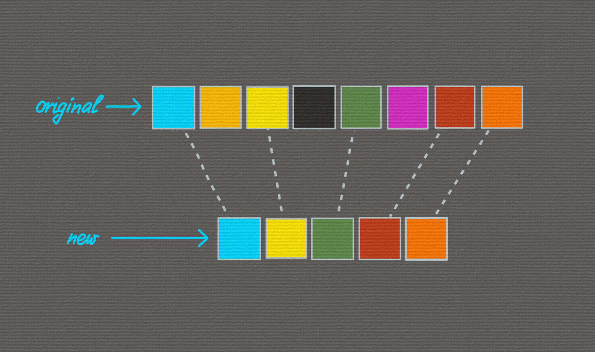
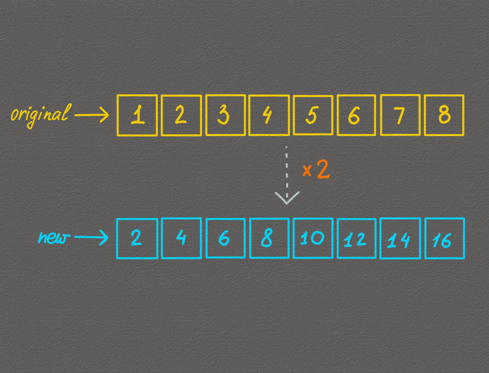
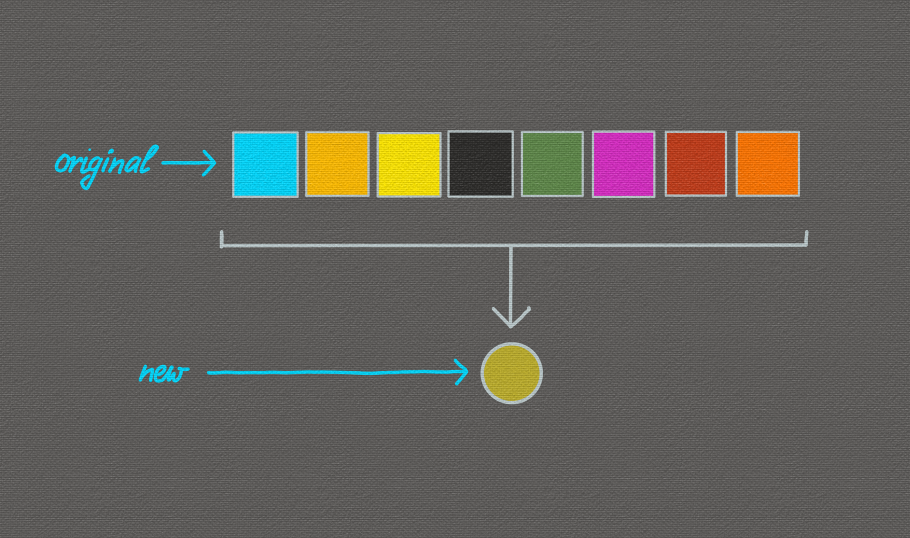
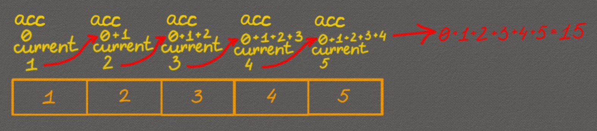

# Работа с массивами. Методы массивов

## Содержание

- [Работа с массивами. Методы массивов](#работа-с-массивами-методы-массивов)
  - [Содержание](#содержание)
  - [Предисловие](#предисловие)
  - [Что такое метод массива?](#что-такое-метод-массива)
  - [Метод `splice()`](#метод-splice)
    - [Описание](#описание)
    - [Синтаксис](#синтаксис)
    - [Возвращаемое значение](#возвращаемое-значение)
    - [Примеры использования](#примеры-использования)
  - [Метод `slice()`](#метод-slice)
    - [Описание](#описание-1)
    - [Синтаксис](#синтаксис-1)
    - [Возвращаемое значение](#возвращаемое-значение-1)
    - [Примеры использования](#примеры-использования-1)
  - [Метод `concat()`](#метод-concat)
    - [Описание](#описание-2)
    - [Синтаксис](#синтаксис-2)
    - [Возвращаемое значение](#возвращаемое-значение-2)
    - [Примеры использования](#примеры-использования-2)
  - [Метод `indexOf()`](#метод-indexof)
    - [Описание](#описание-3)
    - [Синтаксис](#синтаксис-3)
    - [Возвращаемое значение](#возвращаемое-значение-3)
    - [Примеры использования](#примеры-использования-3)
  - [Метод `includes()`](#метод-includes)
    - [Описание](#описание-4)
    - [Синтаксис](#синтаксис-4)
    - [Возвращаемое значение](#возвращаемое-значение-4)
    - [Примеры использования](#примеры-использования-4)
    - [Особенность `includes()`](#особенность-includes)
  - [Метод `reverse()`](#метод-reverse)
    - [Описание](#описание-5)
    - [Синтаксис](#синтаксис-5)
    - [Примеры использования](#примеры-использования-5)
  - [Метод `forEach()`](#метод-foreach)
    - [Описание](#описание-6)
    - [Синтаксис](#синтаксис-6)
    - [Возвращаемое значение](#возвращаемое-значение-5)
    - [Примеры использования](#примеры-использования-6)
    - [Сравнение с for](#сравнение-с-for)
  - [Метод `find()`](#метод-find)
    - [Описание](#описание-7)
    - [Синтаксис](#синтаксис-7)
    - [Возвращаемое значение](#возвращаемое-значение-6)
    - [Примеры использования](#примеры-использования-7)
  - [Метод `filter()`](#метод-filter)
    - [Описание](#описание-8)
    - [Синтаксис](#синтаксис-8)
    - [Возвращаемое значение](#возвращаемое-значение-7)
    - [Примеры использования](#примеры-использования-8)
  - [Метод `every()`](#метод-every)
    - [Описание](#описание-9)
    - [Синтаксис](#синтаксис-9)
    - [Возвращаемое значение](#возвращаемое-значение-8)
    - [Примеры использования](#примеры-использования-9)
    - [А что если надо проверить соответствует хотя бы один элемент?](#а-что-если-надо-проверить-соответствует-хотя-бы-один-элемент)
  - [Метод `map()`](#метод-map)
    - [Описание](#описание-10)
    - [Синтаксис](#синтаксис-10)
    - [Возвращаемое значение](#возвращаемое-значение-9)
    - [Примеры использования](#примеры-использования-10)
  - [Метод `reduce()`](#метод-reduce)
    - [Описание](#описание-11)
    - [Синтаксис](#синтаксис-11)
    - [Возвращаемое значение](#возвращаемое-значение-10)
    - [Примеры использования](#примеры-использования-11)
    - [Сравнение `reduce()` с `forEach()`](#сравнение-reduce-с-foreach)
  - [Метод `sort()`](#метод-sort)
    - [Описание](#описание-12)
    - [Синтаксис](#синтаксис-12)
    - [Главная особенность метода `sort()`](#главная-особенность-метода-sort)
    - [Сортировка чисел с помощью `compareFunction`](#сортировка-чисел-с-помощью-comparefunction)
    - [Особенности `sort()`](#особенности-sort)
    - [Примеры использования](#примеры-использования-12)
  - [Метод `join()`](#метод-join)
    - [Описание](#описание-13)
    - [Синтаксис](#синтаксис-13)
    - [Возвращаемое значение](#возвращаемое-значение-11)
    - [Примеры использования](#примеры-использования-13)
  - [Цепочка вызова методов](#цепочка-вызова-методов)
    - [Пример 1. Фильтрация и преобразование](#пример-1-фильтрация-и-преобразование)
    - [Пример 2. Работа со строками](#пример-2-работа-со-строками)
  - [Цикл `for ... of`](#цикл-for--of)
  - [Немного про функциональное программирование](#немного-про-функциональное-программирование)
  - [Теперь вы знаете ...](#теперь-вы-знаете-)

## Предисловие

В прошлой главе вы изучили устройство массива и научились работать с ним на базовом уровне. На практике же вам чаще всего придётся выполнять над массивами различные операции: _добавление, удаление, поиск, изменение, сортировку элементов или генерацию новых массивов на основе существующих_.

На самом деле вы уже умеете делать всё это, используя знакомые конструкции `if`, `for`, `while`. Например, вы без проблем можете написать цикл, который проверит, есть ли в массиве определённое значение.

```js
// Задача: проверить, есть ли в массиве число 3
const numbers = [1, 2, 3, 4, 5];

function hasElement(arr, element) {
  for (let i = 0; i < arr.length; i++) {
    if (arr[i] === element) {
      return true;
    }
  }
  return false;
}

console.log(hasElement(numbers, 3)); // true
```

Довольно просто, правда? По сути, все базовые операции с массивами вы уже знаете, как реализовать вручную.

Однако JavaScript позаботился о том, чтобы упростить вам жизнь, и добавил в язык множество встроенных методов для работы с массивами. Например, в предыдущем примере можно было воспользоваться методом `includes`, который проверяет наличие элемента в массиве:

```js
const numbers = [1, 2, 3, 4, 5];
console.log(numbers.includes(3)); // true
```

И никаких циклов писать уже не нужно.

## Что такое метод массива?

Скорее всего, при изучении ООП вы уже сталкивались с термином «метод».

_Метод_ - это функция, которая является свойством объекта. В случае массивов методы - это функция, которая привязана к массиву и работает с ним.

Например, у массива есть метод `push`, который добавляет элемент в конец массива:

```js
const numbers = [1, 2, 3];
numbers.push(4);
console.log(numbers); // [1, 2, 3, 4]
```

В следующих разделах мы подробно разберём самые часто используемые методы и научимся применять их вместо ручных циклов и условий.

## Метод `splice()`

### Описание

Метод `splice` используется для изменения содержимого массива. С его помощью можно _удалять элементы, добавлять новые или заменять существующие_ - всё это выполняется одним методом.

Проще говоря, splice позволяет:

- удалять элементы из массива;
- добавлять элементы в массив;
- заменять одни элементы другими.

При этом метод изменяет исходный массив.

### Синтаксис

```js
array.splice(start[, deleteCount[, item1[, item2[, ...]]]])
```

- `start` - индекс, с которого начинается изменение массива.
  - Если значение отрицательное, отсчёт начинается с конца массива.
- `deleteCount` (_необязательный_) - количество элементов, которые нужно удалить, начиная с индекса `start`.
  - Если параметр не указан, будут удалены все элементы от `start` до конца массива.
  - Если `deleteCount` равен `0`, элементы удаляться не будут.
- `item1, item2, ...` (_необязательные_) - элементы, которые будут добавлены в массив, начиная с позиции `start`.

### Возвращаемое значение

Метод `splice` возвращает массив удалённых элементов. Если элементы не были удалены, возвращается пустой массив.

### Примеры использования

_Удаление элементов_

```js
const numbers = [1, 2, 3, 4, 5];
numbers.splice(2, 2); // удалить 2 элемента, начиная с индекса 2
console.log(numbers); // [1, 2, 5]
```

_Замена элементов_

```js
const fruits = ['яблоко', 'груша', 'апельсин'];
const removed = fruits.splice(1, 1, 'банан', 'киви');
console.log(fruits); // ['яблоко', 'банан', 'киви', 'апельсин']
console.log(removed); // ['груша']
```

_Вставка элементов без удаления_

```js
const colors = ['красный', 'зелёный', 'синий'];
colors.splice(2, 0, 'жёлтый', 'фиолетовый');
console.log(colors);
// ['красный', 'зелёный', 'жёлтый', 'фиолетовый', 'синий']
```

Как думаете, _что выведет следующий код?_

```js
const arr = [10, 20, 30, 40, 50];
arr.splice(-1, 1, 20);
console.log(arr); // ?
```

## Метод `slice()`

### Описание

Метод `slice()` возвращает новый массив, содержащий копию указанной части исходного массива.

### Синтаксис

```js
array.slice([begin[, end]])
```

- `begin` (_необязательный_) - индекс, с которого начинается извлечение элементов. Если значение отрицательное, отсчёт начинается с конца массива. По умолчанию `0`.
- `end` (_необязательный_) - индекс, на котором заканчивается извлечение элементов (не включая этот индекс).
  - Если значение отрицательное, отсчёт начинается с конца массива.
  - Если параметр не указан, извлечение продолжается до конца массива.

### Возвращаемое значение

Метод `slice()` возвращает новый массив, содержащий указанные элементы.

### Примеры использования

_Извлечение части массива_

```js
const fullList = ['item1', 'item2', 'item3', 'item4', 'item5'];
const displayedItems = fullList.slice(0, 3); // Срезать первые три элемента списка
console.log(displayedItems); // ['item1', 'item2', 'item3']
```

_Извлечение с отрицательными индексами_

```js
const arr = [1, 2, 3, 4, 5];
const lastThreeItems = arr.slice(-3); // Извлечь последние три элемента массива
console.log(lastThreeItems); // [3, 4, 5]
```

Как думаете, _что выведет следующий код?_

```js
const letters = ['a', 'b', 'c', 'd', 'e'];
const subset = letters.slice();
console.log(subset); // ?
```

## Метод `concat()`

### Описание

Метод `concat()` используется для объединения массивов и возвращает новый массив, состоящий из элементов исходного массива и значений, переданных в качестве аргументов.

При этом важно понимать, что _`concat()` не изменяет исходный массив, а создаёт и возвращает новый_.

### Синтаксис

```js
array.concat(value1[, value2[, ...[, valueN]]])
```

- `value1, value2, ..., valueN` - массивы и/или значения, которые будут объединены с исходным массивом.

### Возвращаемое значение

Метод `concat()` возвращает новый массив, состоящий из элементов исходного массива и переданных значений.

### Примеры использования

_Объединение массивов_

```js
const array1 = [1, 2, 3];
const array2 = [4, 5, 6];
const combinedArray = array1.concat(array2);
console.log(combinedArray); // [1, 2, 3, 4, 5, 6]
```

_Объединение массива с отдельными значениями_

```js
const letters = ['a', 'b', 'c'];
const extendedLetters = letters.concat('d', 'e', 'f');
console.log(extendedLetters); // ['a', 'b', 'c', 'd', 'e', 'f']
```

## Метод `indexOf()`

### Описание

Метод `indexOf()` используется для поиска элемента в массиве. Он возвращает индекс первого вхождения указанного элемента или `-1`, если элемент не найден.

> [!NOTE]
>
> Метод `indexOf()` выполняет сравнение с использованием строгого равенства (`===`). Это означает, что типы данных также должны совпадать.

### Синтаксис

```js
array.indexOf(searchElement[, fromIndex])
```

- `searchElement` - элемент, индекс которого требуется найти.
- `fromIndex` (_необязательный_) - индекс, с которого начинается поиск.
  - Если значение отрицательное, отсчёт начинается с конца массива.

### Возвращаемое значение

Метод `indexOf()` возвращает индекс первого вхождения указанного элемента в массиве, или `-1`, если такой элемент не найден.

### Примеры использования

_Поиск элемента в массиве_

```js
let colors = ['красный', 'зеленый', 'синий'];
const searchTerm = 'зеленый';

const index = colors.indexOf(searchTerm);

if (index !== -1) {
  console.log(`Элемент найден на индексе: ${index}`);
} else {
  console.log('Элемент не найден в массиве.');
}
```

> [!NOTE]
>
> Для проверки вхождения последнего индекса элемента в массиве используется метод `lastIndexOf()`.

## Метод `includes()`

### Описание

Метод `includes()` используется для проверки наличия элемента в массиве. Он возвращает `true`, если указанный элемент найден, и `false` - если элемент отсутствует.

### Синтаксис

```js
array.includes(searchElement[, fromIndex])
```

- `searchElement` - элемент, наличие которого необходимо проверить.
- `fromIndex` (_необязательный_) - индекс, с которого начинается поиск.
  - Если значение отрицательное, отсчёт ведётся с конца массива.

### Возвращаемое значение

Метод `includes()` возвращает логическое значение:

- `true`, если массив содержит указанный элемент;
- `false`, если элемент не найден.

### Примеры использования

_Проверка наличия элемента в массиве_

```js
const arr = [1, 2, NaN];
console.log(arr.includes(2)); // true
console.log(arr.includes(3)); // false
console.log(arr.includes(NaN)); // true
```

_Использование `includes()` для проверки наличия строки в массиве_

```js
const fruits = ['яблоко', 'груша', 'апельсин'];
const searchTerm = 'груша';

// Проверяем, содержит ли массив fruits элемент searchTerm
if (fruits.includes(searchTerm)) {
  console.log(`Массив содержит ${searchTerm}.`);
} else {
  console.log(`Массив не содержит ${searchTerm}.`);
}
```

### Особенность `includes()`

Одной из важных особенностей метода `includes()` является корректная обработка значения `NaN`. В отличие от метода `indexOf()`, он умеет находить `NaN` в массиве.

```js
const array = [1, 2, NaN, 4, 5];

console.log(array.includes(NaN)); // true
console.log(array.indexOf(NaN)); // -1
```

> [!NOTE]
>
> В большинстве случаев для простой проверки наличия элемента в массиве предпочтительнее использовать `includes()`.

## Метод `reverse()`

### Описание

Метод `reverse()` используется для изменения порядка элементов массива. Он разворачивает массив на месте: первый элемент становится последним, а последний - первым.

Важно отметить, что метод `reverse()` изменяет исходный массив, а не создаёт новый.

### Синтаксис

```js
array.reverse();
```

### Примеры использования

```js
const numbers = [1, 2, 3, 4, 5];

numbers.reverse();

console.log(numbers); // [5, 4, 3, 2, 1]
```

## Метод `forEach()`

Методы, которые рассматривались выше, в основном принимали простые значения (числа, строки и т.д.). Далее мы начинаем знакомство с методами, которые принимают функцию в качестве аргумента - callback. Такая функция применяется к каждому элементу массива и выполняет заданные действия.

### Описание

Метод `forEach()` выполняет переданную функцию один раз для каждого элемента массива, по порядку.

### Синтаксис

```js
array.forEach(function callback(currentValue[, index[, array]]) { ... })
```

Параметры `callback`-функции:

- `currentValue` - текущий элемент массива.
- `index` (_необязательный_) - индекс текущего элемента.
- `array` (_необязательный_) - массив, по которому выполняется перебор.

### Возвращаемое значение

Метод `forEach()` ничего не возвращает. Его результат всегда `undefined`.

### Примеры использования

_Вывод элементов массива_

```js
const products = ['Товар 1', 'Товар 2', 'Товар 3'];

// Проходим по каждому элементу массива products
products.forEach((product) => console.log(product));
```

В этом примере функция `(product) => console.log(product)` вызывается для каждого элемента массива:

- на первой итерации `product` равен `'Товар 1'`,
- на второй - `'Товар 2'`,
- на третьей - `'Товар 3'`.

_Вычисление суммы элементов массива_

```js
const numbers = [1, 2, 3, 4, 5];

let sum = 0;

numbers.forEach((num) => {
  sum += num;
});

console.log(sum); // 15
```

_Использование дополнительных аргументов_

```js
['Kate', 'Michael', 'Philip'].forEach((item, index, arr) => {
  console.log(`У ${item} в массиве ${arr}, оказывается индекс ${index}`);
});
```

> [!NOTE]
>
> Метод `forEach()` удобно применять, когда нужно выполнить действие для каждого элемента массива, но при этом не требуется получать новый массив или возвращаемое значение.

### Сравнение с for

Для наглядности сравним предыдущий пример с использованием обычного цикла `for`.

```js
const products = ['Товар 1', 'Товар 2', 'Товар 3'];

for (let i = 0; i < products.length; i++) {
  console.log(products[i]);
}
```

С точки зрения результата оба варианта делают одно и то же. Разница заключается в читаемости и намерении кода. В случае с `forEach()` мы явно говорим: "_выполни действие для каждого элемента массива_", не задумываясь об индексах и условиях цикла.

> Попробуйте самостоятельно реализовать функцию `forEach(array, callback)`, которая принимает массив и callback-функцию и вызывает этот `callback` для каждого элемента массива.

## Метод `find()`

### Описание

Метод `find()` используется для поиска элемента в массиве по условию. Он возвращает значение первого элемента, для которого callback-функция вернёт true. Если ни один элемент не удовлетворяет условию, метод возвращает `undefined`.

В отличие от методов `indexOf()` или `includes()`, которые просто сравнивают элементы на равенство, `find()` позволяет задать произвольное условие поиска.

### Синтаксис

```js
array.find(function callback(currentValue[, index[, array]]) { ... })
```

Параметры callback-функции:

- `currentValue` - текущий элемент массива.
- `index` (_необязательный_) - индекс текущего элемента.
- `array` (_необязательный_) - массив, по которому выполняется поиск.

### Возвращаемое значение

Метод `find()` возвращает первый элемент массива, удовлетворяющий условию, заданному в callback-функции. Если такой элемент не найден, возвращается `undefined`.

### Примеры использования

_Поиск первого чётного числа в массиве_

```js
const numbers = [1, 2, 3, 4, 5];

// Используем find() для поиска первого чётного числа
const evenNumber = numbers.find((number) => number % 2 === 0);

console.log(
  evenNumber ? `В массиве есть чётное число: ${evenNumber}` : `В массиве нет чётного числа!`,
);
```

В данном примере метод `find()` останавливается на первом элементе, удовлетворяющем условию, и сразу возвращает его.

> [!NOTE]
>
> Если требуется найти последний элемент, удовлетворяющий условию, можно использовать метод `findLast()`.

## Метод `filter()`

### Описание

Метод `filter()` используется для фильтрации массива. Он создаёт новый массив, содержащий только те элементы, которые удовлетворяют условию, заданному в callback-функции.

Иными словами, `filter()` "отбирает" элементы по заданному правилу и игнорирует все остальные.



_Рисунок 5.1. Пример работы метода filter_

### Синтаксис

```js
array.filter(function callback(currentValue[, index[, array]]) { ... })
```

`callback` - это функция-предикат, которая применяется к каждому элементу массива. Если функция возвращает `true`, элемент сохраняется в новом массиве, если `false` - исключается из него.

Параметры callback-функции:

- `currentValue` - текущий элемент массива.
- `index` (_необязательный_) - индекс текущего элемента.
- `array` (_необязательный_) - массив, по которому выполняется перебор.

### Возвращаемое значение

Метод `filter()` возвращает новый массив, содержащий все элементы, для которых callback-функция вернула `true`. Если ни один элемент не прошёл проверку, возвращается пустой массив.

### Примеры использования

_Фильтрация элементов массива_

```js
const words = ['apple', 'banana', 'grape', 'orange', 'pineapple'];

// Фильтрация слов, начинающихся на букву 'b'
const bWords = words.filter((word) => word.startsWith('b'));

console.log(bWords); // ['banana']
```

В данном примере callback-функция проверяет каждое слово и оставляет в новом массиве только те, которые начинаются с буквы `'b'`.

## Метод `every()`

### Описание

Метод `every()` используется для проверки условия для всех элементов массива. Он возвращает `true`, если каждый элемент массива удовлетворяет заданному условию, и `false` - если хотя бы один элемент условие не выполняет.

Например, с его помощью можно проверить, что все элементы массива - чётные числа или что все строки имеют нужную длину.

### Синтаксис

```js
array.every(function callback(currentValue[, index[, array]]))
```

- `callback` - функция-предикат, которая применяется к каждому элементу массива.

Параметры callback-функции:

- `currentValue` - текущий элемент массива.
- `index` (_необязательный_) - индекс текущего элемента.
- array (_необязательный_) - массив, по которому выполняется перебор.

...

### Возвращаемое значение

Метод `every()` возвращает:

- `true`, если callback-функция вернула true для всех элементов массива;
- `false`, если хотя бы для одного элемента было возвращено `false`.

### Примеры использования

```js
const words = ['apple', 'banana', 'cherry', 'date', 'low'];

const allLengthGreaterThanThree = words.every((word) => word.length > 3);

console.log(allLengthGreaterThanThree); // false, так как не все слова имеют длину больше 3
```

### А что если надо проверить соответствует хотя бы один элемент?

У метода `every()` есть «брат» - метод `some()`.

Метод `some()` проверяет, что хотя бы один элемент массива удовлетворяет заданному условию. Если callback-функция вернёт `true` хотя бы для одного элемента, результатом будет `true`. Если ни один элемент не подходит - вернётся `false`.

```js
const words = ['apple', 'banana', 'cherry', 'date', 'low'];

const allLengthGreaterThanThree = words.some((word) => word.length > 3);

console.log(allLengthGreaterThanThree); // true, так как хотя бы одно слово имеет длину больше 3
```

## Метод `map()`

### Описание

Метод `map()` используется для преобразования массива. Он создаёт новый массив, в котором каждый элемент является результатом вызова callback-функции для соответствующего элемента исходного массива.

Простыми словами, callback-функция вызывается для каждого элемента исходного массива, преобразует его и сохраняет результат в новый массив.

Например, если исходный массив равен `[1, 2, 3]`, а callback-функция _умножает каждый элемент на `2`_, то получится новый массив `[2, 4, 6]`.

- `1` -> `2`
- `2` -> `4`
- `3` -> `6`



_Рисунок 5.2. Пример работы метода map_

### Синтаксис

```js
array.map(function callback(currentValue[, index[, array]]) { ... })
```

`callback` - функция, которая применяется к каждому элементу массива и возвращает новое значение.

Параметры callback-функции

- `currentValue` - текущий элемент массива;
- `index` (_необязательный_) - индекс текущего элемента;
- `array` (_необязательный_) - исходный массив.

### Возвращаемое значение

Метод `map()` возвращает новый массив, содержащий результаты выполнения callback-функции для каждого элемента исходного массива.

### Примеры использования

_Преобразование чисел_

```js
const numbers = [1, 2, 3, 4, 5];

// Вычисляем квадрат каждого числа
const squaredNumbers = numbers.map((number) => number * number);

console.log(squaredNumbers); // [1, 4, 9, 16, 25]
```

_Преобразование массива строк_

```js
const fruits = ['Яблоко', 'Банан', 'Апельсин'];
const list = document.getElementById('list');

// Создаём HTML-элементы списка
const fruitItems = fruits.map((fruit) => `<li>${fruit}</li>`);

// Обновляем содержимое HTML-списка
list.innerHTML = fruitItems.join('');
```

Метод `map()` особенно полезен, когда необходимо получить новый массив на основе существующего, изменив форму или представление его элементов.

> Попробуйте с помощью метода `map()` скопировать один массив в другой.

## Метод `reduce()`

### Описание

Метод `reduce()` - один из самых мощных и одновременно самых сложных методов массива. Он последовательно применяет callback-функцию к каждому элементу массива (слева направо) и _сводит массив к одному итоговому значению_.

Простыми словами, с помощью `reduce()` можно «собрать» массив в один результат: посчитать сумму, найти максимум, сформировать строку и т.д.

Если вам требуется агрегация данных, то `reduce()` - подходящий инструмент для этой задачи.



_Рисунок 5.3. Пример работы метода reduce_

### Синтаксис

```js
array.reduce(function callback(accumulator, currentValue[, index[, array]])[, initialValue])
```

- `callback` - функция, вызываемая для каждого элемента массива.
  - `accumulator` - аккумулятор, который хранит значение, возвращаемое callback-функцией на каждой итерации;
  - `currentValue` - текущий элемент массива;
  - `index` (_необязательный_) - индекс текущего элемента;
  - `array` (_необязательный_) - обрабатываемый массив.
- `initialValue` (_необязательный_) - начальное значение аккумулятора (`accumulator`). Если оно указано, именно с него начинается вычисление.

### Возвращаемое значение

Метод `reduce()` возвращает одно итоговое значение, полученное в результате последовательной обработки всех элементов массива - то есть последнее значение `accumulator`.

### Примеры использования

_Сумма чисел_

```js
const numbers = [1, 2, 3, 4, 5];

// Суммируем все элементы массива
const sum = numbers.reduce(
  (accumulator, currentValue) => accumulator + currentValue, // callback
  0, // initialValue
);

console.log(sum); // 15
```

В этом примере:

- `accumulator` в начале равен `initialValue`, то есть `0`;
- `currentValue` по очереди принимает значения `1`, `2`, `3`, `4`, `5`;
- `accumulator` хранит результат предыдущей итерации:
  - `accumulator = 0`, `currentValue = 1` → `accumulator + currentValue` → `accumulator = 1`
  - `accumulator = 1`, `currentValue = 2` → `accumulator + currentValue` → `accumulator = 3`
  - `accumulator = 3`, `currentValue = 3` → `accumulator + currentValue` → `accumulator = 6`
  - `accumulator = 6`, `currentValue = 4` → `accumulator + currentValue` → `accumulator = 10`
  - `accumulator = 10`, `currentValue = 5` → `accumulator + currentValue` → `accumulator = 15`
- результатом `reduce` будет последнее значение `accumulator`, в данном случае `15`.



_Рисунок 5.4. Иллюстрация работы метода reduce() на примере суммирования массива_

_Формирование HTML-списка_

```js
const items = ['apple', 'banana', 'orange'];

// Создаём HTML-строку из массива
const htmlList = items.reduce(
  (accumulator, currentValue) => accumulator + `<li>${currentValue}</li>`,
  '',
);

console.log(htmlList);
// '<li>apple</li><li>banana</li><li>orange</li>'
```

Как думаете, что выведет данный код?

```js
const numbers = [1, 2, 3, 4, 5, 6];

const countEven = numbers.reduce((accumulator, currentValue) => {
  if (currentValue % 2 === 0) {
    return accumulator + 1;
  }
  return accumulator;
}, 0);

console.log(countEven); // ?
```

### Сравнение `reduce()` с `forEach()`

Метод `reduce()` во многом похож на другие методы массива, например `forEach()`. Метод `forEach()` просто проходит по всем элементам массива и выполняет заданные операции, _не возвращая никакого результата_.

У `reduce()` логика похожая, но появляется дополнительный аргумент - `accumulator`. Это значение сохраняется между итерациями, поэтому на каждом шаге мы можем накапливать некоторый результат.

Рассмотрим уже знакомый пример с подсчётом суммы через `forEach()`:

```js
const numbers = [1, 2, 3, 4, 5];

let sum = 0;

numbers.forEach((num) => {
  sum += num;
});

console.log(sum); // 15
```

В этом случае нам приходится заводить отдельную переменную `sum` вне массива и изменять её внутри callback-функции. Чтобы избежать этого, можно использовать метод `reduce()` и вынести всю логику накопления в одно выражение.

```js
const numbers = [1, 2, 3, 4, 5];

// Не создаём отдельную переменную sum
const sum = numbers.reduce((accumulator, number) => accumulator + number, 0);
```

Одно из простых правил, которое стоит запомнить: если вам нужно получить из массива одно итоговое значение и для этого приходится создавать внешнюю переменную, то `reduce()` - хорошее и более чистое решение.

## Метод `sort()`

### Описание

Метод `sort()` используется для сортировки элементов массива. Он изменяет исходный массив и возвращает ссылку на него же.

У этого метода есть несколько важных особенностей, о которых обязательно нужно знать, иначе результат может оказаться _неожиданным_.

### Синтаксис

```js
array.sort([compareFunction]);
```

- `compareFunction` (*необязательный*) - функция сравнения, которая определяет порядок сортировки элементов.

### Главная особенность метода `sort()`

По умолчанию метод `sort()` сортирует элементы как строки, а не как числа. Это означает, что _элементы массива сначала приводятся к строкам, а затем сравниваются в лексикографическом (алфавитном) порядке_.

```js
const numbers = [1, 10, 2, 21];

numbers.sort();

console.log(numbers); // [1, 10, 2, 21]
```

Такой результат часто удивляет новичков, но он полностью корректен с точки зрения JavaScript: строка `'10'` идёт раньше строки `'2'`, потому что `'1'` < `'2'`.

### Сортировка чисел с помощью `compareFunction`

Чтобы сортировать числа корректно, необходимо передать функцию сравнения.

```js
const numbers = [1, 10, 2, 21];

numbers.sort((a, b) => a - b);

console.log(numbers); // [1, 2, 10, 21]
```

Функция `compareFunction` должна вернуть результат `< 0`, `> 0` или `0`.

Функция работает следующим образом:

- если функция возвращает _отрицательное число_ (`< 0`), `a` идёт перед `b`;
- если возвращает положительное число (`> 0`), `a` идёт после `b`;
- если возвращает `0`, порядок элементов не меняется.

### Особенности `sort()`

Метод `sort()` изменяет исходный массив, поэтому если требуется сохранить исходный массив, перед сортировкой стоит создать его копию, например с помощью spread-оператора:

```js
const sorted = [...numbers].sort((a, b) => a - b);
```

### Примеры использования

Рассмотрим ещё один пример - сортировку строк по длине слова.

```js
const words = ['яблоко', 'апельсин', 'банан', 'груша'];

// Функция сравнения сортирует строки по убыванию их длины
words.sort((a, b) => b.length - a.length);

console.log(words); // ['апельсин', 'яблоко', 'груша', 'банан']
```

Как думаете, что нужно сделать, чтобы строки отсортировались в обратном порядке?

## Метод `join()`

### Описание

Метод `join()` используется для преобразования массива в строку. Он объединяет элементы массива в одну строку, вставляя между ними указанный разделитель.

### Синтаксис

```js
arr.join([separator]);
```

- `separator` (_необязательный_) - строка, которая будет вставляться между элементами массива.
  - Если не указан, используется запятая `','`.
  - Если передать пустую строку `''`, элементы будут объединены без разделителей.

### Возвращаемое значение

Метод `join()` возвращает строку, полученную в результате объединения элементов массива.

### Примеры использования

_Объединение элементов массива в строку_

```js
const fruits = ['apple', 'banana', 'orange'];
const result = fruits.join();
console.log(result1); // "apple,banana,orange"
```

_Использование собственного разделителя_

```js
const fruits = ['apple', 'banana', 'orange'];
const result = fruits.join(' | ');
console.log(result); // "apple | banana | orange"
```

_Формирование HTML-строки_

```js
const colors = ['red', 'green', 'blue'];

const result = '<ul>' + colors.map((color) => `<li>${color}</li>`).join('') + '</ul>';

console.log(result);
// "<ul><li>red</li><li>green</li><li>blue</li></ul>"
```

## Цепочка вызова методов

Методы вроде `map()`, `filter()`, `reduce()` и `sort()` удобно объединять в цепочки, где результат одного метода сразу передаётся следующему. Такой код читается как последовательность действий.

### Пример 1. Фильтрация и преобразование

_Задача_: взять массив чисел, оставить только чётные и возвести их в квадрат.

```js
const numbers = [1, 2, 3, 4, 5, 6];

const result = numbers
  .filter((num) => num % 2 === 0) // оставляем чётные
  .map((num) => num * num); // возводим в квадрат

console.log(result); // [4, 16, 36]
```

### Пример 2. Работа со строками

_Задача_: из массива слов оставить длинные слова и получить одну строку.

```js
const words = ['apple', 'to', 'banana', 'pie', 'orange'];

const result = words
  .filter((word) => word.length > 3)
  .map((word) => word.toUpperCase())
  .join(', ');

console.log(result); // "APPLE, BANANA, ORANGE"
```

Такие цепочки - стандартная практика в JavaScript при работе с данными и наглядный пример того, как можно выполнять последовательные преобразования «_в одну строку_», сохраняя при этом читаемость и понятную логику кода.

## Цикл `for ... of`

Ещё один удобный способ перебора элементов массива - цикл for ... of. Он позволяет выполнять итерацию по значениям элементов массива, делая код более читаемым и лаконичным по сравнению с классическим for.

Пример использования цикла `for...of` с массивом

```js
const myArray = ['apple', 'banana', 'cherry'];

for (const item of myArray) {
  console.log(item); // Выведет каждый элемент массива: 'apple', 'banana', 'cherry'
}
```

В этом примере переменная `item` последовательно принимает значения каждого элемента массива `myArray`. Это позволяет работать с элементами напрямую, _не используя индексы_ и _не обращаясь к свойству `length`_.

## Немного про функциональное программирование

В предыдущих разделах мы увидели, что методы `map()`, `filter()` и `reduce()` сильно упрощают работу с массивами. С их помощью код становится короче, понятнее и выразительнее. Но на самом деле эти методы затрагивают нечто большее, чем просто удобную обработку массивов. Они знакомят нас с подходом, который называется функциональное программирование.

На базовом уровне _функциональное программирование_ - это способ писать код, в котором основную роль играют функции и их композиция. Такие функции обычно:

- могут передаваться в другие функции и использоваться внутри них;
- не изменяют внешние данные и не зависят от скрытого состояния;
- при одинаковых входных данных всегда возвращают одинаковый результат.

Именно такими являются callback-функции, которые мы использовали в `map()`, `filter()` и `reduce()`. Они «вставляются» в методы массива, выполняют свою задачу и возвращают результат, не вмешиваясь в остальную программу.

Функциональное программирование - это большая и интересная тема, и мы лишь слегка коснулись её основ. Пока достаточно понимать, что методы массивов позволяют писать код в этом стиле.

## Теперь вы знаете ...

1. Что такое методы массивов и зачем они нужны - это готовые инструменты JavaScript, которые позволяют работать с массивами без ручных циклов `for` и условий.
2. Чем отличаются изменяющие массив методы (`splice`, `sort`, `reverse`) от методов, которые возвращают новый массив или значение (`slice`, `concat`, `map`, `filter`, `reduce`, `join`).
3. Как объединять массивы с помощью `concat()` и чем он отличается от spread-синтаксиса.
4. Как искать элементы по условию с помощью `find()` и получать несколько элементов с помощью `filter()`.
5. Как преобразовывать массивы с помощью `map()`, создавая новый массив на основе существующего.
6. Как использовать `reduce()` для агрегации данных и «сведения» массива к одному итоговому значению.
7. Почему `reduce()` полезен в тех случаях, когда вы хотите избежать внешних переменных-аккумуляторов.
8. Как работает метод `sort()`, почему он сортирует элементы как строки по умолчанию и зачем нужна compareFunction.
9. Как превращать массивы в строки с помощью `join()`, включая практические примеры генерации HTML.
10. Как объединять методы массивов в цепочки (`filter → map → reduce → join`) и писать "выразительный код".
11. Как перебирать массивы с помощью цикла `for … of`, не работая напрямую с индексами.
12. Что методы `map`, `filter` и `reduce` являются первым знакомством с функциональным программированием и почему этот стиль делает код чище, предсказуемее и удобнее для сопровождения.