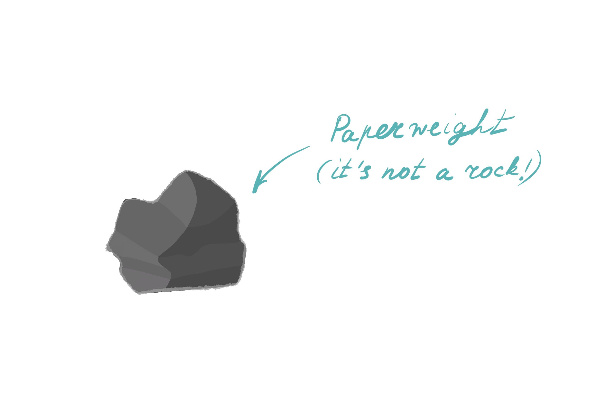
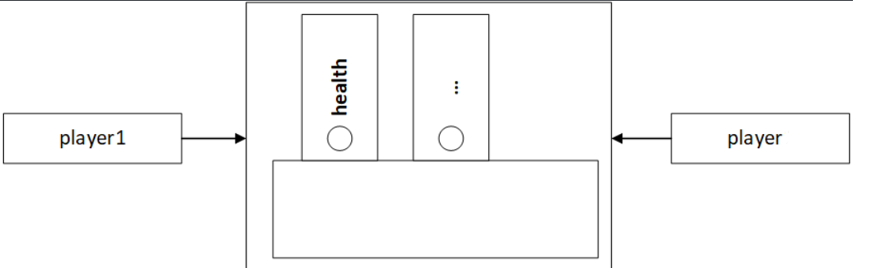

# Объекты

## Что такое объект?

По ходу изучения JavaScript вы уже не раз сталкивались с термином _«объект»_, и мы не раз упоминали, что вернёмся к этой теме подробнее. Теперь пришло время разобраться, что такое объекты в JavaScript и зачем они нужны.

Прежде чем переходить к технической стороне вопроса, сделаем небольшой шаг в сторону и попробуем понять, что вообще такое объект в реальном мире.

Задайтесь простым вопросом: что можно назвать объектом? Можно ли считать машину объектом? А стол, стул, лодку, удочку, окно, или адронный коллайдер объектами? С точки зрения наших чувств и восприятия, ответ очевиден - да, _всё это объекты_.

При этом дать строгое универсальное определение объекту довольно сложно. Однако можно выделить общую идею: _объект_ - это нечто, что существует (физически или виртуально), обладает определёнными характеристиками и может выполнять какие-то действия.

Например, автомобиль:

- имеет цвет, форму, марку, скорость — это его свойства;
- может ехать, тормозить, сигналить — это его действия.

Или камень:

- имеет цвет, форму, размер, вес — это его свойства;
- при этом камень не выполняет действий, но всё равно остаётся объектом.



Таким образом, мы можем характеризовать любой объект нашего мира. Попробуйте сами подумать, какими свойствами и действиями может обладать стол, стул, человек? Именно так мы интуитивно воспринимаем объекты в реальной жизни.

Теперь, оставив философию, вернёмся к технической части и посмотрим, как эта идея реализована в JavaScript.

## Что такое объект в JavaScript?

Попробуем абстрагировать наши представления из реального мира и перенести их в язык программирования.

Другими словами, рассмотрим сущность, которая обладает определёнными свойствами и может выполнять действия, и опишем её в коде.

Допустим, возьмём объект «машина» и несколько её характеристик:

- Марка: Toyota
- Модель: Camry
- Цвет: черный
- Год выпуска: 2018
- Действие: издавать сигнал.

Можно ли создать такой объект в JavaScript? Да, вполне. Для этого используются фигурные скобки `{}`.

```js
const car = {
  // Свойства
  brand: 'Toyota',
  model: 'Camry',
  color: 'black',
  year: 2018,

  // Действия
  signal() {
    console.log('Beeep');
  },
};
```

В этом примере мы создали объект `car` (машина), который содержит:

- данные (свойства объекта);
- поведение (действие в виде функции).

На интуитивном уровне этого уже достаточно, чтобы понять, что такое объект в JavaScript.

## Для чего используются объекты?

Объекты в JavaScript чаще всего используются для хранения связанных между собой данных и представления более сложных сущностей в удобной и логичной форме.

Если данные описывают один и тот же объект реального или виртуального мира, гораздо удобнее хранить их в одной структуре, а не разносить по множеству отдельных переменных.

Рассмотрим пример. Допустим, в программе нужно описать несколько машин.

```js
// Так делать не рекомендуется:
let car1Brand = 'Toyota';
let car1Color = 'Black';
// ...
let car2Brand = 'Ford';
let car2Color = 'White';
```

В таком подходе данные быстро становятся трудно читаемыми и плохо масштабируемыми.

Гораздо логичнее объединить связанные характеристики в объекты:

```js
let car1 = {
  brand: 'Toyota',
  color: 'Black',
};

let car2 = {
  brand: 'Ford',
  color: 'White',
};
```

В этом случае каждая машина представлена как _отдельный объект со своими свойствами_. Такой подход делает код более понятным, структурированным и удобным для дальнейшего расширения.

Именно поэтому объекты являются одной из ключевых структур данных в JavaScript и активно используются при создании практически любых приложений.

## Объекты в JavaScript

### Определение

Ранее мы упоминали, что в JavaScript существует _8 типов данных_. Большинство из них вы уже изучили - это примитивные типы (строки, числа, логические значения и т.д.), которые достаточно просты для понимания.

Однако остаются ещё два типа: `object` и `null`. Тип `object` - это именно тот тип данных, о котором мы говорили в предыдущих главах, а к типу `null` мы вернёмся немного позже.

_Объект в JavaScript_ - это структура данных, представляющая собой набор свойств, записанных в виде пар ключ–значение.

Каждое свойство объекта состоит из:

- _ключа_ - имени свойства;
- _значения_ - данных, связанных с этим свойством.

Например, если рассматривать объект «_машина_», то:

- `color` - это ключ (название свойства),
- `'white'` - это значение,
- `color: 'white'` - одно свойство объекта.

### Создание объекта

Самый простой и часто используемый способ создания объекта в JavaScript - _литерал объекта_.

_Литерал объекта_ - это способ записи объекта непосредственно в коде с помощью фигурных скобок `{}` и перечисления его свойств.

Общий вид литерала объекта выглядит так:

```js
const obj = {
  key1: value1,
  key2: value2,
  key3: value3,
};
```

Каждое свойство объекта записывается в формате:

- _слева_ - ключ (имя свойства),
- _справа_ - значение,
- ключ и значение разделяются двоеточием `:`.

Рассмотрим пример:

```js
const user = {
  name: 'Alex',
  age: 20,
  isStudent: true,
};
```

_В данном примере_:

- `name`, `age`, `isStudent` - это ключи;
- `'Alex'`, `20`, `true` - соответствующие им значения.

Значениями свойств объекта могут быть любые типы данных: числа, строки, логические значения, массивы, функции и даже другие объекты.

```js
const user = {
  name: 'Alex',
  skills: ['JavaScript', 'HTML', 'CSS'],
  greet() {
    console.log('Hello!');
  },
};
```

Для создания пустого объекта также можно использовать фигурные скобки:

```js
const car = {};
```

Такой объект пока не содержит свойств, но их можно добавить позже. Этот приём используется довольно часто - зачем именно, мы разберём чуть позже.

Существуют и другие способы создания объектов:

```js
const player = new Object(); // Синтаксис с использованием конструктора Object
const user = Object.create({}); // Создание объекта с заданным прототипом (ES5)
```

Эти способы используются реже и, как правило, в более специфических ситуациях. Подробно мы рассмотрим их позже, когда будем говорить о внутреннем устройстве объектов и прототипах.

### Свойства объекта

#### Определение свойств объекта

Как уже упоминалось ранее, свойства объекта можно определить непосредственно при его создании - в момент объявления литерала объекта.

```js
const player = {
  // Ключ `username`, значение "Crico"
  username: 'Crico',

  // Ключ `health`, значение 100
  health: 100,

  // ...
};
```

Каждое свойство объекта представляет собой пару _ключ–значение_.

> [!NOTE]
>
> Ключи объекта также называются именами свойств или идентификаторами свойств.

#### Ключи

Имена свойств объекта (ключи) могут состоять из одного или нескольких слов.

Если имя свойства содержит пробелы или другие специальные символы, его необходимо записывать в кавычках.

```js
const user = {
  'video likes': 100,
};
```

В этом примере `"video likes"` - это один ключ, состоящий из двух слов.

> [!NOTE]
>
> Если имя свойства состоит из одного слова и не содержит специальных символов, кавычки можно не использовать.

#### Типы данных свойств

Значение свойства объекта может быть любого типа данных, доступного в JavaScript: числа, строки, символы, массивы, функции и даже другие объекты.

```js
const obj = {
  a: 1,
  b: 'hello, world',
  c: Symbol('1'),
  d: [1, 2, 3],
  e: () => {
    return 'Hello';
  },
  f: {
    f1: "i'm f1!",
  },
};
```

Таким образом, объект может хранить как простые данные, так и более сложные структуры, объединяя их в единую логическую сущность.

#### Получение свойств

Для получения значений свойств объекта в JavaScript используются два основных способа:

- точечная нотация (dot notation);
- скобочная нотация (bracket notation).

```js
const player = {
  username: 'Mary',
  // ...
};

// dot notation
console.log(player.username); // "Mary"

// bracket notation
console.log(player['username']); // "Mary"
```

В обоих случаях результат будет одинаковым - мы получаем значение свойства `username` объекта `player`.

Точечная нотация используется чаще и считается более читаемой, однако скобочная нотация становится необходимой в следующих ситуациях:

- Ключ содержит пробелы или специальные символы. В этом случае обратиться к свойству через точку невозможно.

  ```js
  const user = {
    'video likes': 100,
  };

  console.log(user['video likes']); // 100
  ```

- Имя свойства хранится в переменной. Точечная нотация здесь не подойдёт, так как она ожидает фиксированное имя свойства.

  ```js
  const key = 'username';

  const user = {
    username: 'Alex',
  };

  user[key] = 'Martin';
  ```

- Имя свойства формируется динамически во время выполнения программы.

  ```js
  function createUser(fieldName, value) {
    const user = {};

    // Имя свойства формируется динамически
    user[fieldName] = value;

    return user;
  }

  const newUser = createUser('email', 'test@example.com');

  console.log(newUser); // { email: "test@example.com" }
  ```

  В этом примере имя свойства (`fieldName`) определяется во время выполнения программы и заранее неизвестно.

#### Добавление свойств

Для добавления новых свойств в объект можно использовать как _точечную нотацию_, так и _скобочную нотацию_.

```js
const car = {};

// Используем точечную нотацию для добавления свойства
car.brand = 'Toyota';

// Используем скобочную нотацию для добавления свойства
car['model'] = 'Camry';

console.log(car); // { brand: "Toyota", model: "Camry" }
```

В результате объект `car` был расширен новыми свойствами `brand` и `model`.

В большинстве случаев предпочтительнее использовать точечную нотацию, так как она более читаемая и лаконичная.

#### Удаление свойств

Для удаления свойств объекта используется ключевое слово `delete`.

```js
const player = {
  username: 'Kate',
  age: 25,
};

delete player.age; // Удаляем свойство `age`

console.log(player.age); // undefined
```

После удаления свойства доступ к нему возвращает `undefined`, так как такого свойства в объекте больше не существует.

> [!NOTE]
>
> Оператор `delete` удаляет именно свойство объекта, а не просто его значение.

#### Вычисляемые свойства

Иногда возникает ситуация, когда имя свойства объекта должно быть вычислено во время выполнения программы. В таких случаях используются _вычисляемые свойства_.

Это означает, что ключ объекта можно получить:

- из переменной;
- из выражения;
- из результата вычислений.

Для этого имя свойства указывается в квадратных скобках внутри литерала объекта.

```js
const weapon = 'sword';

// Ключ [weapon] вычисляется из значения переменной weapon
const inventory = {
  [weapon]: 2,
};

console.log(inventory.sword); // 2
```

В этом примере JavaScript подставляет значение переменной `weapon`, и в итоге создаётся свойство с ключом "`sword`".

Вычисляемые свойства могут быть и более сложными - например, формироваться с помощью выражений:

```js
const weapon = 'sword';

const inventory = {
  ['mini' + weapon]: 4,
};

console.log(inventory.minisword); // 4
```

Такой подход особенно полезен, когда структура объекта зависит от условий, пользовательского ввода или логики программы.

#### Свойство из переменной

Довольно часто значения свойств объекта берутся из переменных. Например, пользователь вводит никнейм, он сохраняется в переменной, и затем на основе этого значения создаётся объект `user`.

Вы уже умеете делать это следующим образом:

```js
const username = 'Alex'; // Ввёл пользователь

const player = {
  username: username,
  health: 100,
};
```

Однако можно заметить, что здесь возникает некоторая тавтология - _имя ключа_ и _имя переменной совпадают_ и повторяются.

Для таких случаев в JavaScript существует более удобный и краткий синтаксис. _Если имя свойства и имя переменной совпадают, достаточно указать его один раз_. Этот синтаксис называется _сокращённой записью свойств_ и используется очень часто.

```js
const username = 'Alex'; // Ввёл пользователь

const player = {
  username, // то же самое, что и username: username
  health: 100,
};
```

Если одно и то же свойство указать в объекте несколько раз, последнее значение перезапишет предыдущие:

```js
const username = 'Alex';

const player = {
  username,
  username: 'Karl',
  health: 100,
};

console.log(player.username); // "Karl"
```

Хотя технически это допустимо, такой код не рекомендуется писать, так как он ухудшает читаемость и может привести к ошибкам.

### Методы объектов

Помимо примитивных значений, значениями свойств объекта могут быть функции. В таком случае такие свойства называются _методами объекта_.

_Методы объектов_ - это функции, связанные с конкретным объектом. Они используются для выполнения действий или операций над данными этого объекта. В предыдущих разделах мы уже встречались с одним из способов объявления метода - _сокращённым синтаксисом_:

```js
const user = {
  greet() {
    console.log('Hello, world');
  },
};

user.greet(); // Hello, world
```

В данном примере `user` - это объект, а `greet` - его метод, то есть функция объекта.

Метод объекта можно объявить и с помощью _Function Expression_:

```js
const user = {
  greet: () => {
    console.log('Hello, world');
  },
};

user.greet();
```

Также существует более старый, классический вариант записи:

```js
const user = {
  greet: function () {
    console.log('Hello, world');
  },
};

user.greet();
```

Во всех этих случаях результат будет одинаковым - объект `user` будет иметь метод `greet`, который можно вызвать. Функционально эти способы похожи, однако между ними есть некоторые тонкие различия, связанные с контекстом выполнения. На данном этапе на этом можно не заострять внимание - мы подробно разберём это позже.

> [!NOTE]
>
> _Сокращённый синтаксис_ объявления методов (`greet() { ... }`) является более предпочтительным, так как он короче и обеспечивает лучшую читаемость кода.

Методы объекта работают так же, как и обычные функции. Они могут принимать параметры, иметь любое количество аргументов и возвращать значения.

```js
const user = {
  greet(name) {
    return `Hello, ${name}!`;
  },

  takeDamage(amount) {
    console.log(`Получен урон: ${amount}`);
  },
};

console.log(user.greet('Alex')); // Hello, Alex!
user.takeDamage(10); // Получен урон: 10
```

### Проверка наличия свойств

Если у объекта нет некоторого свойства, обращение к нему не вызовет ошибку - выражение просто вернёт `undefined`. Это поведение _безопасно_, но иногда нам важно точно знать, существует ли свойство в объекте.

```js
const car = {};

console.log(car.brand);
```

Самый простой способ - проверить значение свойства в условии. Однако у этого подхода есть недостаток: если свойство существует, но его значение равно `false`, `0`, `''`, `null` или `undefined`, условие не выполнится, хотя свойство есть.

```js
if (car.brand) {
  // ...
}
```

Более надёжным и читабельным способом является использование оператора `in`. Оператор `in` проверяет сам факт наличия свойства в объекте, независимо от его значения.

```js
if ('brand' in car) {
  // ...
}
```

На практике чаще используется именно оператор `in`, когда важно отличать отсутствие свойства от _«ложных»_ значений.

### Перебор свойств объекта

Иногда возникает необходимость перебирать свойства объекта - получать его ключи, значения или сразу пары «ключ–значение». Для этого в JavaScript предусмотрены специальные методы объекта `Object`.

- `Object.keys(obj)`: возвращает массив ключей объекта.
- `Object.values(obj)`: возвращает массив значений объекта.
- `Object.entries(obj)`: возвращает массив пар `[ключ, значение]`.

Эти методы позволяют удобно работать с объектами, особенно когда заранее неизвестно, какие именно свойства они содержат.

```js
const user = {
  name: 'John',
  age: 30,
  email: 'john@example.com',
};

// Получение массива ключей
const keys = Object.keys(user);
console.log(keys); // ['name', 'age', 'email']

// Получение массива значений
const values = Object.values(user);
console.log(values); // ['John', 30, 'john@example.com']

// Получение массива пар [ключ, значение]
const entries = Object.entries(user);
console.log(entries);
// [['name', 'John'], ['age', 30], ['email', 'john@example.com']]
```

Рассмотрим более приближённый к реальности пример. Допустим, у нас есть объект с описанием городов:

```js
const locations = {
  paris: {
    name: 'Париж',
    description: 'Столица Франции, известная своими музеями, архитектурой и культурным наследием.',
  },
  london: {
    name: 'Лондон',
    description:
      'Столица Великобритании, известная своими историческими достопримечательностями и разнообразными культурными мероприятиями.',
  },
  newyork: {
    name: 'Нью-Йорк',
    description:
      'Крупнейший город США, известный своими небоскрёбами, театрами и культурными мероприятиями.',
  },
};
```

Получим список названий мест и их описаний:

```js
// Получаем массив ключей (названия локаций)
const locationNames = Object.keys(locations);

// Получаем массив описаний
const locationDescriptions = Object.values(locations).map((location) => location.description);

// Вывод списка местоположений и их описаний
locationNames.forEach((locationName, index) => {
  console.log(`${index + 1}. ${locationName}: ${locationDescriptions[index]}`);
});
```

Для перебора свойств объекта также можно использовать цикл `for ... in`.

```js
const player = {
  username: 'Alex',
  age: 25,
  health: 100,
};
for (let key in player) {
  console.log(key, player[key]);
  // "username", "Alex"
  // "age", 25
  // "health", 100
}
```

В цикле `for ... in` переменная `key` по очереди принимает имя каждого свойства объекта, а выражение `player[key]` позволяет получить соответствующее значение этого свойства. Такой способ перебора удобен, когда нужно пройтись по всем свойствам объекта, не зная их имён заранее.

## Объект - ссылочный тип данных

### Особенности ссылочного типа данных

Ранее мы уже обсуждали, что помимо примитивных типов данных в JavaScript существуют ссылочные типы данных.

*Объекты являются примером ссылочного типа данных*. Это означает, что они хранятся и копируются по ссылке, а не по значению.

Простыми словами, *ссылочный тип данных* - это ситуация, когда переменная не хранит само значение, а лишь ссылается на область памяти, где это значение находится.

Рассмотрим простой пример с примитивным типом данных:

```js
let message = 'Hello';
let oneMoreMessage = message;
message = 'World';
console.log(message, oneMoreMessage); // "World" "Hello"
// Ясно, что изменяя переменную `message`, значение переменной `oneMoreMessage` не изменятся.
// Оно остается "Hello".
```

С объектами (и массивами, так как массивы — это тоже объекты) всё иначе. 

Когда переменная содержит объект, она не хранит сам объект, а запоминает ссылку на место в памяти, где этот объект находится. Можно представить, что переменная хранит не сам объект, а «*записку с адресом*», по которому объект лежит в памяти компьютера.

```js
const player1 = {
  username: 'Alex',
  health: 100,
};

const player2 = player1;

console.log(player1.health, player2.health); // 100 100

player1.health = 30;

console.log(player1.health, player2.health); // 30 30
```

Здесь `player1` и `player2` ссылаются на один и тот же объект. Поэтому изменение свойства через одну переменную сразу отражается при обращении через другую.

При изменении свойства у `player1`, это изменение влияет и на `player2`, потому что обе переменные указывают на один и тот же объект.

Это можно представить следующим образом.

- Переменная `player1` ссылается на определённую область памяти, где хранится объект.
  

  _Рисунок 7.1. Переменная player1, ссылающаяся на объект в памяти_

- Переменная `player2` начинает ссылаться на ту же самую область памяти.
  

  _Рисунок 7.2. Две переменные (player1 и player2), ссылающиеся на один объект_

Таким образом:

- существует один экземпляр объекта;
- на него могут ссылаться несколько переменных;
- на него могут ссылаться несколько переменных;

Этот момент часто вызывает трудности на начальном этапе. Если сейчас он кажется не до конца понятным - это нормально. Главное - запомнить ключевую идею: *объекты при присваивании не копируются, а передаются по ссылке*.

### Клонирование объектов 

#### Использование `Object.assign()`

Если нам нужно создать копию объекта и при этом избежать ситуации, когда две переменные указывают на один и тот же объект, можно использовать метод `Object.assign()`.

Метод `Object.assign()` позволяет копировать свойства одного или нескольких объектов в другой объект. Проще говоря, с его помощью можно создать новый объект на основе существующего.

Синтаксис:

```js
Object.assign(target, ...sources)
```

- `target` — целевой объект, в который будут скопированы свойства;
- `sources` — один или несколько объектов, свойства которых копируются в целевой объект.

_Пример 1. Объединение объектов_

В этом примере свойства объектов `skills1` и `skills2` были скопированы в объект `player`. Изменение `skills1` или `skills2` после этого не повлияет на объект `player`.

```js
const player = { name: "Alex" };

const skills1 = { skill1: "Jump" };
const skills2 = { skill2: "Run" };

// Копируем свойства из skills1 и skills2 в объект player
Object.assign(player, skills1, skills2);

// player теперь равен:
// { name: "Alex", skill1: "Jump", skill2: "Run" }
```

_Пример 2. Создание копии объекта_

В данном объект `player2` является отдельной копией объекта `player1`. Изменения в одном объекте не будут отражаться в другом.

```js
const player1 = { name: "John", age: 30 };

// Создаём новый объект и копируем в него свойства player1
const player2 = Object.assign({}, player1);

player1.age = 40;

console.log(player1); // { name: "John", age: 40 }
console.log(player2); // { name: "John", age: 30 }
```

> [!NOTE]
>
> `Object.assign()` выполняет поверхностное копирование. Если объект содержит вложенные объекты, они всё равно будут переданы по ссылке.

#### Использование spread-оператора

Описанный выше подход с `Object.assign` встречается не так часто. На практике гораздо чаще используется spread-оператор, который позволяет раскрывать объекты.

В контексте объектов spread-оператор делает следующее: он берёт все свойства объекта и *«разворачивает»* их в новый объект. Проще говоря, spread-оператор облегчает создание новых объектов, позволяя объединять свойства из нескольких объектов в один.


```js
const defaults = {
  theme: 'light',
  fontSize: 12,
};

const userPreferences = {
  fontSize: 16,
  fontFamily: 'Arial',
};

// Создаём новый объект, объединяя свойства defaults и userPreferences
const mergedPreferences = {
  ...defaults,
  ...userPreferences,
};

console.log(mergedPreferences);
// { theme: 'light', fontSize: 16, fontFamily: 'Arial' }
```

В этом примере свойство `fontSize` присутствует и в объекте `defaults`, и в объекте `userPreferences`. Поскольку `userPreferences` разворачивается после `defaults`, его значение (`16`) перезаписывает значение `12`.


Spread-оператор также часто используется для создания копий объектов с возможностью добавления или изменения свойств.

```js
const originalObject = { x: 1, y: 2 };

// Создаём копию объекта и добавляем новое свойство
const copyWithNewProperty = { ...originalObject, z: 3 };

console.log(copyWithNewProperty);
// { x: 1, y: 2, z: 3 }
```

В этом случае:

- исходный объект `originalObject` не изменяется;
- создаётся новый объект с теми же свойствами и дополнительным полем `z`.

Если одинаковые свойства встречаются в нескольких объектах, разворачиваемых с помощью spread-оператора, значение из последнего объекта перезапишет предыдущие.

> [!NOTE]
> 
> Spread-оператор выполняет поверхностное копирование. Для вложенных объектов ссылки сохраняются.

Spread-оператор считается более современным и наглядным способом работы с объектами по сравнению с `Object.assign()`, особенно при объединении и копировании объектов.

## Деструктуризация объектов

В [главе 5](/05_Arrays/readme.md) мы подробно разобрали, что такое деструктуризация и где она применяется. Там мы рассматривали деструктуризацию массивов.

Поскольку массивы в JavaScript являются объектами, логично, что деструктуризация доступна и для обычных объектов. Принцип остаётся тем же, меняется лишь синтаксис.

### Синтаксис

Общий синтаксис деструктуризации объектов выглядит следующим образом:

```js
const { property1, property2 } = { property1: ..., property2: ... };
```

В отличие от массивов, здесь используются фигурные скобки `{}`, а извлечение значений происходит по именам свойств, а не по их порядку. Проще говоря, мы берём свойства объекта и «раскладываем» их в отдельные переменные.

```js
const car = {
  brand: "hyundai",
  model: "tucson",
  year: 2019,
};

// Деструктуризируем объект
const { brand, model, year } = car;

console.log(brand, model, year); // hyundai tucson 2019
```

При деструктуризации объектов имена переменных должны совпадать с именами свойств объекта. Если свойство называется `brand`, то и переменная по умолчанию будет называться `brand`.

### Переименование свойства

На практике часто возникает ситуация, когда хочется использовать другое имя переменной, отличное от имени свойства объекта.  Например, вместо переменной `brand` использовать более короткое имя `b`. Для этого в деструктуризации применяется *переименование через двоеточие*.

```js
const car = {
  brand: "toyota",
  model: "auris",
  year: 2015,
};

const { brand: b, model: m, year } = car;
// brand -> b
// model -> m

console.log(b, m, year); // toyota auris 2015
```

В этом случае:

- значение свойства `brand` записывается в переменную `b`;
- значение свойства `model` — в переменную `m`;
- свойство `year` остаётся без переименования.

Такой подход часто используется в следующих ситуациях:

-  Для более ясного и краткого обозначения переменных, особенно когда имена свойств слишком длинные или плохо читаются в текущем контексте.

  ```js
  function getOrderInfo() {
    // Возвращаем объект с информацией о заказе
    return {
      orderId: "123456",
      customerName: "John Doe",
      totalAmount: 100.50,
      shippingAddress: "123 Main St",
    };
  }

  // Деструктуризация объекта с переименованием свойств
  const { orderId: id, customerName: name, totalAmount: amount } = getOrderInfo();

  console.log(id, name, amount); // 123456 John Doe 100.50
  ```

  В этом примере мы используем более короткие и удобные имена переменных (`id`, `name`, `amount`), не меняя структуру возвращаемого объекта.

- Когда в коде уже существует переменная с таким же именем, и необходимо избежать конфликта имён при деструктуризации.
  
  ```js
  // Уже существующая переменная
  let model = "Camry";

  // Объект, из которого извлекаем свойство
  const car = {
    model: "Corolla",
  };

  // Деструктуризация объекта с переименованием
  const { model: carModel } = car;

  console.log(carModel); // "Corolla"
  console.log(model);    // "Camry"
  ```

  Здесь переименование позволяет явно разделить значения и избежать перезаписи уже существующей переменной.

### Значения по умолчанию

Как и в массивах, мы можем задавать значения по умолчанию для свойств объекта, если они отсутствуют.

```js
const car = {
    brand: "ford",
}

// Указываем значения по умолчанию
const {brand = "unknown", model = "unknown"} = car;

console.log(brand, model); // Вывод: ford unknown
```

### Остаточные параметры

Если нам необходимо извлечь несколько конкретных свойств, а все остальные собрать в один объект, можно воспользоваться оператором `...` (в данном контексте - rest-оператором).

```js
const person = {
    name: "John",
    age: 30,
    country: "USA",
    employment: "Engineer"
};

// Извлекаем определенные свойства
const { name, age, ...otherInfo } = person;

console.log(name, age); // Вывод: John 30
console.log(otehrInfo); // Вывод: { country: "USA", employment: "Engineer" }
```

В этом примере:

- свойства `name` и `age` извлекаются в отдельные переменные;
- все остальные свойства объекта собираются в новый объект `otherInfo`.

### Вложенная деструктуризация

На практике часто встречаются объекты со вложенной структурой, где один объект содержит другие объекты или массивы. В таких случаях можно применять *вложенную деструктуризацию*.

```js
const person = {
  name: "Alice",
  age: 25,
  address: {
    city: "Los Angeles",
    country: "USA",
    contacts: ["email@example.com", "phone: 123-456-7890"],
  },
};

// Деструктуризация вложенных объектов и массива
const {
  name,
  age,
  address: {
    city,
    country,
    contacts: [email, phone],
  },
} = person;

console.log(name, age);      // Alice 25
console.log(city, country);  // Los Angeles USA
console.log(email, phone);   // email@example.com phone: 123-456-7890
```

Здесь мы:

- извлекаем свойства `name` и `age` из основного объекта;
- получаем доступ к вложенному объекту `address`;
- извлекаем значения из массива `contacts`.


_Рисунок 7.3. Схема работы вложенной деструктуризации объектов_

## null

### Что такое null?

Последним типом данных в JavaScript, о котором необходимо упомянуть, является `null`.

Тип данных `null` - это специальный примитив, который содержит только одно значение — `null`. При этом важно знать, что результат выражения `typeof null` равен "`object`" — это известная историческая особенность JavaScript, а не отражение реального типа данных.

В JavaScript `null` не является ссылкой на несуществующий объект и не является нулевым указателем, как в некоторых других языках программирования. Значение `null` буквально означает: «*ничего*» или «*значение отсутствует намеренно*».

### Разница между `null` и `undefined`

`null` и `undefined` - это разные значения и используются в разных ситуациях:

- `undefined` означает, что значение не было присвоено или не определено вообще;
- `null` означает, что значение явно отсутствует и это сделано осознанно.

Другими словами, null — это специальное значение, которое мы используем, чтобы явно показать: «*Здесь должно быть значение (обычно объект), но сейчас его нет*».

### Пример использования `null`

```js
const element = document.getElementById('nonExistentElement');

if (element === null) {
  console.log('Элемент не найден');
}
```
 
В этом примере функция `getElementById` не смогла найти элемент в документе с указанным идентификатором. Она не возвращает `undefined`, а возвращает `null`, чтобы явно указать: поиск был выполнен, но результат отсутствует.

Таким образом, `null` используется для обозначения отсутствия объекта или значения, тогда как `undefined` чаще всего говорит о том, что значение просто ещё не задано.

> Попробуйте написать функцию, которая в определённых случаях будет возвращать значение `null`.\

## Коллекции `Map` и `Set`

### Коллекция `Map`

`Map` - это коллекция пар ключ–значение, похожая на объект. Главное отличие `Map` от обычного объекта заключается в том, что в качестве ключей можно использовать значения любого типа, а не только строки.

*Методы и свойства `Map`*:

- `new Map()` – создает коллекцию.
- `map.set(key, value)` – добавляет в коллекцию элемент с ключом key и значением value.
- `map.get(key)` – возвращает значение, соответствующее ключу key, или undefined, если ключ key отсутствует.
- `map.has(key)` – возвращает true, если ключ key присутствует в коллекции, в противном случае возвращает false.
- `map.delete(key)` – удаляет элемент (пару "ключ/значение") по ключу key.
- `map.clear()` – удаляет все элементы из коллекции.
- `map.size` – возвращает текущее количество элементов в коллекции.

_Примеры использования_:

```js
let myMap = new Map();

myMap.set('apple', 10);
myMap.set('banana', 20);
myMap.set('orange', 15);

console.log(myMap);
// Map(3) {"apple" => 10, "banana" => 20, "orange" => 15}

console.log(myMap.get('banana')); // 20
console.log(myMap.get('grape'));  // undefined
console.log(myMap.has('banana')); // true
console.log(myMap.has('grape'));  // false
```

_Перебор `Map`_:

Для перебора коллекции `Map` используются следующие методы:

- `map.keys()` – возвращает итерируемый объект, содержащий ключи.
- `map.values()` – возвращает итерируемый объект, содержащий значения.
- `map.entries()` – возвращает итерируемый объект, содержащий пары вида `[ключ, значение]`.

```js
let myMap = new Map();
myMap.set('apple', 10);
myMap.set('banana', 20);
myMap.set('orange', 15);

// Перебор ключей
for (let key of myMap.keys()) {
  console.log(key);
}

// Перебор значений
for (let value of myMap.values()) {
  console.log(value);
}

// Перебор пар ключ-значение
for (let entry of myMap.entries()) {
  console.log(entry);
}

// Перебор с деструктуризацией
for (let [key, value] of myMap) {
  console.log(key, value);
}
```

*Преимущества Map*:

- *Любые типы ключей*. В отличие от объектов, где ключами могут быть только строки или символы, Map позволяет использовать в качестве ключей любые типы данных, включая объекты, функции или примитивные значения.
- *Порядок итерации*. Элементы в Map сохраняются в том порядке, в котором они были добавлены. *В объектах порядок свойств может быть неопределенным и зависеть от реализации JavaScript-движка*.
- *Легкость очистки*. Для удаления всех элементов из Map можно использовать метод `clear()`, в то время как в объектах для этого придется перебирать все свойства и удалять их по отдельности.
- *Легкость определения размера*. Свойство `size` в Map предоставляет простой способ получения количества элементов, в то время как в объектах приходится использовать цикл или другие методы для подсчета свойств.
- *Управление памятью*. Map лучше подходит для кэширования больших объемов данных или временных значений, так как он может быть очищен с помощью метода `clear()`, что упрощает управление памятью.

### Коллекция `Set`

Объект `Set` - это специальный тип коллекции, который представляет собой множество уникальных значений. В отличие от `Map` и обычных объектов, `Set` не использует ключи - он хранит только значения, и каждое значение может встречаться в коллекции только один раз.

_Методы и свойства `Set`_:

- `new Set(iterable)` - создаёт новый `Set`. Если передать итерируемый объект (например, массив), его значения будут добавлены в множество.
- `set.add(value)` - добавляет значение в `Set`. Если такое значение уже существует, операция будет проигнорирована. Возвращает сам объект `Set`.
- `set.delete(value)` - удаляет значение из множества и возвращает `true`, если значение существовало, иначе `false`.
- `set.has(value)` - возвращает `true`, если значение присутствует в множестве.
- `set.clear()` - удаляет все значения из `Set`.
- `set.size` - воозвращает количество элементов в множестве.

_Примеры использования_:

```js
// Создаем новый объект Set
let uniqueNumbers = new Set();

// Добавляем элементы в Set
uniqueNumbers.add(1);
uniqueNumbers.add(2);
uniqueNumbers.add(3);
uniqueNumbers.add(2); // Дубликат будет проигнорирован

console.log(uniqueNumbers); // Set(3) { 1, 2, 3 }

// Проверяем наличие элемента
console.log(uniqueNumbers.has(2)); // true
console.log(uniqueNumbers.has(4)); // false
```

```js
// Создаем Set для хранения уникальных email-адресов
let emailSubscribers = new Set();

// Добавляем подписчиков
emailSubscribers.add('example1@example.com');
emailSubscribers.add('example2@example.com');
emailSubscribers.add('example1@example.com'); // Дубликат будет проигнорирован

// Отправляем рассылку только уникальным адресам
emailSubscribers.forEach(email => {
  console.log("Отправляем сообщение на адрес:", email);
});
```

`Set` особенно полезен в ситуациях, когда важно гарантировать уникальность данных, например: уникальные ID, email-адреса, значения фильтров или результаты вычислений.

## Встроенные объекты и методы примитивов

Кроме пользовательских объектов, которые мы научились создавать есть еще вст