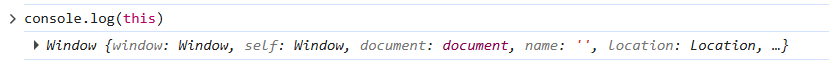

# Продвинутые объекты JavaScript

## Содержание

- [Продвинутые объекты JavaScript](#продвинутые-объекты-javascript)
  - [Содержание](#содержание)
  - [Предисловие к главе](#предисловие-к-главе)
  - [Ключевое слово `this`](#ключевое-слово-this)
    - [Ключевое слово `this` в объектах](#ключевое-слово-this-в-объектах)
      - [Использование `this` в методах объектов](#использование-this-в-методах-объектов)
      - [`this` - не фиксированное значение](#this---не-фиксированное-значение)
  - [Продвинутая работа с `this`](#продвинутая-работа-с-this)
    - [Что такое `this` на самом деле?](#что-такое-this-на-самом-деле)
    - [Что такое контекст выполнения?](#что-такое-контекст-выполнения)
    - [Глобальный контекст и глобальный объект](#глобальный-контекст-и-глобальный-объект)
    - [Контекст выполнения функции (`this` в функциях)](#контекст-выполнения-функции-this-в-функциях)
    - [`this` в стрелочных функциях](#this-в-стрелочных-функциях)
  - [Конструктор объектов и оператор `new`](#конструктор-объектов-и-оператор-new)
    - [Почему нам нужен конструктор объектов?](#почему-нам-нужен-конструктор-объектов)
    - [Функция-конструктор](#функция-конструктор)
    - [Использование ключевого слова `return` в функции-конструкторе](#использование-ключевого-слова-return-в-функции-конструкторе)
  - [Классы в JavaScript](#классы-в-javascript)
    - [Определение класса](#определение-класса)
    - [Создание экземпляров класса](#создание-экземпляров-класса)
    - [Конструктор класса](#конструктор-класса)
    - [Поля и методы класса](#поля-и-методы-класса)
    - [Инициализация полей через конструктор](#инициализация-полей-через-конструктор)
    - [Что такое класс в JS?](#что-такое-класс-в-js)
  - [Оператор опциональной цепочки (Optional chaining)](#оператор-опциональной-цепочки-optional-chaining)
    - [Проблема "несуществующих" свойств](#проблема-несуществующих-свойств)
    - [Оператор опциональной цепочки `?.`](#оператор-опциональной-цепочки-)
    - [Оператор `?.` с методами и со скобочной нотацией](#оператор--с-методами-и-со-скобочной-нотацией)
  - [JSON](#json)
    - [Что такое JSON?](#что-такое-json)
    - [Значения JSON](#значения-json)
    - [Примеры JSON](#примеры-json)
    - [Работа с JSON в JavaScript](#работа-с-json-в-javascript)
  - [Теперь вы знаете ...](#теперь-вы-знаете-)

## Предисловие к главе

Если вам кажется, что вы уже знаете всё об объектах в JavaScript, скорее всего, это лишь иллюзия. Объекты в JavaScript это одна из фундаментальных концепций, которая лежит в основе всего языка. И, их изучение может быть "бесконечным", так как в них есть множество нюансов и особенностей.

В рамках этого курса мы не будем пытаться охватить всё сразу. Вместо этого сосредоточимся на наиболее важных и практических продвинутых концепциях, которые действительно пригодятся вам в реальной разработке.


## Ключевое слово `this`

Из других языков программирования, таких как C++ и Java, вам уже известно о ключевом слове `this`. В языке JavaScript ключевое слово `this` обозначает почти то же самое, что и в других языках программирования, однако оно обладает своими особенностями.

Мы ограничимся лишь основами данной темы и не будем углубляться в детали, поскольку это может затруднить дальнейшее понимание. Попытаемся разобрать данное ключевое слово сразу на практике.

### Ключевое слово `this` в объектах

#### Использование `this` в методах объектов

Рассмотрим задачу. Предположим, у нас есть объект `player`, который содержит свойство `username`. Необходимо создать метод объекта, который выводил бы приветствие и имя пользователя (`username`).

То есть, иметь следующий объект с методом `greet()`:

```js
const player = {
  username: 'Alex',

  greet() {
    // ...
  },
};
```

Если Вы знакомы с другими языками программирования, то, возможно, попробуете реализовать метод `greet()` следующим образом:

```js
const player = {
  username: 'Alex',
  greet() {
    console.log(`Hi, my name is ${username}`);
  },
};
```

Но если Вы попытаетесь запустить данный код, то получите следующую ошибку:

```
Uncaught ReferenceError: username is not defined
```

Вы получите данную ошибку, так как переменная `username` не определена в контексте функции `greet()`, это значит, что функция `greet()` не знает, а какой именно `username` Вы имеете в виду: глобальную переменную `username` или же свойство `username` объекта `player`.

В других языках данное обращение сработало бы, но в JavaScript контекст выполнения функции не подразумевает автоматическое распознавание переменной `username` как свойства объекта. Поэтому, чтобы обратиться к свойству `username` объекта `player` внутри метода `greet()`, необходимо использовать ключевое слово `this`, которое ссылается на текущий объект, в данном случае на `player`.

```js
const player = {
  username: 'Alex',
  greet() {
    console.log(`Hi, my name is ${this.username}`);
  },
};

player.greet(); // "Hi, my name is Alex"
```

Теперь, когда мы используем `this.username`, JavaScript понимает, что мы имеем в виду свойство `username` объекта `player`, и успешно выводит приветствие с именем пользователя.

Если Вы не поняли, то попробуйте выполнить данный код:

```js
const player = {
  name: 'Alex',
  age: 23,

  greet() {
    console.log('Hi!');
  },

  displayThis() {
    console.log(this);
  },
};

player.displayThis();

// Будет выведено:
/* 
{
    name: 'Alex',
    age: 23,
    greet: [Function: greet],
    displayThis: [Function: displayThis]
} 
*/
```

Как видите, при вызове метода `displayThis()`, который выводит значение `this`, мы получаем весь объект `player`. То есть, _в данном случае_, `this` это буквально текущий объект, в котором был вызван метод `displayThis()`.

Более простыми словами, когда мы используем `this`, мы обращаемся к текущему объекту, в котором находится код, где это слово используется.

#### `this` - не фиксированное значение

Еще одной особенностью `this` является его динамическая среда. Попробуем написать следующий код:

```js
function greet() {
  console.log(this.name);
}
```

Казалось бы, мы использовали `this` в функции `greet()`, но не определили, к какому объекту оно относится. Это можно исправить, присвоим функцию `greet` в качестве метода объекта `player`:

```js
// Определяем функцию greet(), которая выводит приветственное сообщение,
// используя свойство name объекта, на котором она вызывается
function greet() {
  console.log(`Hi, my name is ${this.name}`);
}

// Создаём объект player с свойством name и методом greet,
// который ссылается на функцию greet()
const player = {
  name: 'Player',
  greet,
};

console.log(player.greet()); // Hi, my name is Player

// Создаём объект user с свойством name и методом greet,
// который также ссылается на функцию greet()
const user = {
  name: 'User',
  greet,
};

console.log(player.greet()); // Hi, my name is User
```

В данном примере мы определили функцию `greet()`, которая использует `this.name` для вывода приветственного сообщения. Затем мы создали два объекта, `player` и `user`, каждый из которых имеет свойство `name` и метод `greet`, который ссылается на одну и ту же функцию `greet()`.

При вызове `player.greet()`, `this` внутри функции `greet()` ссылается на объект `player`, и выводится "Hi, my name is Player". При вызове `user.greet()`, `this` ссылается на объект `user`, и выводится "Hi, my name is User".

Это происходит, так как `this` в JavaScript определяется в момент выполнения кода. То есть одна и та же функция может быть "привязана" к разным объектам, и `this` будет указывать на тот объект, на котором была вызвана функция.

## Продвинутая работа с `this`

> [!NOTE]
>
> Эта глава является дополнительной. Её содержание не будет включено в экзаменационные материалы и контрольные вопросы.

В прошлой главе был разробран один частный случай использования `this` в контексте объектов. Хотя, `this` можно использовать в любой части кода: в обычных функциях, методах объектов и даже в глобальной области видимости. Но, в зависимости от того, где и как используется `this`, его значение может меняться.

Сама "_философия_" этого слова довольно сложна, и его понимание приходит лишь с опытом и практикой. Поэтому, возможно, после прочтения главы вы будете себя чувствовать вот так:


Но не отчаивайтесь, это нормально. Попробуем максимально просто объяснить, как работает `this` в различных контекстах.

### Что такое `this` на самом деле?

`this` - это специальное ключевое слово, которое ссылается на текущий контекст выполнения, который выполняется в данный момент.

Звучит очень абстрактно и немного "страшно", не правда ли? Но на самом деле, это не так сложно, как кажется. Разберемся со всем по порядку.

### Что такое контекст выполнения?

_Контекст выполнения_ - это окружение, в котором выполняется код. Он определяет, какие переменные и функции доступны в данный момент времени. То есть, это своего рода "окружение", в котором выполняется код и доступны определенные переменные и функции.

Для лучшего понимания рассмотрим пример из _реальной жизни_.

Представьте, что ваш дом - это ваша программа. Тогда, _контекст выполнения_ - это комната, в которой вы находитесь и все предметы, которые находятся в этой комнате.

Например, когда вы находитесь в кухне, контекст выполнения для вас - это кухня, и такие предметы, которые можно использовать в этом контексте - это кастрюли, сковородки, холодильник и т.д. Если вы хотите использовать другие предметы, например, кровать или телевизор, вам нужно выйти из кухни и войти в другую комнату.

А сам ваш дом в данном случае будет _глобальным контекстом_, который содержит все комнаты и предметы внутри них.

Точно так же в JavaScript, контекст выполнения определяет, какие переменные доступны внутри функции, метода или глобальной области видимости. И `this` ссылается на текущий контекст выполнения, в котором выполняется код.

### Глобальный контекст и глобальный объект

_Глобальный контекст выполнения_ - это контекст, который существует с момента запуска программы и доступен во всех частях кода. В глобальном контексте `this` ссылается на _глобальный объект_.

_Глобальный объект_ - это объект, который существует в глобальной области видимости и содержит глобальные переменные и функции. В браузере глобальный объект - это `window`, а в Node.js - это `global`.

Попробуйте зайти в консоль разработчика в браузере и вывести значение `this`:

```js
console.log(this);
```

Вы увидите, что `this` ссылается на глобальный объект `window`.



_Рисунок 8.1. Вывод глобального объекта в браузере_

То есть `Window` - это глобальный объект, который доступен в браузере, и содержит такие объекты и функции, как `console` - для взаимодействия с консолью, или `alert()` - для отображения всплывающих окон. Эти объекты и функции доступны в глобальном контексте, и мы можем использовать их напрямую или через `this`, например, `this.console.log("Hello")` или просто `console.log("Hello")`.

> [!NOTE]
>
> В браузере можно обращаться к глобальному объекту `window` напрямую, так как он является глобальным контекстом. Поэтому, например, `window.alert("Hello")`, `alert("Hello")` и `this.alert("Hello")` будут работать одинаково, так как `window`, `this` и глобальный контекст ссылаются на один и тот же объект.

Если Вы попробуйте запустить тот же код в среде Node.js (на компьютере), то увидите, что `this` ссылается на глобальный объект `global`, который является аналогом `window` в браузере. Однако, в Node.js нет таких объектов, как `alert()`, так как это специфично для браузера, но есть другие глобальные объекты и функции.

Как думаете, а какие функции содержит был бы глобальный объект в кофе-машине, если бы она была написана на JavaScript?

### Контекст выполнения функции (`this` в функциях)

Теперь, когда мы разобрались с `this` в глобальном контексте, давайте рассмотрим, как `this` работает внутри функций. В общем случае, значение `this` внутри функции зависит от того, как эта функция была вызвана.

Алгоритм определения значения `this` в функции довольно сложный, но в большинстве случаев он определяется следующим образом:

1. Если функция была вызвана как метод объекта, `this` будет ссылаться на этот объект.

   ```js
   const car = {
     brand: 'Toyota',
     model: 'Camry',
     year: 2020,
     displayInfo: function () {
       console.log(`Brand: ${this.brand}, Model: ${this.model}, Year: ${this.year}`);
     },
   };

   car.displayInfo(); // Выведет: Brand: Toyota, Model: Camry, Year: 2020
   ```

2. Если функция не привязана к какому-либо объекту или неявно не вызвана с использованием ключевого слова `new` (см. главу [Конструктор объектов и оператор `new`](#конструктор-объектов-и-оператор-new)), ключевое слово `this` будет ссылаться на глобальный объект (в строгом режиме `undefined`).

   ```js
   function showThis() {
     console.log(this);
   }

   showThis(); // В браузере выведет глобальный объект window, в Node.js - global
   ```

### `this` в стрелочных функциях

Одно из отличий стрелочных функций заключается в том, что у стрелочных функций _нет своего собственного_ `this`. Они всегда берут значение `this` из окружающего контекста, в котором они были определены (то есть, из лексического окружения или простыми словами, из того места, где они были созданы).

```js
const person = {
  name: 'Alice',

  greet: () => {
    console.log(`Hi, my name is ${this.name}`);
  },
};

person.greet(); // Выведет: Hi, my name is undefined
```

В примере выше выводится `undefined`, потому что стрелочная функция `greet` не имеет своего собственного `this`, и она пытается получить `this.name` из _глобального контекста_, где `name` не определено. Поэтому, в данном случае, `this.name` возвращает `undefined`.

А теперь давайте попробуем переписать метод `greet` с использованием обычной функции, а внутри нее использовать стрелочную функцию для вывода приветствия:

```js
const person = {
  name: 'Alice',

  greet() {
    const func = () => {
      console.log(`Hi, my name is ${this.name}`);
    };
    func();
  },
};

person.greet(); // Выведет: Hi, my name is Alice
```

Смотрите, функция `func` объявлена внутри метода `greet`, который является обычной функцией. Поскольку `func` - это стрелочная функция, она не имеет своего собственного `this` и берет его из окружающего контекста (то есть, из функции выше), которая является методом объекта `person`. Поэтому, когда мы вызываем `func()`, `this.name` внутри нее ссылается на `person.name`, и выводится "_Hi, my name is Alice_".

> [!NOTE]
>
> Эти правила действуют в _нестрогом режиме_. Про строгий режим и его влияние на `this` будет рассмотрено в следующих главах.

В данной главе были рассмотрены лишь нюансы продвинутой работы с ключевым словом `this`. Как уже было упомянуто ранее, существует множество подводных камней в данной "_философии_". Однако, такие ситуации встречаются не так часто, и вы сможете рассмотреть их чуть позже, когда будете "_морально и физически_" готовы.

> [!TIP]
>
> Интересная статья по `this`: https://habr.com/articles/785872/

## Конструктор объектов и оператор `new`

### Почему нам нужен конструктор объектов?

В предыдущих разделах мы создавали объекты, используя фигурные скобки `{ ... }`. Однако у этого способа есть один недостаток: невозможность создания объектов по определенному шаблону, что заставляет повторять один и тот же код вручную. То есть, если мне нужно создать два объекта `Player`, то мне придется писать код для каждого объекта, что неэффективно и неудобно.

```javascript
const player1 = {
  username: '...',
  age: '...',
};

const player2 = {
  username: '...',
  age: '...',
};
```

Этот метод не является плохим, но он ограничивает Вас в создании объектов одинакового типа. В других языках программирования есть "классы", в JS они тоже имеются, но мы рассмотрим их чуть позже. В JS есть другой способ создания объектов по шаблону - это использование функции-конструктора.

### Функция-конструктор

Из курса ООП вы уже знаете, что такое конструктор. В JavaScript функция-конструктор немного отличается от обычного конструктора в ООП, хоть сама концепция и похожа.

В JavaScript _функция-конструктор_ - это _обычная функция, которая используется для создания новых объектов_ с определёнными свойствами и методами. Она позволяет создавать объекты по шаблону, что делает код более эффективным и удобным.

Есть два правила, которые необходимо соблюдать при создании функции-конструктора:

1. Функция-конструктор должна называться с большой буквы. Это не является обязательным, но это общепринятая практика, которая помогает отличать функции-конструкторы от обычных функций.
2. Функция-конструктор должна вызываться с помощью слова `new`. Это позволяет создать новый объект и установить его прототип на функцию-конструктор.

Общий синтаксис функции-конструктора выглядит следующим образом:

```js
function ConstructorName(param1, param2, ...) {
  // Инициализация свойств и методов объекта
  // С помощью ключевого слова this
  this.property1 = param1;
  this.property2 = param2;

  this.method1 = function () {
    // Код метода
  };
}

// Создание нового объекта с помощью оператора new
const object1 = new ConstructorName(arg1, arg2, ...);
const object2 = new ConstructorName(arg1, arg2, ...);
```

Например, создадим функцию-конструктор `Player`, которая будет использоваться для создания объектов игроков с определёнными свойствами и методом:

```js
function Player(username, age) {
  this.username = username;
  this.age = age;
  this.greet = function () {
    return `Hi, my name is ${this.username}`;
  };
}
// Создаем два объекта `Player`
const player1 = new Player('Alex', 22);
const player2 = new Player('Robert', 18);
```

Теперь чуть подробнее о том, как работает функция-конструктор. Когда мы вызываем `new Player('Alex', 22)`, происходит следующее:

1. Создается новый пустой объект, который затем присваивается ключевому слову `this`.
2. Выполняются инструкции внутри соответствующей функции-конструктора, которая может устанавливать свойства объекта через `this`.
3. Затем возвращается объект `this`, который содержит созданные свойства и методы.

Действия [1] и [2] происходят неявно, то есть мы не пишем их явно в коде, что делает его более чистым и компактным.

```js
function Player(username, age) {
  // this = {} - создается новый пустой объект и присваивается this

  this.username = username; // this.username = 'Alex'
  this.age = age; // this.age = 22
  this.greet = function () {
    return `Hi, my name is ${this.username}`;
  };

  // return this - возвращается объект this, который содержит созданные свойства и методы
}
```

Теперь объекты можно создавать по шаблону, что делает код более эффективным и удобным. Например, мы можем создать несколько игроков с разными именами и возрастами, используя одну и ту же функцию-конструктор:

### Использование ключевого слова `return` в функции-конструкторе

В функции-конструкторе можно использовать ключевое слово `return`, но его использование может привести к _неожиданным результатам_. Если `return` возвращает:

1. _Примитивное значение_ (например, строку, число, булевое значение), то оно будет проигнорировано, и функция-конструктор вернет объект `this`, который был создан при вызове с помощью `new`.

   ```js
   function Player(username, age) {
     this.username = username;
     this.age = age;

     return 'This is a string'; // Это будет проигнорировано
   }

   const player1 = new Player('Alex', 22);
   console.log(player1); // Выведет: Player { username: 'Alex', age: 22 }
   ```

2. _Объект_, то он будет возвращен вместо объекта `this`.

   ```js
   function Player(username, age) {
     this.username = username;
     this.age = age;

     return { message: 'This is an object' }; // Этот объект будет возвращен
   }

   const player1 = new Player('Alex', 22);

   // Выведет: { message: 'This is an object' }
   // Поскольку функция-конструктор возвращает объект, он будет возвращен вместо объекта this, который был создан при вызове с помощью new.
   console.log(player1); // Выведет: { message: 'This is an object' }
   ```

## Классы в JavaScript

Классы в JavaScript были введены в стандарте ECMAScript 2015 (ES6) и предоставляют синтаксический сахар над функциями-конструкторами и прототипами (прототипы будут рассмотрены в следующей главе). Они позволяют создавать объекты и управлять наследованием более удобным и понятным способом.

### Определение класса

Для определения класса в JavaScript используется ключевое слово `class`, за которым следует имя класса и тело класса, заключенное в фигурные скобки `{ ... }`. Внутри тела класса можно определять конструктор, методы и свойства.

```js
class Player {
  // тело класса
}

// class expression
const player = class {
  // тело класса
};
```

### Создание экземпляров класса

Для создания экземпляров класса используется оператор `new`, за которым следует имя класса и аргументы, передаваемые в конструктор (если он определен).

```js
class Player {
  // ...
}

const player1 = new Player();
const player2 = new Player();
```

### Конструктор класса

Конструктор класса - это специальный метод, который вызывается при создании нового экземпляра класса. Часто он используется для инициализации свойств объекта. Конструктор определяется с помощью ключевого слова `constructor`.

```js
class Player {
  constructor() {}
}

const player1 = new Player(); // В данном случае, конструктор не принимает аргументов и не выполняет никаких действий, но он все равно вызывается при создании экземпляра класса.
```

### Поля и методы класса

Как вы могли заметить в примере выше, мы определили два поля `username` и `age` внутри конструктора, это обычная практика. Нет необходимости определять поля вне конструктора, если они не являются приватными.

Поля (свойства) класса подразделяются на 2 уровня доступа (2 модификатора доступа):

- public (публичные),
- private (приватные).

Эти понятия вам уже знакомы из курса объектно-ориентированного программирования.

Для обозначения приватного модификаторов доступа используются символ `#` перед именем свойства:

```js
class Player {
  username; // публичное (public) свойство
  #address; // приватное (private) свойство

  constructor(username, address) {
    this.username = username;
    this.#address = address;
  }
}

const player = new Player('Alex', '105 Big Hill');
console.log(player.username); // "Alex"
console.log(player.#address); // Error: Property '#address' is not accessible outside class 'Player' because it has a private identifier.
```

Методы объявляются также, как и в других языках программирования.

```js
class Player {
  username;
  #hp = 100;

  /**
   * Приветствие игрока
   */
  greet() {
    // публичный метод
    console.log(`Hello, i'm ${this.username}`);
  }

  /**
   * Уменьшение HP на 20
   */
  #reduceHP() {
    // приватный метод
    this.#hp -= 20;
  }
}
```

### Инициализация полей через конструктор

Вы очень редко увидите, как поля объявляются вне конструктора. Вместо этого, все поля обычно инициализируются внутри конструктора, что делает код более чистым и удобным для чтения.

> [!NOTE]
>
> Стоит отметить, что в конструкторе можно определить только публичные поля, в то время как все приватные поля следует определять в начале класса.

```js
class Player {
  constructor(username, address) {
    this.username = username;
    // this.#address = address; // так нельзя
  }
}

const player = new Player('Alex', 20);
console.log(player.username); // Alex
```

### Что такое класс в JS?

Чтобы ответить на вопрос, что же такое класс в JavaScript, давайте создадим класс и посмотрим, каким типом он является:

```js
class Player {}

typeof Player; // 'function'
```

И да, не удивляйтесь. В JavaScript _классы - это функция_.

Ответ на вопрос, почему в JavaScript классы представляют собой функции, звучит очень просто. Когда мы объявляем класс, например `class Player { }`, происходит следующее:

1. Создается функция-конструктор с именем `Player`, которая будет использоваться для создания новых объектов.
2. Внутри функции-конструктора выполняется код из конструктора `constructor`, если он определен.
3. Путем наследования (о чем мы поговорим позже), все методы из класса сохраняются в объект, который будет использоваться в качестве прототипа для всех экземпляров класса.

```js
class Player {
  constructor() {
    this.name = 'Alex';
    this.age = 2;
  }
}

// по сути то же самое, что и
function Player() {
  this.name = 'Alex';
  this.age = 2;
}
```

Это еще одно доказательство, что классы в JavaScript - это просто синтаксический сахар над функциями-конструкторами.

## Оператор опциональной цепочки (Optional chaining)

### Проблема "несуществующих" свойств

Часто в JavaScript возникает ситуация, когда мы работаем с объектами, которые могут не иметь определенных свойств. Например, у нас может быть объект `user`, который может содержать информацию о пользователе, но не всегда гарантированно будет иметь все свойства.

Если свойство объекта отсутствует, то выражение вернет `undefined`. Однако, если у нас возникает более глубокая вложенность, то могут возникать различные ошибки.

Например, если мы попытаемся обратиться к свойству `address` объекта `user`, который не имеет такого свойства, то мы получим `undefined`.

```js
const user = {
  name: 'Alice',
};

user.address; // undefined
```

А теперь давайте предположим, что `address` - это вложенный объект, который может содержать свойство `street`. Если мы попытаемся обратиться к `user.address.street`, то мы получим ошибку, так как `address` не определен. Так как `user.address` возвращает `undefined` и мы буквально пытаемся обратиться к `street` у `undefined`, что приводит к ошибке:

```js
const user = {
  name: 'Alice',
};

user.address.street; // Ошибка: Невозможно прочитать свойства undefined
```

Рассмотрим другой пример с HTML-элементами. Если мы попытаемся извлечь содержимое определенного HTML-элемента, который может не существовать на странице, то мы также столкнемся с ошибкой.

```js
const btnText = document.getElementById('button').innerText;
// Если элемент с id "button" не будет найден, будет сгенерирована ошибка
```

Можно было бы избежать данной ошибке используя условные операторы.

```js
// Вариант 1
const playerAddress = user.address ? user.address.street : undefined;

// Вариант 2
const playerAddress = user.address && user.address.street;
```

Однако в данном случае наш код становится менее читаемым и более громоздким, особенно если у нас есть несколько уровней вложенности.

### Оператор опциональной цепочки `?.`

Оператор опциональной цепочки `?.` позволяет безопасно обращаться к вложенным свойствам объекта, даже если одно из промежуточных свойств отсутствует. Если любое из свойств в цепочке не существует, выражение возвращает `undefined` вместо генерации ошибки.

Если выражение до `?.` равно `undefined` или `null`, то оператор `?.` останавливает вычисление и возвращает `undefined`.

```js
const user = {};

const userHome = user.address?.home;

// Поскольку user.address == undefined,
// в userHome возвращается undefined

console.log(userHome); // undefined
```

```js
const btnText = document.getElementById('button')?.innerText;

// Поскольку  document.getElementById("button") == null, так как на странице нет элемента
// в btnText возвращается undefined

console.log(btnText); // undefined
```

### Оператор `?.` с методами и со скобочной нотацией

Оператор `?.` работает также с методами и со скобочной нотацией.

```js
const player = {
  username: 'Admin',
};

player.greet?.(); // undefined, так как метода greet() нет.
player.address?.['home']; // undefined,
```

## JSON

Еще одной темой, которую стоит рассмотреть в рамках объектов, является JSON.

### Что такое JSON?

Вы наверняка уже сталкивались с понятием JSON. JSON используется повсеместно в веб-разработке, а также в других языках программирования, не связанных с JavaScript.

_JSON (JavaScript Object Notation)_ - это легкий формат представления данных, основанный на синтаксисе объектов JavaScript. JSON предоставляет удобный способ представления структурированных данных, таких как массивы и объекты, в виде текстовой строки. Благодаря своей простоте и удобству в использовании, JSON стал популярным форматом для работы с данными в различных сценариях программирования.

То есть, JSON, по сути, представляет собой формат для представления данных в виде объектов и массивов JS. Несмотря, что он основан на синтаксисе JavaScript, сам по себе является независимым от него, что позволяет использовать его в различных языках программирования.

> [!TIP]
>
> Часто, JSON используется для _обмена данными между разными системами_. Мы рассмотрим его использования в главах с асинхронными операциями.

### Значения JSON

В качестве значений в JSON можно использовать:

1. Объект
2. Массив
3. Число (`number`)
4. Строка (`string`)
5. Литералы `true`, `false` и `null`

### Примеры JSON

_Пример №1_. Объект

```json
{
  "name": "Ilya",
  "age": 23,
  "address": {
    "street": "105 Silent See",
    "home": 10
  },
  "isActive": true
}
```

_Пример №2_. Массив объектов

```json
[
  {
    "nickname": "dev",
    "hp": 100,
    "xp": 204
  },
  {
    "nickname": "nicky",
    "hp": 400,
    "xp": 285
  }
]
```

Заметьте, в конце последнего свойства запятая не ставится, это считается ошибкой.

### Работа с JSON в JavaScript

В JavaScript существуют две функции, которые позволяют преобразовывать объекты в формат JSON (в строку JSON) и обратно, из строки JSON в объект.

- `JSON.stringify` - для преобразования объектов в JSON.
- `JSON.parse` - для преобразования JSON обратно в объект.

_Преобразование объекта в JSON_

```js
const player = {
  nickname: 'dev',
  hp: 200,
};

const json = JSON.stringify(player);

// `json` - строка
// {"nickname":"dev","hp":200}
console.log(json);
```

_Преобразование JSON в объект_

```js
const str = `{"nickname": "Piotr", "hp": 22}`;
const player = JSON.parse(str);

// `player` - объект
// { nickname: 'Piotr', hp: 22 }
console.log(player);
```

> [!NOTE]
> `JSON.stringify` _пропускает_
>
> 1. Методы объекта (свойства функции)
> 2. Свойства, значение которых `undefined`
> 3. Свойства объявленные с помощью `Symbol`

## Теперь вы знаете ...

1. Что ключевое слово `this` в JavaScript не имеет фиксированного значения и определяется в момент вызова функции, а не в момент её объявления.
2. Что в контексте объекта this ссылается на сам объект, внутри которого был вызван метод.
3. Почему без `this` внутри методов невозможно корректно обратиться к свойствам объекта.
4. Что значение `this` зависит от контекста вызова, а одна и та же функция может работать с разными объектами.
5. Что такое контекст выполнения и почему он напрямую влияет на поведение `this`.
6. Как работает `this` в глобальном контексте (например, window в браузере).
7. Как ведёт себя `this` в обычных функциях и чем отличается строгий режим.
8. В чём особенность стрелочных функций и почему у них нет собственного `this`.
9. Зачем нужны функции-конструкторы и как с помощью `new` создавать объекты по шаблону.
10. Что классы в JavaScript - это синтаксический сахар над функциями-конструкторами.
11. Как работает оператор опциональной цепочки `?.` и почему он делает код безопаснее.
12. Что такое JSON и как использовать `JSON.stringify()` и `JSON.parse()` для работы с данными.
