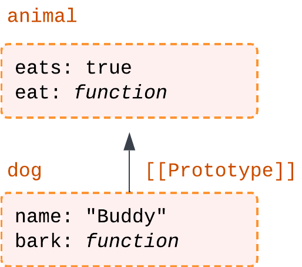
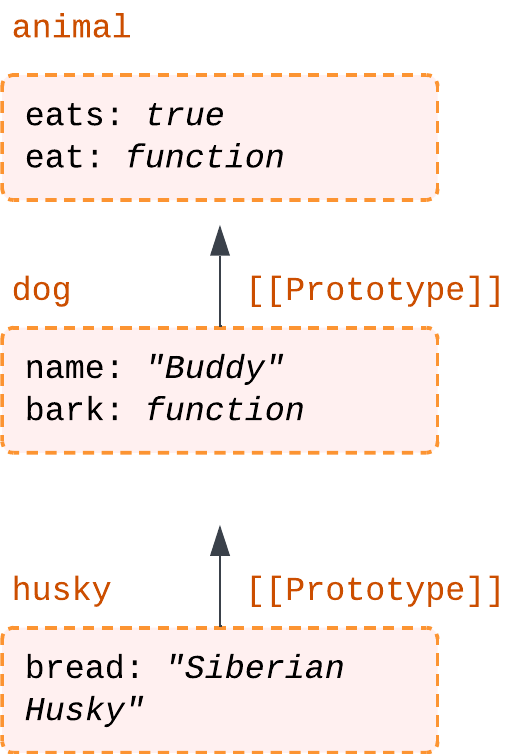
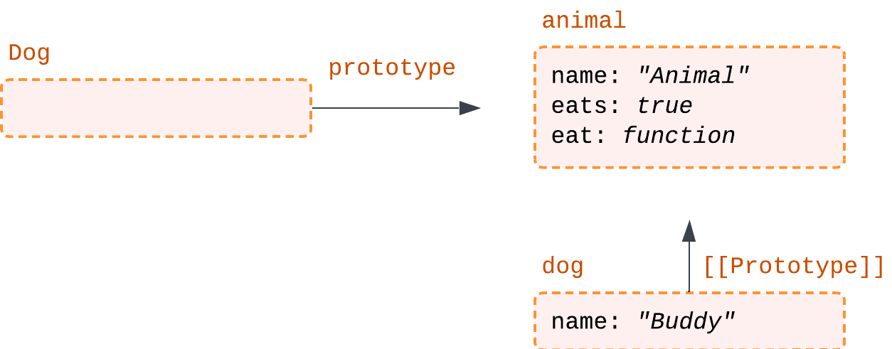
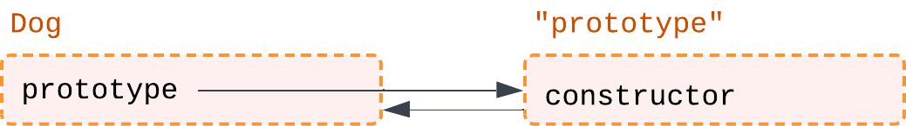
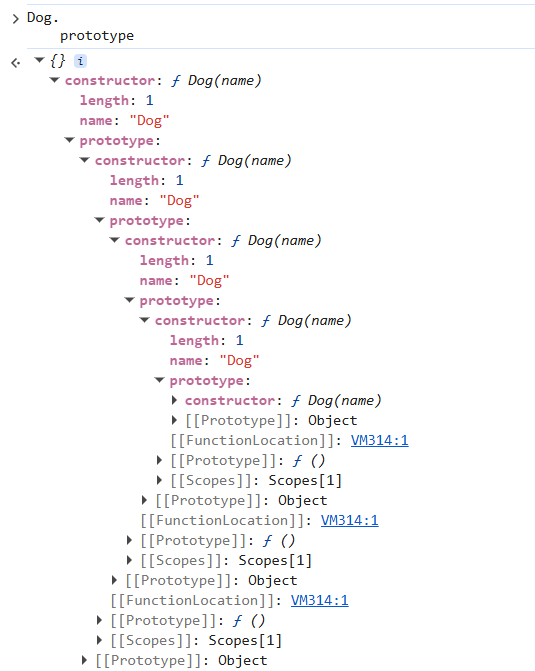
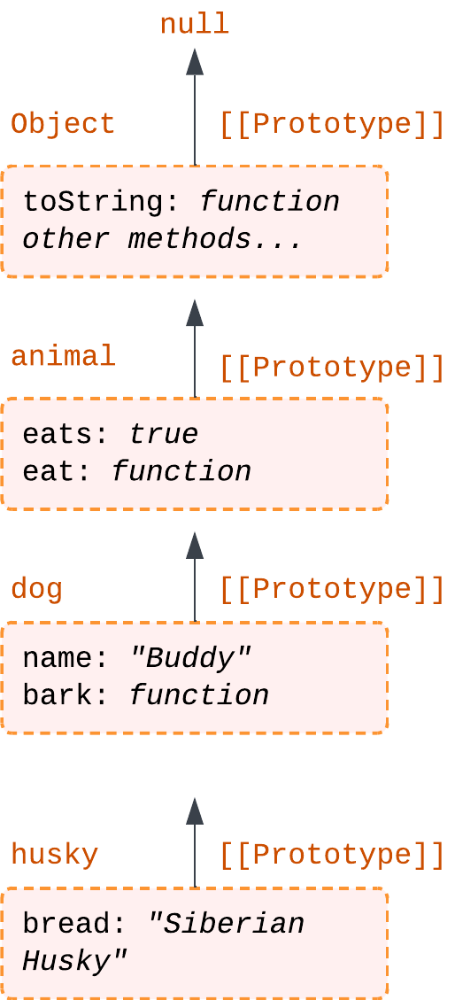
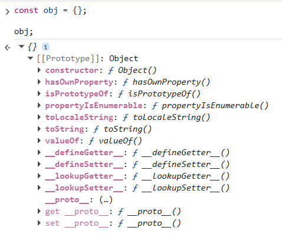

# Прототипы и насследование

## Содержание

- [Прототипы и насследование](#прототипы-и-насследование)
  - [Содержание](#содержание)
  - [Вспомним, что такое наследование](#вспомним-что-такое-наследование)
  - [Наследование в JavaScript: прототипное наследование](#наследование-в-javascript-прототипное-наследование)
  - [Свойство `[[Prototype]]` и `__proto__`](#свойство-prototype-и-__proto__)
    - [Как реализовано прототипное наследование и что такое `[[Prototype]]`?](#как-реализовано-прототипное-наследование-и-что-такое-prototype)
    - [Операции записи в прототипной цепочке](#операции-записи-в-прототипной-цепочке)
  - [Прототипы и функции-конструкторы](#прототипы-и-функции-конструкторы)
    - [Использование прототипов с функциями-конструкторами](#использование-прототипов-с-функциями-конструкторами)
    - [Свойство `constructor`](#свойство-constructor)
  - [Встроенные прототипы](#встроенные-прототипы)
    - [Object.prototype и другие встроенные прототипы](#objectprototype-и-другие-встроенные-прототипы)
    - [Изменение встроенных прототипов](#изменение-встроенных-прототипов)
  - [Методы работы с прототипами](#методы-работы-с-прототипами)
  - ["Простейший объект" и `null`](#простейший-объект-и-null)
  - [Цикл `for...in` и прототипы](#цикл-forin-и-прототипы)
  - [Теперь вы знаете ...](#теперь-вы-знаете-)

## Вспомним, что такое наследование

Из курса по ООП вы уже знаете, что такое наследование. Напомним: _наследование_ - это механизм, позволяющий создавать новый класс на основе уже существующего. Новый класс (называемый _потомком_) получает свойства и методы _родительского класса_, что позволяет повторно использовать код и выстраивать более сложные структуры.

Например, у нас есть класс `Animal` (животное), содержащий общие свойства и методы для всех животных: _кушать_, _спать_, _двигаться_. На его основе можно создать класс `Dog` (собака), который унаследует всё базовое поведение и при этом получит собственные, специфичные особенности: _гавкать_, _приносить палку_ и т.д.

Без механизма наследования пришлось бы описывать схожую логику в каждом классе отдельно, что быстро привело бы к дублированию кода и усложнило поддержку. Наследование же помогает сделать код более аккуратным и логически связанным.

## Наследование в JavaScript: прототипное наследование

Если говорить простыми словами, объекты в JavaScript могут ссылаться на другие объекты. Когда свойство не найдено в самом объекте, JavaScript автоматически ищет его в его "родителе" (прототипе), затем в "родителе родителя" и так далее.

Например, у нас есть объект `animal` с методом `eat()`. Если мы создадим новый объект `dog`, который будет ссылаться на `animal`, и добавим ему метод `bark()`, то `dog` сможет использовать оба метода: `eat()` и `bark()`. Даже если `eat()` не определён в самом объекте `dog`, он будет найден в его прототипе `animal`.

> [!NOTE]
>
> В JavaScript наследование называется прототипным, потому что вместо системы "_класс-чертёж_" (как в классических ООП-языках) у нас есть живой объект-пример, от которого можно "отталкиваться". _Прототип_ - это просто другой объект, на который ведёт скрытая ссылка у текущего объекта. Если в классическом ООП у нас есть класс `Animal` и наследник `Dog`, то в JavaScript созданный объект `dog` может напрямую ссылаться на объект `animal` и использовать его свойства и методы через цепочку прототипов.

## Свойство `[[Prototype]]` и `__proto__`

### Как реализовано прототипное наследование и что такое `[[Prototype]]`?

Чтобы один объект мог использовать свойства и методы другого, в JavaScript существует скрытое внутреннее свойство `[[Prototype]]`, которое есть у каждого объекта. Свойство `[[Prototype]]` указывает на другой объект или `null`. Этот другой объект и называется _прототипом_.

То есть, если у нас есть объект `animal`, то объект `dog` может иметь `[[Prototype]]`, указывающий на `animal`.

Когда вы пытаетесь вызвать метод `dog.eat()`, JavaScript действует по следующему алгоритму:

1. Проверяет сам объект `dog`. Есть ли у него метод `eat`.
2. Если нет - обращается к `[[Prototype]]`. Переходит к объекту `animal`, на который ссылается `dog`.
3. Продолжает поиск по цепочке. Если метод не найден, поиск продолжается дальше - в прототипе прототипа, и так далее, пока:
   - метод не будет найден;
   - или не будет достигнут конец цепочки (`[[Prototype]] === null`).

Одним из способов установить прототип является использование специального свойства `__proto__`. Это свойство позволяет явно указать, какой объект будет прототипом для текущего объекта. Например:

```javascript
const animal = {
  eats: true,

  eat() {
    console.log('Animal is eating');
  },
};

const dog = {
  name: 'Buddy',

  bark() {
    console.log('Dog is barking');
  },
};

// Устанавливаем прототип для dog, указывая на animal
dog.__proto__ = animal;

// У самого dog нет метода eat, поэтому
// JavaScript будет искать его в прототипе, который указывает на animal
dog.eat(); // Выведет: "Animal is eating"
dog.eats; // Выведет: true
```

В примере выше, мы можем сказать, что "_`animal` является прототипом для `dog`_" или "_`dog` прототипно наследует от `animal`_".

Данное насследование можно представить в виде следующей схемы:



_Рисунок 9.1. Схема прототипного наследования: dog -> animal_

> [!NOTE]
>
> Свойство `__proto__` считается устаревшим способом работы с прототипами и не рекомендуется для использования в реальных проектах. Позже мы рассмотрим более правильные и современные способы работы с прототипами.

Цепочка прототипов может быть намного длинее, например: `husky -> dog -> animal`, в данном случае у объекта `husky` будет доступ к методам и свойствам как `dog`, так и `animal`.

```js
const animal = {
  eats: true,

  eat() {
    console.log('Animal is eating');
  },
};

const dog = {
  name: 'Buddy',

  bark() {
    console.log('Dog is barking');
  },

  __proto__: animal,
};

const husky = {
  breed: 'Siberian Husky',

  __proto__: dog,
};

husky.eat(); // Выведет: "Animal is eating"
husky.bark(); // Выведет: "Dog is barking"
husky.breed; // Выведет: "Siberian Husky"
```

В данном случае схема прототипного наследования будет выглядеть следующим образом:



_Рисунок 9.2. Схема прототипного наследования: husky -> dog -> animal_

### Операции записи в прототипной цепочке

Прототип используется только для _чтения свойств_. _Операции записи_ и _удаления всегда_ выполняются непосредственно в самом объекте.

Например, если мы попытаемся изменить свойство `eats` у объекта `husky`, это не изменит значение `eats` в объекте `animal`, а создаст новое свойство `eats` прямо в объекте `husky`:

```js
const animal = {
  eats: true,
};

const dog = {
  name: 'Buddy',

  __proto__: animal,
};

const husky = {
  breed: 'Siberian Husky',

  __proto__: dog,
};

console.log(husky.eats); // Выведет: true

// У объекта husky появляется собственное свойство eats
husky.eats = false;

// Теперь свойство husky перекрывает значение из прототипа
console.log(husky.eats); // Выведет: false (свойство из husky)
console.log(animal.eats); // Выведет: true (свойство из animal)
```

> [!NOTE]
>
> Такое поведение называется затенением свойств (_property shadowing_): свойство объекта перекрывает одноимённое свойство из прототипа, не изменяя его.

> [!NOTE]
>
> Исключением являются _свойства-аксессоры_ (геттеры и сеттеры). Если в прототипе определён _геттер_ или _сеттер_, то при чтении или записи такого свойства будет вызываться соответствующий аксессор, даже если он находится в прототипе. Данная тема ещё не была вами изучена, но обязательно будет рассмотрена далее, поэтому пока просто запомните это правило.

Попробуйте понять, что будет выведено в следующем коде:

```js
let animal = {
  jumps: null,
};

let rabbit = {
  __proto__: animal,
  jumps: true,
};

alert(rabbit.jumps); // ? (1)

delete rabbit.jumps;

alert(rabbit.jumps); // ? (2)

delete animal.jumps;

alert(rabbit.jumps); // ? (3)
```

<details>
   <summary>Ответ</summary>
   
   1. `true` - свойство `jumps` находится в объекте `rabbit` и имеет значение `true`.
   2. `null` - после удаления свойства `jumps` из объекта `rabbit`, JavaScript ищет его в прототипе `animal`, где оно равно `null`.
   3. `undefined` - после удаления свойства `jumps` из объекта `animal`, оно больше не существует ни в объекте `rabbit`, ни в его прототипе, поэтому результатом будет `undefined`.
</details>

## Прототипы и функции-конструкторы

### Использование прототипов с функциями-конструкторами

В прошлой подглаве мы устанавливали прототипы напрямую у объектов. Однако в JavaScript есть более удобный способ создавать объекты с общими свойствами и методами - это функции-конструкторы, которые вы изучали в прошлой главе.

Мы можем заранее задать прототип для таких объектов, и он будет автоматически использоваться всеми экземплярами, созданными через эту функцию-конструктор.

Правило простое: мы можем присвоить объект свойству `F.prototype` (где `F` - функция-конструктор), и тогда все объекты, созданные с помощью `new F()`, будут иметь этот объект в качестве своего прототипа.

> [!IMPORTANT]
>
> Важно понимать, что `F.prototype` - это _обычное свойство функции_, которое по соглашению используется для указания прототипа объектов, создаваемых функцией-конструктором `F`. Когда JavaScript создаёт новый объект при вызове `new F()`, он берёт значение из `F.prototype` и устанавливает его в качестве `[[Prototype]]` для этого объекта.

Например, если у нас есть функция-конструктор `Dog`, мы можем задать её прототип следующим образом:

```js
const animal = {
  name: 'Animal',

  eats: true,

  eat() {
    console.log(`${this.name} is eating`);
  },
};

function Dog(name) {
  this.name = name;
}

Dog.prototype = animal;

const dog = new Dog('Buddy'); // dog.__proto__ === animal

dog.eat(); // Выведет: "Buddy is eating"
dog.eats; // Выведет: true
```



_Рисунок 9.3. Схема прототипного наследования с функцией-конструктором: dog -> Dog.prototype -> animal_

Можно также задавать методы для функции-конструктора отдельно, через её свойство prototype:

```js
function Dog(name) {
  this.name = name;
}

Dog.prototype.eat = function () {
  console.log(`${this.name} is eating`);
};

Dog.prototype.sleep = function () {
  console.log(`${this.name} is sleeping`);
};

const dog = new Dog('Buddy');

dog.eat(); // Выведет: "Buddy is eating"
dog.sleep(); // Выведет: "Buddy is sleeping"
```

### Свойство `constructor`

> [!NOTE]
>
> Эта глава является дополнительной. Её содержание не будет включено в экзаменационные материалы и контрольные вопросы.

Помните, мы говорили, что функции в JavaScript - это объекты, которые можно вызывать. У каждой функции есть встроенное свойство `prototype`, которое по умолчанию является объектом с единственным свойством `constructor`, указывающим на саму функцию.

Например,

```js
function Dog(name) {
  this.name = name;
}

console.log(Dog.prototype.constructor === Dog); // Выведет: true
```

Это можно представить так: у функции есть объект-прототип, а внутри него хранится ссылка обратно на эту же функцию.



_Рисунок 9.4. Схема прототипного наследования с функцией-конструктором и свойством constructor_

Именно поэтому возможны такие цепочки:

```js
Dog.prototype.constructor.prototype.constructor.prototype.constructor.prototype.constructor == Dog; // Выведет: true
```

Фактически, мы каждый раз "прыгаем" от объекта к функции и обратно, поэтому снова и снова приходим к `Dog`.



_Рисунок 9.5. Бесконечная цепочка свойства constructor_

На практике свойство `constructor` редко используют напрямую. Однако оно может быть полезно, когда у нас есть объект, но мы не знаем, какой конструктор использовался для его создания (например, объект получен из сторонней библиотеки), а нам нужно создать ещё один такой же объект.

```js
let oneMoreDog = new dog.constructor('Max');
```

## Встроенные прототипы

> [!NOTE]
>
> Как было сказано ранее, свойство `prototype` - это свойство функции-конструктора, которое определяет прототип для создаваемых объектов. Все встроенные функции-конструкторы в JavaScript используют этот механизм.

### Object.prototype и другие встроенные прототипы

Проведём небольшой опыт. Попробуйте создать объект и вывести его:

```js
const obj = {};

alert(obj); // Выведет: [object Object]
```

Вы видите, что при выводе объекта `obj` мы получаем строку `[object Object]`. На самом деле при выводе JavaScript неявно вызывает метод `toString()`: `obj.toString()`. Но откуда у объекта `obj` вообще есть метод `toString()`, если мы его не определяли и видим буквально _пустой объект_?

Давайте посмотрим на создание объекта `obj` внимательнее:

1. _Литерал `{}`_. Когда мы пишем `{}`, JavaScript фактически выполняет `new Object()`, создавая объект через встроенную функцию-конструктор `Object`.
2. _Функция-конструктор `Object`_. Эта функция создаёт объекты с прототипом `Object.prototype`.
3. _Методы в прототипе_. Именно в `Object.prototype` определён метод `toString()`, а также другие методы, такие как `hasOwnProperty()` и `isPrototypeOf()`.

Таким образом, при создании любого обычного объекта он автоматически наследует от `Object.prototype`. Поэтому даже "пустой" объект получает доступ к этим встроенным методам.

_Object.prototype_ - это корневой прототип для всех объектов в JavaScript. Сам `Object.prototype` не имеет прототипа (его `[[Prototype]]` равен `null`), что означает, что он является вершиной цепочки прототипов. Все объекты, созданные через литералы или функции-конструкторы, в конечном итоге наследуют от `Object.prototype`, если не указано иное.



_Рисунок 9.6. Схема прототипного наследования с Object.prototype_

Чтобы убедиться в этом, попробуйте в консоли браузера:

```js
const obj = {};

obj;

// или

console.log(obj.__proto__); // Выведет: Object.prototype (содержащий методы toString, hasOwnProperty и т.д.)
console.log(obj.__proto__.__proto__); // Выведет: null, так как Object.prototype не имеет прототипа
```



_Рисунок 9.7. Вывод объекта в консоли браузера_

Другими словами, `Object.prototype` - это базовый объект, от которого наследуют все остальные объекты. Он содержит общие методы, которые доступны всем объектам в JavaScript.

Кроме `Object.prototype` существуют и другие встроенные прототипы для различных типов данных. Например, у массивов есть `Array.prototype`, который содержит методы `push()`, `pop()`, `map()` и т.д. У строк есть `String.prototype` с методами `toUpperCase()`, `slice()` и другими.

### Изменение встроенных прототипов

Встроенные прототипы в JavaScript можно изменять. Например, мы можем переопределить метод `Array.prototype.forEach`, чтобы он выводил элементы массива в консоль:

```js
Array.prototype.forEach = function () {
  for (let i = 0; i < this.length; i++) {
    console.log('Element: ' + this[i]);
  }
};

[1, 2, 3].forEach(); // Выведет: "Element: 1", "Element: 2", "Element: 3"
```

Однако переопределение встроенных методов - плохая практика. Это может привести к неожиданному поведению программы и конфликтам с другими библиотеками.

> [!IMPORTANT]
>
> Никогда не изменяйте встроенные прототипы в реальных проектах без крайней необходимости. Это делает код менее предсказуемым и усложняет его поддержку. Единственный случай, когда это может быть оправдано - это полифиллы для добавления поддержки новых возможностей в старых браузерах, но даже в этом случае следует быть осторожным и хорошо документировать такие изменения.

## Методы работы с прототипами

В первой главе мы рассмотрели свойство `__proto__`, которое позволяет устанавливать прототип для объекта. Однако это устаревший способ, и в реальных проектах его использовать не рекомендуется.

Вместо этого существуют более современные и безопасные методы:

- `Object.create(proto)`. Создаёт новый объект с указанным прототипом `proto`.
- `Object.getPrototypeOf(obj)`. Возвращает прототип объекта `obj`.
- `Object.setPrototypeOf(obj, proto)`. Устанавливает прототип `proto` для объекта `obj`.

Эти методы делают работу с прототипами более явной и предсказуемой.

Рассмотрим пример с `animal` и `dog`:

```js
const animal = {
  eats: true,

  eat() {
    console.log('Animal is eating');
  },
};

const dog = Object.create(animal);

dog.name = 'Buddy';

dog.bark = function () {
  console.log('Dog is barking');
};

dog.eat(); // Выведет: "Animal is eating"
dog.eats; // Выведет: true

console.log(Object.getPrototypeOf(dog) === animal); // Выведет: true
```

> [!NOTE]
>
> Менять `[[Prototype]]` объекта после его создания (например, с помощью `Object.setPrototypeOf`) - плохая практика. Это может ухудшить производительность, так как JavaScript-движки оптимизируют объекты исходя из их структуры. Если структура меняется динамически, доступ к свойствам становится менее эффективным.

## "Простейший объект" и `null`

Иногда требуется создать объект без прототипа - без доступа к встроенным методам, таким как `toString()` или `hasOwnProperty()`.

Для этого используется `Object.create(null)`, который создаёт объект с `[[Prototype]]`, равным `null`:

```js
const obj = Object.create(null);

alert(obj); // Ошибка: obj.toString is not a function
```

Такой объект не наследует ничего, даже от `Object.prototype`. Это может быть полезно, например, при создании "чистых" словарей без риска пересечения с именами встроенных свойств.

## Цикл `for...in` и прототипы

Ещё одной особенностью прототипного наследования является то, что цикл `for...in` перебирает не только собственные свойства объекта, но и унаследованные из цепочки прототипов.

Например:

```js
const animal = {
  eats: true,
};

const dog = {
  name: 'Buddy',

  __proto__: animal,
};

for (let key in dog) {
  console.log(key); // Выведет: "name", затем "eats"
}
```

Если нам не нужно перебирать унаследованные свойства, можно использовать метод `hasOwnProperty()` для проверки, принадлежит ли свойство самому объекту:

```js
for (let key in dog) {
  if (dog.hasOwnProperty(key)) {
    console.log(key); // Выведет только: "name"
  }
}
```

> [!TIP]
>
> В реальных проектах чаще используют `Object.keys()`, `Object.values()` или `Object.entries()`, так как они возвращают только собственные свойства объекта и делают поведение более предсказуемым.

## Теперь вы знаете ...

1. Что в JavaScript наследование реализуется через прототипы, а не через классическую систему классов.
2. Что у каждого объекта есть скрытое свойство `[[Prototype]]`, которое указывает на другой объект (его прототип).
3. Как работает цепочка прототипов и почему при отсутствии свойства поиск продолжается вверх по цепочке.
4. Как использовать `__proto__` (и почему это устаревший способ) для установки прототипа.
5. Что при записи свойств изменения происходят в самом объекте, а не в прототипе (затенение свойств).
6. Как работают прототипы в функциях-конструкторах через свойство `prototype`.
7. Что все объекты, созданные через `new`, получают прототип из `F.prototype`.
8. Почему `Object.prototype` является корнем всей прототипной цепочки и от него наследуются все объекты.
9. Какие существуют современные методы работы с прототипами: `Object.create`, `Object.getPrototypeOf`, `Object.setPrototypeOf`.
10. Почему цикл `for...in` перебирает не только собственные, но и унаследованные свойства, и как это контролировать.