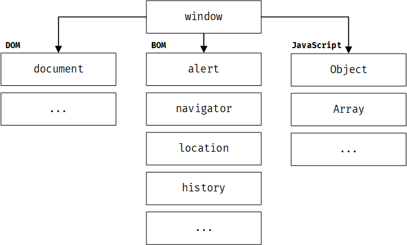
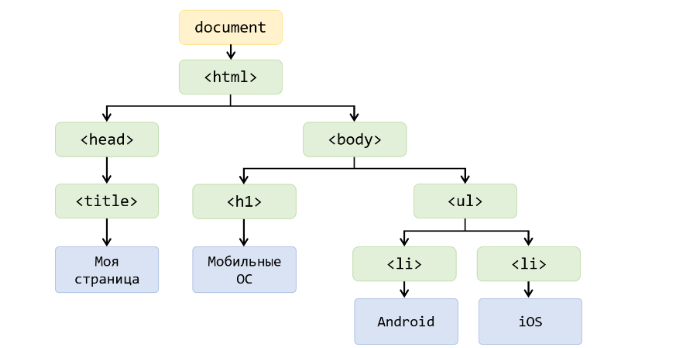
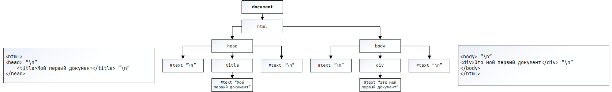

# Взаимодействие с DOM деревом. Часть 1: Получение элементов

## Предисловие

Как уже отмечалось в предыдущих разделах, JavaScript изначально создавался как язык для работы с веб-страницами - не просто для отображения информации, а для того, чтобы страница жила: реагировала, изменялась, отвечала пользователю. Именно благодаря JavaScript статичный HTML превращается в нечто более гибкое: кнопки начинают "откликаться", формы - проверять ввод, а интерфейс - подстраиваться под действия пользователя почти незаметно, как будто это естественная часть среды.

Чтобы управлять элементами страницы, нам нужно выполнить два базовых шага:

1. _Получить доступ к элементу_. Найти в документе тот самый элемент (кнопку, поле ввода, изображение и т.д.), с которым мы собираемся работать.+
2. _Изменить его или задать поведение_. Например:
   - Изменить текст или содержимое;
   - Поменять стиль (цвет, размер, отображение);
   - Добавить реакцию на действия пользователя (клик, наведение, ввод с клавиатуры).

В этой главе мы сосредоточимся на первом шаге - получении доступа к элементам страницы. Мы рассмотрим различные методы и подходы, которые позволяют нам находить нужные элементы в DOM дереве, а также обсудим, как эти методы работают и в каких ситуациях их лучше использовать.

## Окружение JavaScript

### Почему мы говорим об окружении JavaScript?

Перед тем как углубляться в методы получения элементов, важно отметить один важный момент. JavaScript способен функционировать в различных средах: в веб-браузере, на сервере, и, вероятно, даже в вашей микроволновке. Однако следует учитывать, что в каждой из этих сред требуется разная функциональность.

Однако у каждой среды - свои задачи и, соответственно, свои возможности.

- _В браузере_ JavaScript работает с веб-страницей: взаимодействует с элементами, обрабатывает действия пользователя.
- _На сервере_ он отвечает за обработку данных, работу с файлами, запросами и базами данных.
- _В микроволновке_ он может управлять процессами приготовления пищи, хотя это уже выходит за рамки нашего обсуждения.

Каждая из указанных сред, будь то веб-браузер, окружение вашего компьютера, или микроволновка, называется _окружением выполнения JavaScript._

_Окружение JavaScript_ расширяет базовый набор функций и переменных языка, предоставляя дополнительные возможности. Например, окружение браузера добавляет функционал взаимодействия с браузером, в то время как Node.js расширяет возможности работы с файловой системой. Допустим, ваша микроволновка также может предоставить функции управления (включения и выключения), если бы в ней была поддержка JavaScript.

### Браузерное окружение

Учитывая, что данная глава посвящена взаимодействию с HTML-элементами, мы будем рассматривать JavaScript в контексте браузерного окружения.

Окружение браузера состоит из 3 основных компонентов:

- DOM (Document Object Model)
- BOM (Browser Object Model)
- JavaScript API



_Рисунок 12.1. Компоненты браузерного окружения JavaScript_

`window` — это глобальный объект, который представляет собой окно браузера. Он содержит множество свойств и методов для управления окном, взаимодействия с пользователем и доступа к другим объектам.

### Document Object Model (DOM)

При взаимодействии с веб-страницей используется `DOM` (_Document Object Model_) - это объектное представление HTML-документа в виде дерева.

Проще говоря, браузер "разбирает" HTML и превращает его в структуру, где каждый элемент становится объектом, с которым можно работать через JavaScript.

- Каждый HTML-элемент становится узлом (node) в дереве;
- Узлы связаны между собой (родители, потомки, соседи);
- Каждый элемент имеет свои свойства и методы, которые позволяют изменять его внешний вид, содержимое и поведение.



_Рисунок 12.2. Структура DOM дерева_

### Browser Object Model

Кроме функций взаимодействия с элементами страницы, браузерное окружение предоставляет `BOM` (_Browser Object Model_) - набор объектов и методов для управления самим браузером. Это включает в себя:

- Управление окнами и вкладками;
- Работа с URL и историей браузера;
- Взаимодействие с пользователем (например, через `alert`, `confirm`, `prompt`);
- Доступ к информации о браузере и его возможностях.

Например,

- Объект `history` позволяет управлять историей браузера, что включает в себя переходы между посещенными страницами и навигацию назад и вперед.
- Объект `location` предоставляет информацию о текущем URL страницы и позволяет изменять URL или перенаправлять пользователя на другие страницы.

```js
// Пример использования объекта history для перехода на предыдущую страницу
history.back();

// Пример использования объекта location для получения текущего URL страницы
var currentURL = location.href;
console.log(currentURL);

// Пример использования объекта location для перенаправления пользователя на другую страницу
location.href = 'https://www.example.com';
```

### JavaScript API

_JavaScript API_ - это набор встроенных объектов, методов и функций, которые предоставляет браузер для работы с различными возможностями среды.

Если говорить проще, это "инструменты", которые уже есть в JavaScript внутри браузера, вам не нужно их писать с нуля, вы просто их используете.

Например,

- _Работа со временем_. Например, setTimeout, setInterval.
- _Работа с сетью_. Например, fetch для отправки HTTP-запросов.
- _Работа с данными в браузере_. Например, localStorage, sessionStorage.
- _Работа с мультимедиа и устройствами_. Например, доступ к камере, геолокации и т.д.

> [!NOTE]
>
> Напомним, что JavaScript сам по себе - это язык. А такие вещи, как `fetch`, `localStorage` или `alert`, - это уже возможности, которые добавляет окружение (в данном случае браузер).

## Основы DOM-дерева

### Что такое DOM-дерево?

`DOM-дерево` - это иерархическая структура, которая представляет HTML-документ в виде дерева объектов. Каждый элемент HTML становится узлом (node) в этом дереве, и эти узлы связаны между собой через родственные отношения (родитель, потомок, сосед).

Рассмотрим пример HTML-разметки:

```html
<html>
  <head>
    <title>Мой первый документ</title>
  </head>
  <body>
    <div>Это мой первый документ</div>
  </body>
</html>
```

В данном случае `DOM-дерево` будет выглядеть следующим образом:


_Рисунок 12.3. Структура DOM-дерева для простого HTML-документа_

> [!NOTE]
>
> Текст внутри элементов формирует текстовые узлы. Таким образом, текст также является узлом.

На самом деле выше приведена упрощенная схема DOM-дерева. Фактически, если в HTML-разметке (в HTML-файле) есть переход на новую строку, это также считается текстовым узлом, содержащим символ новой строки `\n`. Однако данные элементы не отображаются обычному пользователю.

Полное DOM-дерево для данного HTML-документа будет включать в себя дополнительные текстовые узлы, которые представляют собой символы новой строки и пробелы между элементами.



> [!TIP]
>
> Если весь HTML написать в одну строчку, такие элементы не будут созданы. Их обычно не учитывают при построении DOM-дерева. Поэтому в дальнейшем мы будем опускать `\n`, чтобы избежать путаницы.

## Отношения между HTML-элементами

Элементы в DOM-дереве связаны между собой через определенные отношения, которые помогают нам ориентироваться в структуре документа и находить нужные элементы.

### Верхние узлы дерева

_Верхние узлы дерева_ - это узлы, которые находятся на верхних уровнях иерархии. Они включают в себя:

- `<html>` - корневой элемент, который содержит весь документ.
- `<head>` - содержит метаданные, такие как заголовок страницы, ссылки на стили и скрипты.
- `<body>` - содержит видимое содержимое страницы, такое как текст, изображения, кнопки и т.д.

### Элементы-дети, элементы-потомки

_Элементы-дети_ (дочерние элементы) - это узлы, которые находятся непосредственно внутри другого узла (то есть _прямые дети_).

_Элементы-потомки_ - это узлы, которые находятся внутри другого узла на любом уровне вложенности.

Рассмотрим следующий HTML-код:

```html
<html>
  <head>
    <title>Млекопитающие</title>
  </head>
  <body>
    <div>
      <h1>Млекопитающие:</h1>
      <ul>
        <li>Жираф</li>
        <li>Корова</li>
      </ul>
    </div>
  </body>
</html>
```

- Для элемента `body` дочерним (ребенком) является элемент `div`.
- Для элемента `ul` дочерними являются два элемента `li`.
- Для элемента `body` потомками являются элементы `div`, `h1`, `ul`, и два элемента `li`.

### Элементы-родители

Не сложно догадаться, что _родители_ - это элементы, которые содержат в себе другие.

Рассмотрим следующий HTML-код:

```html
<html>
  <head>
    <title>Млекопитающие</title>
  </head>
  <body>
    <div>
      <h1>Млекопитающие:</h1>
      <ul>
        <li>Жираф</li>
        <li>Корова</li>
      </ul>
    </div>
  </body>
</html>
```

- Элемент `div` является родителем для `h1` и `ul`.
- Элемент `ul` является родителем для `li`.

### Элементы-соседи (элементы-братья)

_Элементы-соседи_ (или _элементы-братья_) - это элементы, которые находятся на одном уровне иерархии и имеют одного родителя.

Рассмотрим следующий HTML-код:

```html
<html>
  <head>
    <title>Млекопитающие</title>
  </head>
  <body>
    <div>
      <h1>Млекопитающие:</h1>
      <ul>
        <li>Жираф</li>
        <li>Корова</li>
      </ul>
    </div>
  </body>
</html>
```

- Элементы `h1` и `ul` являются соседями:
  - `h1` является "предыдущим" или «левым» соседом для `ul`;
  - `ul` является "следующим" или «правым» соседом для `h1`.
- Элементы `head` и `body` также являются соседями.

## Получение элементов из DOM-дерева

Теперь, когда мы знаем, что такое DOM-дерево и как элементы в нем связаны, мы можем приступить к получению доступа к этим элементам с помощью JavaScript. Существует несколько методов для получения элементов из DOM-дерева, и каждый из них имеет свои особенности и области применения.

Элементы можно получить с помощью различных методов, таких как:

- Навигация по дереву (родители, дети, соседи);
- Поиск, используя селекторы (по тегу, классу, идентификатору и т.д.);

### А зачем нам нужно получать элементы из DOM-дерева?

Как было сказано ранее, JavaScript позволяет нам не только отображать информацию на странице, но и делать ее интерактивной. Для этого нам нужно получить доступ к элементам страницы, чтобы:

- Изменить их содержимое (например, текст, изображения);
- Изменить их стиль (например, цвет, размер, отображение);
- Добавить обработчики событий (например, реагировать на клики, наведение мыши, ввод с клавиатуры);
- Создавать новые элементы и добавлять их на страницу;
- Удалять элементы со страницы.

Например, чтобы поменять цвет `<body>`, можно получить доступ к этому элементу и изменить его стиль:

```js
// Получаем элемент body
var bodyElement = document.body;

// Меняем цвет фона на светло-серый
bodyElement.style.backgroundColor = '#f0f0f0';
```

### Навигация по дереву

Навигация по дереву позволяет перемещаться между элементами DOM-дерева, используя их отношения (родители, дети, соседи). Основные методы навигации включают:

#### Получение верхних узлов дерева

Для получения верхних узлов дерева можно использовать следующие свойства:

- `document` - представляет весь документ и является корневым узлом DOM-дерева. Элемент `document` стоит на вершине иерархии и содержит все остальные узлы, даже `<html>`.
- `document.documentElement;` - возвращает элемент `<html>`, который является корневым элементом документа. Это верхний узел, который содержит все остальные элементы страницы.
- `document.head;` - возвращает элемент `<head>`, который содержит метаданные страницы, такие как заголовок, ссылки на стили и скрипты.
- `document.body;` - возвращает элемент `<body>`, который содержит видимое содержимое страницы, такое как текст, изображения, кнопки и т.д.

#### Получение элементов-детей и элементов-потомков

Для получения дочерних элементов часто применяются следующие свойства:

- `childNodes` - возвращает всех дочерних узлов (детей);
- `firstChild` - позволяет получить первого ребенка;
- `lastChild` - возвращает последнего ребенка.

Рассмотрим пример,

```html
<html>
  <head>
    <title>Млекопитающие</title>
  </head>
  <body>
    <div>
      <h1>Млекопитающие:</h1>
      <ul>
        <li>Жираф</li>
        <li>Корова</li>
      </ul>
    </div>
  </body>
</html>
```

_Использование `firstChild` и `lastChild` для получения дочерних элементов_

```js
document.documentElement.firstChild; // Получаем первый дочерний узел элемента <html>, который является элементом <head>
document.documentElement.lastChild; // Получаем последний дочерний узел элемента <html>, который является элементом <body>
```

_Использование `childNodes` для получения всех дочерних элементов_

```js
document.body.childNodes; // #text (\n), <div>, #text (\n)

for (let i = 0; i < document.body.childNodes.length; i++) {
  console.log(document.body.childNodes[i]);
}

// Результат:
// #text (\n)
// <div>
// #text (\n)

// Получаем второй дочерний элемент тела документа (в данном случае, это элемент div).
const element = document.body.childNodes[1];
// Проходим по всем дочерним узлам этого элемента.
for (let i = 0; i < element.childNodes.length; i++) {
  console.log(element.childNodes[i]); // Выводим каждый из дочерних узлов в консоль.
}

// Результат:
// - #text "\n"
// - <h1>
// - #text "\n"
// - <ul>
// - #text "\n"
```

> [!NOTE]
>
> Важно отметить, что `childNodes` не является массивом, а является коллекцией (особый перебираемый объект). Например, он не имеет метода `filter`. Для применения метода `filter` необходимо сначала преобразовать его в массив с помощью `Array.from(document.body.childNodes).filter`.

> [!NOTE]
>
> DOM-коллекции доступны только для чтения, то есть их нельзя изменить. Например, попытка присвоить новое значение элементу коллекции, например, `document.body.childNodes[1] = "div"`, будет невозможной.

#### Получение элементов-соседей

Для получения элементов-соседей используются свойства:

- `previousSibling` - возвращает предыдущий соседний узел (элемент, который находится непосредственно перед текущим узлом);
- `nextSibling` - возвращает следующий соседний узел (элемент, который находится непосредственно после текущего узла).

Рассмотрим пример,

```html
<html>
  <head>
    <title>Млекопитающие</title>
  </head>
  <body>
    <div>
      <h1>Млекопитающие:</h1>
      <ul>
        <li>Жираф</li>
        <li>Корова</li>
      </ul>
    </div>
  </body>
</html>
```

_Использование `nextSibling`_

```js
document.body.nextSibling; // "\n"
document.head.nextSibling.nextSibling; // <body>
document.body.previousSibling; // "\n"
```

Для _получения родителей используется свойство `parentNode`_

```js
document.body.parentNode; // <html>
const divElement = document.body.childNodes[1]; // <div>
divElement.parentNode; // <body>
```

#### Получение элементов без текстовых узлов

Обычно нам не требуются текстовые узлы, нам нужно получать только сами элементы: `<div>`, `<h1>`, и так далее.

Для этого, вместо рассмотренных выше свойств, можно использовать:

- `children` - возвращает коллекцию дочерних элементов (без текстовых узлов);

  ```js
  document.body.childNodes; // #text "\n", div
  document.body.children; // <div>
  ```

- `firstElementChild` - возвращает первого дочернего элемента (без текстовых узлов);
- `lastElementChild` - возвращает последнего дочернего элемента (без текстовых узлов).

#### Верное размещение тэга `<script>`

Перед тем, как мы начнем использовать JavaScript для получения элементов из DOM-дерева, важно убедиться, что наш скрипт размещен в правильном месте в HTML-документе. Если скрипт находится в `<head>`, он будет выполняться до того, как браузер загрузит и построит DOM-дерево, что может привести к ошибкам при попытке доступа к элементам страницы.

Рассмотрим пример,

```js
<html>
  <head>
    <title>Млекопитающие</title>
    <script>const body = document.body; // null</script>
  </head>
  <body>
    <div>
      <h1>Млекопитающие:</h1>
      <ul>
        <li>Жираф</li>
        <li>Корова</li>
      </ul>
    </div>
  </body>
</html>
```

Если мы попытаемся обратиться к `document.body` внутри блока `<head>`, результатом будет `null`, что означает "_пусто_" или "_ничего_". Но почему это происходит? Все дело в том, что при построении DOM-дерева сначала выполнится скрипт в `head`, так как сначала будет построен данный элемент, а только потом создается элемент `body`. Поэтому скрипты, которые взаимодействуют с HTML, _следует помещать в конце документа_.

```js
<html>
<head>
    <title>Млекопитающие</title>
</head>
<body>
<div>
    <h1>Млекопитающие:</h1>
    <ul>
        <li>Жираф</li>
        <li>Корова</li>
    </ul>
</div>
<!-- Корректное размещение -->
<script>
    const body = document.body; // <body>
</script>
</body>
</html>
```
