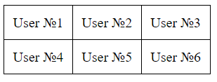
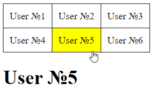

# Взаимодействие с DOM деревом. Часть 2: События

## Содержание

- [Взаимодействие с DOM деревом. Часть 2: События](#взаимодействие-с-dom-деревом-часть-2-события)
  - [Содержание](#содержание)
  - [Мы научились получать доступ к элементам DOM дерева, что дальше?](#мы-научились-получать-доступ-к-элементам-dom-дерева-что-дальше)
  - [Основы событий в JavaScript](#основы-событий-в-javascript)
    - [Что такое событие?](#что-такое-событие)
    - [Обработчик событий](#обработчик-событий)
      - [Использование атрибута HTML](#использование-атрибута-html)
      - [Использование свойств объектов](#использование-свойств-объектов)
    - [Метод `addEventListener`](#метод-addeventlistener)
    - [Объект события](#объект-события)
    - [Свойство `event.target`](#свойство-eventtarget)
    - [Пример. Модальное окно](#пример-модальное-окно)
  - [Всплытие событий](#всплытие-событий)
    - [Что такое всплытие событий?](#что-такое-всплытие-событий)
    - [Остановка всплытия](#остановка-всплытия)
  - [Погружение событий](#погружение-событий)
  - [Делегирование событий](#делегирование-событий)
  - [Действия браузера по умолчанию](#действия-браузера-по-умолчанию)
    - [Описание проблемы](#описание-проблемы)
    - [Отмена действий браузера](#отмена-действий-браузера)
  - [Получение и обработка форм](#получение-и-обработка-форм)
    - [Получение формы](#получение-формы)
    - [Получение значений формы](#получение-значений-формы)
      - [`input` и `textarea`](#input-и-textarea)
      - [`select`](#select)
    - [События формы](#события-формы)
      - [События `focus` и `blur`](#события-focus-и-blur)
      - [События `change` и `input`](#события-change-и-input)
      - [События `submit`](#события-submit)
    - [Пример валидации формы](#пример-валидации-формы)
  - [Теперь Вы знаете ...](#теперь-вы-знаете-)

## Мы научились получать доступ к элементам DOM дерева, что дальше?

В прошлой главе мы научились получать доступ к элементам DOM-дерева. Однако возникает логичный вопрос: что делать дальше? Например, как изменить цвет или текст элемента, добавить новые элементы, удалить существующие и т.д.

Следующий важный вопрос - когда необходимо применять такие изменения? В большинстве случаев это происходит в момент взаимодействия пользователя со страницей: при нажатии на кнопку, вводе текста в поле, наведении курсора на элемент и других действиях.

Например, у нас может быть кнопка, при нажатии на которую изменяется цвет текста, или поле ввода, при изменении которого введённое значение отображается в другом элементе. Все подобные действия связаны с понятием _событий_.

## Основы событий в JavaScript

### Что такое событие?

Как уже было отмечено в предыдущих темах, элементы в JavaScript представляют собой объекты, обладающие определёнными свойствами: цветом, положением на странице, размерами и другими характеристиками.

Однако, помимо свойств, элементы могут иметь и определённое поведение - _реакции на события_. Например, при нажатии на кнопку пользователь ожидает выполнения некоторого действия, а при наведении курсора на элемент - визуального или функционального отклика.

Таким образом, _событие_ - это сигнал о том, что на странице произошло некоторое действие, на которое программа может отреагировать.

Рассмотрим некоторые из событий.

1. События _мыши_:
   1. `click` - левый клик мыши по элементу (нажатие на сенсорный экран).
   2. `contextmenu` - правый клик мыши по элементу.
   3. `mouseover` - когда мышь наводится на элемент.
   4. `mouseout` - когда мышь покидает элемент.
   5. `dblclick` - двойной клик мыши по элементу.
2. События _формы_:
   1. `submit` - форма отправлена.
   2. `focus` - пользователь фокусируется (использует) на элементе формы
   3. `input` - ввод в поле `input`
3. События _клавиатуры_:
   1. `keydown` - когда была нажата кнопка.
   2. `keyup` - когда была отжата кнопка.
4. События документа:
   1. `DOMContentLoaded` - когда элемент полностью загружен и DOM документа построен полностью

### Обработчик событий

Для того чтобы реагировать на события, необходимо назначить* обработчик события* - функцию, которая будет выполняться при возникновении определённого события.

Например, если на кнопке происходит событие `click`, можно назначить функцию, которая изменит цвет текста на странице. Когда пользователь нажимает на кнопку, эта функция будет вызвана, и цвет текста изменится.

Если описать этот процесс более формально, он включает следующие шаги:

- _Выбор элемента_. Необходимо получить элемент, для которого будет обрабатываться событие (например, кнопку).
- _Назначение обработчика_. К элементу "привязывается" функция, которая будет выполняться при наступлении события (например, при клике на кнопку).

Существует несколько способов назначить обработчик события:

- Использование атрибута HTML
- Использование свойства элемента
- Использование метода `addEventListener`

#### Использование атрибута HTML

Один из наиболее ранних способов обработки событий - использование HTML-атрибутов. В настоящее время этот подход считается устаревшим, однако всё ещё может встречаться на практике.

Обработчик события может быть назначен элементу _с помощью специального атрибута_, который имеет вид `on<событие>`. Например:

- для события `click` используется атрибут `onclick`
- для события `contextmenu` - атрибут `oncontextmenu`.

```html
<!-- При клике мышкой на данную кнопку будет вызвана переданная функция: `alert` -->
<button onclick='alert("Hello")'>Нажми меня</button>
```

Также можно вызвать пользовательскую функцию, определённую в отдельном JavaScript-файле:

```js
// index.js

function add(a, b) {
  const sum = a + b;
  console.log(`Сумма ${a} + ${b}  == ${sum}`);
}
```

```html
<!-- index.html -->
<button onclick="add(2,3)">Добавить</button>
```

#### Использование свойств объектов

Вторым, более распространенным вариантом является использование свойств объектов DOM-дерева. У объектов элемента DOM-дерева есть свойства, которые формируются аналогично атрибутам `on<событие>`.

Например:

```js
const buttonEl = document.querySelector('button');
buttonEl.onclick = function () {
  alert('Hello, world');
};
```

В этом примере мы получаем доступ к кнопке с помощью `querySelector`, а затем назначаем обработчик события `onclick` - функцию, которая будет вызвана при клике на кнопку.

Можно так же присвоить уже существующую функцию:

```js
function showMessage() {
  console.log('Hello, World!');
}

const buttonEl = document.querySelector('button');
// Функцию не нужно вызывать, а просто передать.

// Неверный способ, так как функция будет вызвана и возвратит undefined.
// buttonEl.onclick = showMessage();

// Верный способ:
buttonEl.onclick = showMessage;
```

> [!TIP]
>
> Атрибут, объявленный в HTML-документе, это тот же обработчик.

### Метод `addEventListener`

В рассмотренных ранее подходах могут возникать определённые ограничения. Одним из наиболее существенных является невозможность корректно назначить несколько обработчиков для одного и того же события. Например, если для кнопки уже задан обработчик события `click`, при попытке назначить новый обработчик предыдущий будет перезаписан.

Для решения этой проблемы используется метод `addEventListener`, который позволяет назначать несколько обработчиков для одного события без их взаимного перезаписывания. Это делает код более гибким и удобным для расширения.

Метод принимает как минимум два аргумента: тип события и функцию-обработчик.

_Синтаксис метода_:

```js
element.addEventListener(event, handler [, options])
```

- `event` - событие;
- `handler` - функция-обработчик;
- `options` - дополнительные параметры (будет рассмотрено позже).

Например:

```js
const buttonEl = document.querySelector('p');

buttonEl.addEventListener('click', () => {
  buttonEl.style.display = 'none';
});

// Можно также передать функцию:
function hideButton() {
  buttonEl.style.display = 'none';
}

buttonEl.addEventListener('click', hideButton);
```

Для удаления обработчика события, назначенного с помощью метода `addEventListener`, используется метод `removeEventListener`. Однако для корректного удаления необходимо передать ту же функцию, которая была использована при добавлении обработчика.

```js
const buttonEl = document.querySelector('p');

buttonEl.addEventListener('click', () => (buttonEl.style.display = 'none'));

// Обработчик не будет удален, так как при вызове `removeEventListener` передается другой экземпляр функции
// даже если код внутри обоих функций идентичен.
buttonEl.removeEventListener('click', () => (buttonEl.style.display = 'none'));
```

В данном примере удаление обработчика не произойдёт, поскольку при вызове `removeEventListener` создаётся новая функция, отличная от той, которая была передана ранее.

Для правильного удаления обработчика необходимо использовать одну и ту же функцию:

```js
const buttonEl = document.querySelector('p');

function hideButton() {
  buttonEl.style.display = 'none';
}

buttonEl.addEventListener('click', hideButton);

// Удаление обработчика события
buttonEl.removeEventListener('click', hideButton);
```

### Объект события

После того как обработчик успешно реагирует на событие (например, нажатие кнопки), возникает следующий вопрос: _как получить дополнительную информацию о самом событии?_

Например, как определить, какой текст ввёл пользователь в поле ввода, или узнать координаты точки, в которой был выполнен клик мышью.

При возникновении любого события в браузере автоматически создаётся специальный объект - _объект события_. Он содержит информацию о произошедшем событии и автоматически передаётся в функцию-обработчик в качестве аргумента. Передавать его вручную не требуется.

Рассмотрим пример с полем ввода:

```html
<input id="username" type="text" />
```

```js
// Получаем элемент с HTML-страницы
const inputEl = document.querySelector('#username');

// Добавляем обработчик события
inputEl.addEventListener('input', (event) => {
  // Событие 'input' происходит при изменении значения поля ввода
  // event.target ссылается на элемент, на котором произошло событие, то есть на наш inputEl
  // event.target.value содержит текущее значение поля ввода
  // Выводим в консоль сообщение о том, что было введено в поле ввода
  console.log('Вы ввели в поле ввода: ' + event.target.value);
});
```

В данном случае объект `event` позволяет получить доступ к текущему значению поля ввода.

Рассмотрим ещё один пример - определение координат клика мышью:

```js
document.addEventListener('click', (event) => {
  // event.clientX содержит координату X точки клика мыши относительно окна браузера
  // event.clientY содержит координату Y точки клика мыши относительно окна браузера
  console.log('Координата X: ', event.clientX, 'Координаты Y: ', event.clientY);
});
```

### Свойство `event.target`

Когда на веб-странице происходит событие, _например_, _клик мышью_ или _нажатие клавиши_, браузер "запускает" это событие на каком-то конкретном элементе страницы. Вот тут и появляется `event.target` - это как раз этот элемент, на котором произошло событие.

Давайте представим, что у нас есть кнопка на странице, и мы нажимаем на неё. В этом случае `event.target` будет указывать на эту кнопку. Это очень удобно, потому что мы можем использовать `event.target`, чтобы понять, на каком именно элементе произошло событие, и далее выполнять какие-то действия.

Например, рассмотрим кнопку:

```html
<button id="myButton">Нажми меня</button>
```

```javascript
document.getElementById('myButton').addEventListener('click', function (event) {
  console.log('Событие произошло на элементе:', event.target);
});
```

Когда мы нажимаем на кнопку "Нажми меня", в консоль будет выведено:

```
Событие произошло на элементе: <button id="myButton">Нажми меня</button>
```

Таким образом, `event.target` представляет собой объект, который содержит информацию о элементе, на котором произошло событие. Этот объект предоставляет доступ ко всем свойствам и методам этого элемента, что позволяет нам выполнять различные операции с этим элементом в нашем JavaScript-коде.

```js
document.getElementById('myButton').addEventListener('click', function (event) {
  // Изменяем текст кнопки
  event.target.textContent = 'Кнопка нажата';

  // Изменяем цвет фона кнопки
  event.target.style.backgroundColor = 'red';
});
```

### Пример. Модальное окно

Рассмотрим пример создания модального окна, которое будет открываться при клике на кнопку и закрываться при клике на крестик внутри окна.

```html
<!DOCTYPE html>
<html lang="en">
  <head>
    <meta charset="UTF-8" />
    <meta name="viewport" content="width=device-width, initial-scale=1.0" />
    <link rel="stylesheet" href="./style.css" />
    <title>Document</title>
  </head>
  <body>
    <!-- Кнопка для открытия модального окна -->
    <button class="modal-button">Дополнительная информация</button>
    <!-- Модальное окно -->
    <div class="modal">
      <h3>Дополнительная информация</h3>
    </div>
    <!-- Затемненный фон при открытии всплывающего окна -->
    <div class="modal-overlay" id="modal-overlay"></div>
    <script src="./index.js"></script>
  </body>
</html>
```

```css
.modal {
   // по умолчанию окно не видео
   display: none;
   justify-content: center;
   align-items: center;
   z-index: 1010;
   position: fixed;
   top: 50%;
   left: 50%;
   width: 600px;
   height: 600px;
   border-radius: 30px;
   background: white;
   transform: translate(-50%, -50%);
}
.modal-overlay {
   display: none;
   z-index: 1000;
   position: fixed;
   top: 0;
   left: 0;
   width: 100%;
   height: 100%;
   background-color: #b2b2b261;
}
```

```js
const modalEl = document.querySelector('.modal');
const buttonEl = document.querySelector('.modal-button');
const modalOverlay = document.querySelector('.modal-overlay');

// Функция для открытия модального окна
const openModal = () => {
  modalEl.style.display = 'flex';
  modalOverlay.style.display = 'block';
};

// Функция для закрытия модального окна
const closeModal = () => {
  modalEl.style.display = 'none';
  modalOverlay.style.display = 'none';
};

// Добавляем обработчик события клика на кнопку для открытия модального окна
buttonEl.addEventListener('click', openModal);

// Добавляем обработчик события клика на затемненную подложку для закрытия модального окна
modalOverlay.addEventListener('click', closeModal);
```

В этом примере мы создаём модальное окно, которое открывается при клике на кнопку "Дополнительная информация" и закрывается при клике на затемнённую подложку.

## Всплытие событий

Одной из тем, которая часто вызывает затруднения при изучении событий, является механизм всплытия и погружения событий. Эти процессы определяют порядок обработки событий в DOM-дереве и могут существенно влиять на поведение приложения. Рассмотрим данную тему более подробно.

### Что такое всплытие событий?

Чтобы понять механизм всплытия, рассмотрим следующую HTML-разметку:

```html
<div onclick="console.log('Hello, world')">
  <p>Кликни</p>
</div>
```

При нажатии на элемент `<p>` мы увидим в консоли сообщение `Hello, world`. Но почему? Ведь обработчик события привязан только к элементу `<div>`.

При нажатии на элемент `<p>` в консоли будет выведено сообщение `Hello, world`. Возникает закономерный вопрос: почему это происходит, если обработчик события привязан только к элементу `<div>`?

Рассмотрим еще один пример HTML-разметки:

```html
<div onclick="console.log('div is clicked')">
  <p onclick="console.log('p1 is clicked')">
    <b onclick="console.log('b is clicked')"></b>
  </p>
</div>
```

Когда мы нажимаем на элемент `<b>`, на экране выводится следующее:

```
b is clicked
p1 is clicked
div is clicked
```

Это происходит из-за _механизма всплытия событий в DOM_. Всплытие подразумевает, что сначала обработчик события вызывается на самом элементе, затем на его родительском элементе, и так далее вверх по иерархии, если у родителей также есть обработчики для этого события.

### Остановка всплытия

Для предотвращения всплытия события и его дальнейшего распространения необходимо использовать метод `stopPropagation()`.

```html
<div onclick="console.log('div is clicked')">
  <p onclick="console.log('p1 is clicked'); event.stopPropagation();">
    <b onclick="console.log('b is clicked')"></b>
  </p>
</div>
```

В данном случае будет выведено:

```
b is clicked
p1 is clicked
```

Таким образом, событие не доходит до элемента `div`, так как было остановлено на элементе `<p>`.

## Погружение событий

_Погружение событий (event capturing)_ - это механизм в JavaScript, который позволяет обрабатывать события на фазе
погружения, то есть на этапе перехода события от корневого элемента до целевого элемента в дереве DOM.

В отличие от [всплытия событий](#всплытие-событий), при погружении события обрабатываются сверху вниз, начиная с
корневого элемента и заканчивая целевым элементом.

В противоположность всплытию, погружение событий является менее распространенным и используется реже. Однако, оно может
быть полезным в некоторых случаях, особенно при разработке сложных интерфейсов или веб-приложений.

Другими словами, когда мы говорим о погружении событий в JavaScript, давайте представим, что у нас есть элементы на
веб-странице, размещенные друг над другом, словно ящики в стопке.

1. Если на верхнем ящике происходит событие, например клик мышкой, JavaScript начинает проверять, есть ли у этого ящика
   обработчик для этого события.
2. Если нет, он спускается на следующий ящик вниз и снова проверяет.
3. Этот процесс повторяется до тех пор, пока не найдется ящик с обработчиком, или пока не дойдет до самого нижнего
   ящика.

Для использования погружения событий в JavaScript, вы можете добавить обработчик события с параметром `capture`, который
говорит браузеру, что вы хотите использовать погружение.

```js
element.addEventListener('click', myFunction, { capture: true });
// либо можно просто `true`
element.addEventListener('click', myFunction, true);
```

_Например_, если у нас есть HTML-разметка с элементами вложенными друг в друга:

```html
<div id="outer">
  <div id="inner">Нажми меня</div>
</div>
```

И JavaScript-код

```js
document.getElementById('outer').addEventListener(
  'click',
  function () {
    console.log('Outer div clicked');
  },
  true,
);

document.getElementById('inner').addEventListener('click', function () {
  console.log('Inner div clicked');
});
```

Когда мы нажимаем на внутренний элемент, в консоль будет выведено

```
Outer div clicked
Inner div clicked
```

## Делегирование событий

Одной из ключевых концепций при работе с событиями является _делегирование событий_. _Делегирование событий_ - это техника, при которой обработчик назначается не каждому дочернему элементу отдельно, а их общему родителю.

Суть подхода заключается в использовании механизма всплытия событий: событие, возникшее на дочернем элементе, поднимается вверх по DOM-дереву и может быть обработано на родительском уровне.

Данный подход особенно полезен в следующих случаях:

- _Большое количество элементов_. Назначение обработчиков каждому элементу отдельно приводит к избыточности кода и снижению производительности.
- _Динамически изменяемый DOM_. Если элементы добавляются или удаляются во время работы приложения, делегирование позволяет автоматически обрабатывать события для новых элементов без необходимости повторного назначения обработчиков.

Рассмотрим _типичный пример_.

На веб-странице представлена таблица с пользователями. При щелчке по ячейке необходимо выполнить определённое действие и выделить выбранную ячейку. При выборе другой ячейки должна выполняться соответствующая логика, а выделение должно переходить на новую ячейку. Например, можно отображать имя выбранного пользователя.

При этом важно учитывать, что пользователи могут добавляться или удаляться, поэтому _количество ячеек в таблице может изменяться_.

_Желаемый результат_:



После клика по ячейке.



HTML-разметка для данной таблицы может выглядеть следующим образом:

```html
<!DOCTYPE html>
<html lang="en">
  <head>
    <meta charset="UTF-8" />
    <title>Users</title>
    <style>
      table {
        border-collapse: collapse;
      }

      td {
        border: 1px solid black;
        padding: 10px;
      }
    </style>
  </head>
  <body>
    <table>
      <tr>
        <td>User №1</td>
        <td>User №2</td>
        <td>User №3</td>
      </tr>
      <tr>
        <td>User №4</td>
        <td>User №5</td>
        <td>User №6</td>
      </tr>
    </table>
    <script src="./index.js"></script>
  </body>
</html>
```

Как можно заметить, в таблице представлено всего 6 ячеек, однако их количество может изменяться динамически. Назначение обработчика события для каждой ячейки по отдельности является неэффективным решением. Более предпочтительным подходом является использование одного обработчика, назначенного на общий родительский элемент `<table>`.

В таком случае можно воспользоваться свойством `event.target`, чтобы определить, на какой именно ячейке произошло событие.

```js
// Переменная, в которой будет храниться ссылка на выделенный элемент
let selected;

// Добавление обработчика события "click" к таблице
document.querySelector('table').addEventListener('click', function (e) {
  // Проверка, является ли элемент, по которому было совершено событие, ячейкой таблицы
  if (e.target.tagName !== 'TD') {
    return; // Если не является, завершаем выполнение функции
  }

  // Сохранение ссылки на ячейку таблицы, по которой было совершено событие
  // Переменная e.target хранит ссылку на элемент, который инициировал событие клика в момент его возникновения.
  // В данном случае `td` будет ячейка, на которую мы кликнули
  let td = e.target;

  // Если уже есть выделенный элемент
  if (selected) {
    selected.style.backgroundColor = ''; // Сброс цвета фона выделенного элемента
  }

  // Сохранение ссылки на текущую выделенную ячейку
  selected = td;

  // Установка желтого цвета фона для выделенной ячейки
  td.style.backgroundColor = 'yellow';

  // Изменение содержимого элемента с id "username" на текст выделенной ячейки
  document.querySelector('#username').innerHTML = td.textContent;
});
```

Но почему при клике на `<td>` вызывается событие `<table>`? Все дело в _всплытии событий_, о котором мы говорили в предыдущей главе. При клике на `<td>` вызываются события предков, и соответственно событие `<table>`.

Но, появляется проблема, что если в `<td>` у нас есть другой элемент, например, `<p>`, то при нажатии на него будет выделиться он.

```html
<td>
  <p>User №1</p>
</td>
```

_Как думаете как решить данную проблему?_

Для этого можно использовать метод `closest()`, который позволяет найти ближайшего предка элемента, соответствующего заданному селектору. В нашем случае, при клике на элемент внутри `<td>`, мы можем использовать `event.target.closest('td')`, чтобы получить ссылку на родительский элемент `<td>`, даже если клик был совершен на вложенном элементе.

```js
document.querySelector('table').addEventListener('click', function (e) {
  // Получаем ближайший родительский элемент <td> для элемента, на который был совершен клик
  let td = e.target.closest('td');

  if (!td) return;

  // Если уже есть выделенный элемент
  if (selected) {
    selected.style.backgroundColor = ''; // Сброс цвета фона выделенного элемента
  }

  // Сохранение ссылки на текущую выделенную ячейку
  selected = td;

  // Установка желтого цвета фона для выделенной ячейки
  td.style.backgroundColor = 'yellow';

  // Изменение содержимого элемента с id "username" на текст выделенной ячейки
  document.querySelector('#username').innerHTML = td.textContent;
});
```

Рассмотрим ещё один пример.

На странице у нас есть несколько счетчиков. Как можно сделать так, чтобы не приходилось назначать обработчик события на каждый из них? Попробуйте реализовать сами.

```html
<!DOCTYPE html>
<html lang="en">
  <head>
    <meta charset="UTF-8" />
    <title>Counters</title>
  </head>
  <body>
    <div id="counter">
      <input type="button" value="1" />
      <input type="button" value="1" />
    </div>
    <script src="./index.js"></script>
  </body>
</html>
```

> [!NOTE]
>
> В реальном проекте вполне естественно иметь множество обработчиков событий, назначенных на элемент `document`, и это является общепринятой практикой. Обработчики событий могут быть установлены из различных частей кода, что позволяет организовать структуру проекта более гибко и модульно.

## Действия браузера по умолчанию

### Описание проблемы

Рассмотрим следующую ситуацию: имеется ссылка `<a>`, для которой необходимо назначить обработчик события `click`.

```html
<a id="link" href="/">Go to home...</a>
```

```js
document.querySelector('#link').addEventListener('click', () => {
  console.log('Clicked to link!');
});
```

Что произойдёт при нажатии на данную ссылку? Браузер выполнит переход по адресу, указанному в атрибуте `href`. При этом действие, заданное в обработчике, может не иметь ожидаемого эффекта, поскольку выполнение стандартного поведения браузера происходит независимо.

Подобные ситуации возникают и в других случаях:

- отправка формы (что приводит к перезагрузке страницы)
- выделение текста

Все перечисленные действия являются поведением браузера по умолчанию. Они выполняются автоматически и могут не учитывать логику, заданную в обработчиках событий.

### Отмена действий браузера

Чтобы отменить выполнение действий браузера по умолчанию, существуют два основных метода:

- Использование метода события `event.preventDefault()`.

  ```js
  document.querySelector('#link').addEventListener('click', (e) => {
    // Отмена действия браузера, то есть переход по ссылке не будет выполнен
    e.preventDefault();
    console.log('Clicked to link!');
  });
  ```

- Если обработчик назначен с помощью атрибута `on<событие>`, то можно использовать `return false`.

  ```html
  <a id="link" href="/" onclick="return false;">Go to home...</a>
  ```

В обоих случаях при клике на ссылку переход по адресу не будет выполнен. Предпочтительным является использование метода `event.preventDefault()`, так как он обеспечивает более явный контроль над поведением событий и позволяет сохранять структуру кода, отделяя логику обработки событий от разметки HTML.

## Получение и обработка форм

Отдельной темой являются события, связанные с формами, так как они имеют свои особенности и часто используются в веб-разработке.

### Получение формы

Форму можно получить так же, как и другие элементы DOM, используя методы `querySelector`, `getElementById` и другие. Однако существует другой способ - использование встроенной коллекции форм.

Все формы документа автоматически доступны через коллекцию `document.forms`.

```js
document.forms[0]; // первая форма в документе
document.forms.login; // <form name="login">
```

Для доступа к элементам формы также можно использовать стандартные методы поиска, однако, аналогично самой форме, для этого предусмотрена специальная коллекция.

```html
<form name="auth">
  <input type="text" name="username" />
  <input type="text" name="password" />
</form>
```

```js
document.forms.auth; // элемент <form name="auth">

// элемент <input name="username"> внутри формы
document.forms.auth.elements.username;

// элемент <input name="password"> внутри формы
document.forms.auth.elements.password;
```

Если два элемента содержат одинаковое поле `name`, то свойство elements будет содержать массив.

```html
<form name="auth">
  <input type="radio" value="Female" name="gender" />
  <input type="radio" value="Male" name="gender" />
</form>
```

```js
document.forms.auth.elements.gender[0]; // <input type="radio" value="Female" name="gender">
document.forms.auth.elements.gender[1]; // <input type="radio" value="Male" name="gender">
```

### Получение значений формы

#### `input` и `textarea`

Для получения значения элементов формы используются соответствующие свойства, зависящие от типа элемента.

- _Текстовые поля_ (`input[type="text"]`, `textarea`). Значение доступно через свойство `value`.
- _Чекбоксы_ (`input[type="checkbox"]`). Состояние доступно через свойство `checked`, которое возвращает `true` или `false` в зависимости от того, установлен флажок или нет.

Например:

```html
<input type="text" name="username" value="John Doe" />
<input type="checkbox" name="subscribe" checked />
```

```js
const authForm = document.forms.auth;

const username = authForm.elements.username.value; // "John Doe"
const isSubscribed = authForm.elements.subscribe.checked; // true
```

#### `select`

Элемент `select` предоставляет несколько свойств для получения информации о выбранных значениях:

- `select.value`. Содержит значение (`value`) выбранной опции.
- `select.selectedIndex`. Возвращает индекс выбранной опции в списке.
- `select.options`. Коллекция всех опций внутри элемента select, позволяющая получить доступ к каждой из них и её свойствам.

Кроме того, каждая опция (`option`) имеет булево свойство `selected`, с помощью которого можно определить, выбрана ли она:

- `select.options[0].selected`. Возвращает `true`, если опция выбрана, и `false` в противном случае.

Рассмотрим пример:

```html
<select id="citySelect">
  <option value="chisinau">Chisinau</option>
  <option value="orhei">Orhei</option>
</select>
```

```js
const citySelect = document.getElementById('citySelect');

// Изменение выбранного значения
select.value = 'chisinau'; // "chisinau"
select.options[0].selected = true;
select.selectedIndex = 0; // 0
```

### События формы

#### События `focus` и `blur`

Событие `focus` возникает в момент, когда элемент получает фокус, а событие `blur` - когда элемент теряет его.

```html
<label>
  <input type="email" id="email" />
</label>
<p id="error"></p>
```

```js
const errorEl = document.querySelector('#error');

// Срабатывает, когда пользователь убирает фокус с поля ввода
document.querySelector('#email').addEventListener('blur', (event) => {
  if (event.target.value.includes('@')) {
    return;
  }

  errorEl.innerHTML = 'Вы ввели неверный email';
});
```

В данном примере при потере фокуса выполняется проверка введённого значения. Если строка не содержит символ `@`, пользователю отображается сообщение об ошибке.

#### События `change` и `input`

При взаимодействии пользователя с элементами формы могут возникать различные события, наиболее часто используемыми из которых являются `input` и `change`.

_Событие `input`_ срабатывает каждый раз при изменении значения элемента. Это означает, что обработчик будет вызываться _при каждом вводе символа_ в текстовом поле или при любом изменении значения.

_Например_, если пользователь вводит имя в текстовое поле, событие `input` будет происходить при вводе каждой буквы. Это позволяет реализовать мгновенную реакцию на действия пользователя, например, валидацию данных или отображение введённого текста в реальном времени.

Событие `change`, в свою очередь, срабатывает только после завершения изменения значения элемента. Как правило, это происходит в момент потери фокуса.

Например, при выборе даты или значения из выпадающего списка событие `change` произойдёт после того, как пользователь завершит выбор. Это удобно в ситуациях, когда необходимо обработать уже окончательно установленное значение, например, перед отправкой формы..

Например,

```html
<input type="text" id="nameInput" placeholder="Введите ваше имя" />
<p id="output"></p>
```

```js
const nameInput = document.getElementById('nameInput');
const output = document.getElementById('output');

// Событие input срабатывает каждый раз при вводе символов в поле ввода
nameInput.addEventListener('input', function (event) {
  output.textContent = 'Привет, ' + event.target.value + '!';
});

// Событие change срабатывает, когда пользователь закончил ввод и фокус ушел с поля
nameInput.addEventListener('change', function (event) {
  alert('Вы выбрали имя: ' + event.target.value);
});
```

#### События `submit`

Событие `submit` возникает при отправке формы пользователем.

Это событие происходит в двух случаях:

- _Нажатие на кнопку отправки_. Например, `<input type="submit">` или `<input type="image">`.
- _Нажатие клавиши Enter_. Если фокус находится в одном из полей ввода формы.

В обоих случаях происходит попытка отправки формы, что приводит к срабатыванию события `submit`.

Обработчик данного события позволяет выполнить предварительную обработку данных. Например, можно проверить корректность введённых значений и, при наличии ошибок, отобразить соответствующие сообщения. Для предотвращения фактической отправки формы используется метод `event.preventDefault()`.

Следует также учитывать, что у элемента `<form>` существует метод `submit()`, который позволяет программно отправить форму. Однако при вызове этого метода событие `submit` не генерируется.

### Пример валидации формы

В пособии курса приведён пример валидации формы, демонстрирующий использование событий для проверки корректности введённых данных и отображения сообщений об ошибках: [Ссылка](../_samples/13_forms/)

## Теперь Вы знаете ...

1. Что такое события в JavaScript и почему именно они делают страницу интерактивной.
2. Какие основные типы событий существуют: мыши, клавиатуры, формы и события документа.
3. Что такое обработчик события и как он связывает действие пользователя с логикой программы.
4. Какие существуют способы назначения обработчиков: через HTML, свойства элементов и `addEventListener`.
5. Почему `addEventListener` является предпочтительным способом работы с событиями.
6. Что такое объект события (`event`) и какую информацию он предоставляет.
7. Как использовать `event.target` для определения элемента, на котором произошло событие.
8. Что такое всплытие событий и как события распространяются по DOM-дереву.
9. Как остановить всплытие с помощью `event.stopPropagation()`.
10. Что такое делегирование событий и почему оно важно для оптимизации и динамических интерфейсов.
11. Как работать с формами: получать значения, обрабатывать события (`input`, `change`, `submit`) и отменять поведение браузера через `event.preventDefault()`.