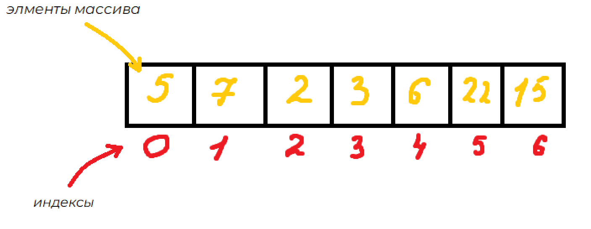

# Массивы

Перед тем, как изучать массивы в JS необходимо понимать, что такое `массив` и где он может быть полезен в реальном мире.

## Что такое массив?

**Массив** — это структура данных в программировании, представляющая собой упорядоченный набор элементов, каждому из которых присваивается индекс.  Он может содержать элементы любого типа данных, такие как числа, строки, объекты и другие массивы.

В реальном мире массивы аналогичны контейнерам, ящикам или коллекциям, которые могут содержать различные объекты или предметы, упорядоченные в определенном порядке для удобства доступа и управления.

Например,


В программировании массивы облегчают доступ к группам элементов данных, позволяют проводить операции сразу над несколькими значениями, а также предоставляют удобный способ хранения и организации информации.

## Массивы в JS

**Массивы в JS** — это специальные объекты, которые представляют собой упорядоченные списки элементов, индексированные числовыми значениями (о том, что такое объекты, мы поговорим немного позже).

### Объявление массива

Существует два способа объявить массив в JS.
```js
// Способ №1
let arr = [];

// Способ №2
let arr = new Array();
```

Для инициализации массива используется следующий синтаксис. Элементы **разделены запятыми.**
```js
// Способ №1
let arr = [1, 2, 3];

// Способ №2
let arr = new Array(1, 2, 3);
```

Часто, когда элементы массива имеют большую длину или когда массив содержит много элементов, удобнее и читаемее использовать запись объявления массива с каждым элементом на отдельной строке.
```js
const users = [
    "Gilbert",
    "Katherine",
    "Alexey", // запятая после последнего элемента упрощает процесс добавления/удаления элементов.
];
```

> [!NOTE]
> Чаще всего используется способ №1, хотя существует множество ситуаций, когда предпочтительнее оказывается способ №2.

### Доступ к элементам массива

Для получения элемента массива  используются квадратные скобки, аналогично другим языкам программирования.
```js
let users = ["John", "Peter", "Kate", "Mary"];

console.log(users[0]); // John
console.log(users[3]); // Mary
```

Мы имеем право изменять элементы массива.
```js
let users = ["John", "Peter", "Kate", "Mary"];

users[1] = "Grigory"; // заменяем "Peter" на "Grigory"
console.log(users[1]); // Grigory
```

Еще одной особенностью JavaScript, в силу его динамической типизации, является возможность хранения в массиве элементы разных типов.
```js
let arr = [1, "string", undefined, function () { return a + b }];
```


### Размер массива

Для того чтобы получить размер массива, используется свойство `length`.
```js
let arr = [22, 38, 18, 223];
console.log(arr.length); // 4;
```

### Добавление элементов в массив

Существует два способа добавить элемент в массив. 

**Первый способ** заключается в явном указании индекса ячейки массива.
```js
let arr = [1, 2, 3]; // Создание массива с тремя элементами: 1, 2, 3.
arr[3] = 4; // Явное присваивание значения 3 ячейке массива с индексом 3.
console.log(arr); // [ 1, 2, 3, 4 ]
```
Данный способ довольно неоптимален, так как мы можем ошибиться с индексом и добавить элемент в неожиданное место в массиве или создать неявные пропуски между элементами, что может вызвать проблемы с оптимизацией работы с памятью и доступом к элементам массива.

Например,
```js
let arr = [1, 2, 3];
arr[4] = 4;
console.log(arr); // [ 1, 2, 3, <1 empty item>, 4 ]
```

**Второй способ** заключается в добавлении элемента в конец массива с использованием метода `push()`.
```js
let arr = [1, 2, 3];
arr.push(4, 5); // добавление элементов `4` и `5`  в конец
console.log(arr); // [1, 2, 3, 4, 5]
```

Для добавления элемента в начало массива используется метод `unshift()`.
```js
let arr = [1, 2, 3];
arr.unshift(0);
console.log(arr); // [0, 1, 2, 3]
```

## Устройство массива в JavaScript

Более подробное устройство массива в JS будет описано, когда изучим объекты. На данный момент стоит, отметить пару важных моментов.

### Хранение в памяти

Движки JavaScript стремятся к хранению элементов массива в непрерывной области памяти, расположенной один за другим, как показано на рисунке во введении.

### Свойство `length`

Свойство length массива автоматически обновляется при изменении массива. Хотя многие считают его свойством, отображающим количество элементов, это не так.

**Свойство `length`** представляет собой наибольший индекс массива плюс 1.
```js
let arr = [1,2,3];
arr[50] = 1;
console.log(arr.length); // 51
```

Вы можете вручную изменить свойство length, таким образом укоротив массив.
```js
let arr = [1,2,3,4];
console.log(arr); // [ 1, 2, 3, 4 ]
arr.length = 3;
console.log(arr); // [ 1, 2, 3 ]
```

Свойство `length` не рекомендуется изменять, так как это может привести к нежелательным побочным эффектам и ошибкам в программе. Укорачивание массива может привести к потере данных и нарушению оптимизации работы с памятью. 
 
**Исключение**: если мы хотим очистить массив, можно установить его length в 0, что позволит быстро освободить память, занимаемую массивом.
```js
let arr = [1, 2, 3];
arr.length = 0;
```

### Создание массива через `new Array()`

Как было сказано выше, существует еще один способ объявления массива через Array.
```js
let arr = new Array();
```

Данный метод редко используется из-за одной проблемы: если мы передаем всего лишь один элемент в Array, то создается массив с определенной длиной, вместо того чтобы создать массив с одним элементом. Это может вызвать недопонимание и нежелательное поведение в коде.

```js
let arr = new Array(3);
console.log(arr[0]); // undefined
console.log(arr.length) // 3
```

### Объявления массива с помощью `const`

При объявлении массива с использованием ключевого слова const в JavaScript, переменная, содержащая этот массив, становится неизменяемой, что означает, что сама ссылка на массив не может быть изменена. Однако содержимое массива, включая его элементы, может быть изменено, не нарушая так называемой "неизменяемости" переменной.

Например,
```js
const numbers = [1, 2, 3, 4];
// Это допустимо, массив изменяется, но ссылка на него остается неизменной
numbers[1] = 3;
```

Когда мы объявляем массив с помощью `const`, мы фактически защищаем только саму переменную, а не данные, на которые она ссылается. В случае массива, переменная const сохраняет ссылку на массив, а не его содержимое.

Рассмотрим пример,
```js
const arr = [1, 2, 3];
let oneMoreArr = arr;
oneMoreArr.push(4); // Мы можем изменять содержимое массива, не изменяя ссылку на него
console.log(arr); // Выведет: [4, 4, 5]
console.log(oneMoreArr); // Выведет: [4, 4, 5]
```